# MFM

MFM is a typed, append-only execution core for deterministic State sequences with explicit
observational Reads, retained Effects, and bounded recovery. Runtime owns continuation transitions
and local validation, Journal seals exact canonical frames, and Store provides mechanical
admission/latest/optional-probe load and atomic exact-head append.

## Using MFM as a platform and framework

MFM has three public usage paths. They are activities a developer can combine, rather than
separate kinds of users:

| Activity | What the caller should express |
| --- | --- |
| Select an existing operation | Its inputs and supported options |
| Compose existing Operations or States | Their order, valid connections, and any intentional policy |
| Implement a new State | Its actual semantics and typed contracts |

An Operation packages reusable composition; a State defines one deterministic step. Reads and
Effects perform external IO through explicit adapters. All three paths use the same checked
Program and Runtime. Caller-owned choices and new semantics belong in authoring code; reusable
assembly, execution, and result handling should not be reimplemented by each caller.

These paths guide the public API, not a claim that every convenience interface already exists.
The [public interfaces and tests RFC](RFC_RESHAPING_PUBLIC_FACING_N_TESTS.md) records current
friction, proposed requirements, test responsibilities, and unresolved API decisions. Rust framework
composition and extension remain first-class uses alongside configured product entry points.

## Current products and documentation

The current product composition is Portfolio snapshots and explicit candidate-asset enrichment over
secret-free EVM balance Reads. Enrichment can publish an immutable snapshot configuration revision.
Application owns a typed stored-config, discovery, and run surface over one checked multi-route
composition. Callers supply an explicit `RunId`; the CLI may generate one at its client boundary.
The CLI drives exact-revision config import/list/delete and run start/progress/show/list, documented in
[bin/cli/README.md](bin/cli/README.md). [The REST API](bin/rest-api/README.md) serves the same typed
use cases over an unauthenticated Unix socket. The shared production bootstrap and complete
`deployment.toml` example are documented by [`mfm-app`](crates/app/README.md).

Start with [design](docs/design.md), [architecture](docs/architecture.md), and
[build and verification](docs/build-and-verification.md).

## Target workflow for the DSL refactor

This diagram describes the target in [RFC_REFACTOR_DSL.md](RFC_REFACTOR_DSL.md), not the
current implementation. Orange nodes identify capability-owned network-specific behavior.
Runtime executes every expanded State through the same Pure/Read/Effect machinery; the domain
and supporting-State branches below show ownership, not different execution engines.

```mermaid
flowchart TB
      subgraph INPUTS["0 - Config"]
          CONTRACT["Smart contract definition"]
          CONFIG["Toml config file:<br/>network, chainid, wallets, contracts refs"]
      end
      CONTRACT-->CONFIG

      subgraph DSL["1 · DSL / definition"]
          TCONFIG["Checked input and configs"]
          SOURCE["Select or compose concrete States and Operations:<br/> Deploy → Configure → Observe → Validate → Report"]
      end
      CONFIG-->TCONFIG

      RESOURCES["Supply explicit provider, signer and authority handles"]

      subgraph EXPANSION["Construct the complete Program — before execution"]
          ERESOLVE["Resolve capability implementations and public bindings"]

          subgraph NETWORK["Network-dependent implementation"]
              CONSTRUCT["Construct the selected capability implementation for the State<br/>Supply supporting States through the same injection mechanism<br/>Bind native adapters to supplied handles and associate exact codecs"]
          end
          classDef native fill:#fff0d9,stroke:#b96812,color:#33210b;
          class CONSTRUCT native;

          EXPAND["Expand the State sequence and inject supporting States<br/>Construct each exact executable entry"]
          BUILD["Build the immutable executable Program<br/>Commit the sequence, public bindings, policies and starting input<br/>Retain bound callbacks outside its persisted description"]
          READY["Return the complete Program to the caller"]

          ERESOLVE --> CONSTRUCT
          CONSTRUCT --> EXPAND
          EXPAND --> BUILD
          BUILD --> READY
      end

      TCONFIG --> ERESOLVE
      SOURCE --> ERESOLVE
      RESOURCES --> CONSTRUCT
      READY --> RUNTIME_ADMIT

      subgraph RUNTIME_EXECUTION["Runtime execution"]
          RUNTIME_ADMIT["Admit the exact Program and typed initial input"]
          RUNTIME_NEXT{"Determine the next step from the recorded run state"}

          RUNTIME_STATE["Execute the domain State<br/>Evaluate Pure semantics or supply a checked capability request"]

          subgraph RUNTIME_NETWORK["Execute network-dependent implementation"]
              RUNTIME_SUPPORT["Execute the injected supporting State<br/>Consume current input for native preparation or supporting work"]
              RUNTIME_NATIVE_REQUEST["Translate and validate the exact request<br/>Use the already-selected native codecs"]
              RUNTIME_IO["Invoke the Program's already-bound native adapter<br/>Use its captured provider, signer and authority handles"]
              RUNTIME_CHECK_PROJECT["Validate and project native evidence<br/>Run the selected checked projection"]
              RUNTIME_WAIT["Await readiness within the native adapter<br/>Retain the same pending Effect command"]
              RUNTIME_PROJECT["Reconstruct checked semantic evidence from retained settlement<br/>Run the same selected projection"]
          end

          RUNTIME_ENCODE["Encode and admit exact native evidence<br/>Preserve its original contents and identity"]
          RUNTIME_REQUEST{"Check request mode and recorded phase"}
          RUNTIME_COMMAND["Record the exact Effect command before adapter execution"]
          RUNTIME_SETTLEMENT{"Check whether this is an Effect"}
          RUNTIME_RECORD["Record the accepted native settlement"]

          RUNTIME_INTERPRET["Interpret semantic evidence in the State<br/>Apply domain rules without network-specific code"]
          RUNTIME_RESULT{"Inspect the State's typed outcome"}

          RUNTIME_ERROR["Record the exact original failure and execution context"]
          RUNTIME_RECOVERY["Apply the original error's classification<br/>Invoke the handler and authorize recovery"]
          RUNTIME_RECOVERY_RECORD["Record the authorized recovery decision"]
          RUNTIME_RECOVERY_ROUTE{"Follow the recorded recovery outcome"}
          RUNTIME_CONCLUDE["Record the successful State conclusion<br/>Retain checked output and execution evidence"]
          RUNTIME_ADVANCE{"Check whether more States remain"}
          RUNTIME_SUCCESS["Return checked terminal success"]
          RUNTIME_STOP["Return terminal failure or RecoveryStopped"]

          RUNTIME_INVOCATION["Return the invocation failure<br/>Preserve causes, known acknowledgements and retained authority"]

          RUNTIME_ADMIT --> RUNTIME_NEXT
          RUNTIME_NEXT -->|"Enter a domain State"| RUNTIME_STATE
          RUNTIME_NEXT -->|"Enter an injected State"| RUNTIME_SUPPORT
          RUNTIME_NEXT -->|"Reconcile an acknowledged pending command"| RUNTIME_NATIVE_REQUEST
          RUNTIME_NEXT -->|"Interpret retained native settlement"| RUNTIME_PROJECT
          RUNTIME_NEXT -->|"Recover a recorded original failure"| RUNTIME_RECOVERY
          RUNTIME_NEXT -->|"Read terminal success"| RUNTIME_SUCCESS
          RUNTIME_NEXT -->|"Read terminal failure"| RUNTIME_STOP

          RUNTIME_STATE -->|"Pure outcome"| RUNTIME_RESULT
          RUNTIME_SUPPORT -->|"Pure outcome"| RUNTIME_RESULT
          RUNTIME_STATE -->|"Prepared request"| RUNTIME_NATIVE_REQUEST
          RUNTIME_SUPPORT -->|"Prepared request"| RUNTIME_NATIVE_REQUEST

          RUNTIME_NATIVE_REQUEST --> RUNTIME_REQUEST
          RUNTIME_REQUEST -->|"Read or retained pending Effect"| RUNTIME_IO
          RUNTIME_REQUEST -->|"New Effect"| RUNTIME_COMMAND
          RUNTIME_COMMAND --> RUNTIME_IO

          RUNTIME_IO -->|"Receive native evidence"| RUNTIME_ENCODE
          RUNTIME_IO -->|"Remain pending"| RUNTIME_WAIT
          RUNTIME_WAIT -->|"Return control for reconciliation"| RUNTIME_NEXT
          RUNTIME_IO -->|"Receive an original operational failure"| RUNTIME_ERROR

          RUNTIME_ENCODE --> RUNTIME_CHECK_PROJECT
          RUNTIME_CHECK_PROJECT --> RUNTIME_SETTLEMENT
          RUNTIME_SETTLEMENT -->|"Effect"| RUNTIME_RECORD
          RUNTIME_SETTLEMENT -->|"Read"| RUNTIME_INTERPRET
          RUNTIME_RECORD --> RUNTIME_PROJECT

          RUNTIME_PROJECT --> RUNTIME_INTERPRET
          RUNTIME_INTERPRET --> RUNTIME_RESULT

          RUNTIME_ADMIT -->|"Fail admission or acknowledgement"| RUNTIME_INVOCATION
          RUNTIME_NEXT -->|"Fail reconstruction or local checks"| RUNTIME_INVOCATION
          RUNTIME_STATE -->|"Fail a callback or value check"| RUNTIME_INVOCATION
          RUNTIME_SUPPORT -->|"Fail a callback or value check"| RUNTIME_INVOCATION
          RUNTIME_NATIVE_REQUEST -->|"Fail translation or correspondence checks"| RUNTIME_INVOCATION
          RUNTIME_IO -->|"Fail native authority or an adapter invariant"| RUNTIME_INVOCATION
          RUNTIME_ENCODE -->|"Fail encoding or admission"| RUNTIME_INVOCATION
          RUNTIME_CHECK_PROJECT -->|"Fail binding or semantic projection"| RUNTIME_INVOCATION
          RUNTIME_INTERPRET -->|"Fail interpretation"| RUNTIME_INVOCATION
          RUNTIME_PROJECT -->|"Fail semantic projection"| RUNTIME_INVOCATION
          RUNTIME_COMMAND -->|"Fail or lose acknowledgement"| RUNTIME_INVOCATION
          RUNTIME_RECORD -->|"Fail or lose acknowledgement"| RUNTIME_INVOCATION

          RUNTIME_RESULT -->|"Domain failure"| RUNTIME_ERROR
          RUNTIME_ERROR --> RUNTIME_RECOVERY
          RUNTIME_RECOVERY -->|"Authorize a transition"| RUNTIME_RECOVERY_RECORD
          RUNTIME_RECOVERY -->|"Fail classification or handler invocation"| RUNTIME_INVOCATION
          RUNTIME_RECOVERY_RECORD --> RUNTIME_RECOVERY_ROUTE
          RUNTIME_RECOVERY_ROUTE -->|"Continue"| RUNTIME_NEXT
          RUNTIME_RECOVERY_ROUTE -->|"Terminate or stop pending-Effect recovery"| RUNTIME_STOP
          RUNTIME_ERROR -->|"Fail encoding or acknowledgement"| RUNTIME_INVOCATION
          RUNTIME_RECOVERY_RECORD -->|"Fail encoding or acknowledgement"| RUNTIME_INVOCATION

          RUNTIME_RESULT -->|"Success"| RUNTIME_CONCLUDE
          RUNTIME_CONCLUDE -->|"Acknowledge conclusion"| RUNTIME_ADVANCE
          RUNTIME_CONCLUDE -->|"Fail encoding or acknowledgement"| RUNTIME_INVOCATION
          RUNTIME_ADVANCE -->|"Continue"| RUNTIME_NEXT
          RUNTIME_ADVANCE -->|"Finish"| RUNTIME_SUCCESS
      end

      classDef RUNTIME_native fill:#fff0d9,stroke:#b96812,color:#33210b;
      class RUNTIME_SUPPORT,RUNTIME_NATIVE_REQUEST,RUNTIME_IO,RUNTIME_CHECK_PROJECT,RUNTIME_PROJECT,RUNTIME_WAIT RUNTIME_native;
```

Deploy and Configure remain concrete States, using `TransactionEffect<DeploymentRequest>` and
`TransactionEffect<DeployedContract>` respectively. `ContractRead` returns the checked scalar observation.
EVM injects reservation and preparation before each transaction State; it needs no outcome suffix
or supporting State merely to run a codec.

Construction returns a complete immutable executable Program. Runtime receives it and owns each
run's continuation, persistence and authorized recovery; it does not select implementations,
register code, or bind missing resources. Program's canonical description contains exact public
facts, including public bindings. Executable functions and live handles are not serialized or hashed.
Cold loading matches recorded implementation identities to installed code and binds explicit matching
resources before returning the same complete Program, without rerunning configuration resolution.
Runtime read/resume receive that Program and verify its identity against the retained run.

Expansion selects implementations and injects their supporting States before execution. Those
States consume the actual predecessor output during execution: Add can produce 84 before
capability-owned preparation constructs and validates the native configuration request. Configure
does not inspect native fields or duplicate that validation. Observe receives checked semantic
evidence from its capability; Validate compares the observed value with the retained effective value.

RecoveryStopped follows a recorded decision to stop recovery of an unresolved Effect; the retained
command remains authoritative. It does not imply that the external transaction failed.

Nonce reservation and other supporting States use the same typed injection mechanism. Supporting
selections can themselves require injection, using already-selected implementations and bindings.
The compiler expands them within its depth and State-count limits. Contracts and codecs are
associated requirements; they do not become additional persisted States merely by being selected.

The selected checked projection validates and normalizes native evidence before settlement append.
Effect interpretation reconstructs the semantic view with that same pure function after acknowledgement;
only native evidence is stored as the authoritative settlement. Reads consume the checked view and
retain native evidence through their existing conclusion, without a separate settlement.
Cold continuation uses the retained exact implementation, binding, and command with existing local
checks; it does not resolve configuration or repeat already-acknowledged preparation States.

The readiness node describes waiting inside the existing async adapter boundary, not a separate
scheduler or injected State. Runtime retains progression authority. Direct progression can return
Pending; ordinary execute must avoid spinning while preserving cancellation and the same command.
Every recording failure preserves known acknowledgements and any ambiguous append disposition;
an invocation failure is not a promise that it was durably recorded.
