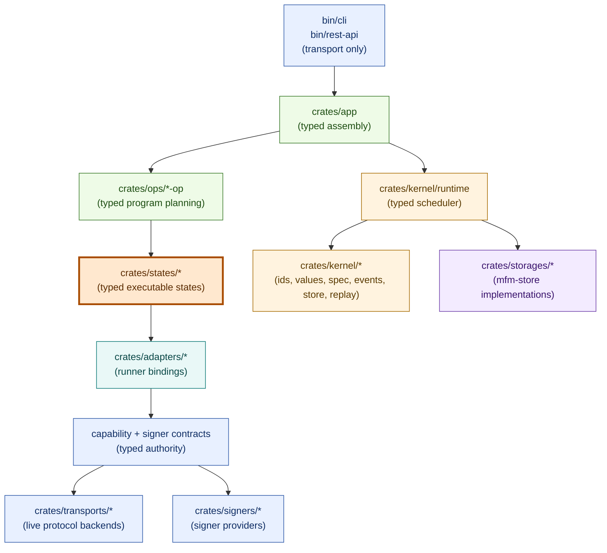

# MFM

Experimental, WIP toolkit for on-chain operations built around an event-sourced state machine runtime.

> WARNING: Not production-ready. Do not use on mainnet.

## Architecture at a glance



Typed state programs are the semantic executable surface. Ops plan typed programs, the certified typed execution spec is the runtime contract, states declare reusable semantics, adapters bind state intent to capability contracts, transports/signers provide reusable platform implementations, and binaries stay transport-only.

## Core capabilities

- Event-sourced certified typed runs with append-only execution history.
- Crash-resume and replay-aware typed execution semantics.
- Certified saga remediation with signed manual authorization decisions.
- Content-addressed manifests, snapshots, facts, and outputs.
- Deterministic typed-state orchestration for ops/pipelines.
- Thin CLI and REST transport layers for typed automation surfaces.
- Security-hardened Ethereum keystore (tamper checks + signing utilities).
- Typed storage backends for run events and artifacts.

## Current workflow surface

The compiled application exposes exactly one public run objective:
`mfm.portfolio/snapshot@2`. Its root composes reusable Bitcoin and EVM collector operations, then
passes their typed receipts to one store-backed portfolio report operation. EVM contract validation
and transaction submission remain reusable library/test foundations, but production app
certification, runner, and replay assembly does not register them.

## Documentation

Start here:

- Design contract (source of truth): [`docs/design.md`](docs/design.md)
- Certified saga contract: [`docs/saga.md`](docs/saga.md)
- Architecture taxonomy + placement rules: [`docs/architecture.md`](docs/architecture.md)
- Rust build and verification contract: [`docs/build-and-verification.md`](docs/build-and-verification.md)
- AI-agent contribution rules: [`AGENTS.md`](AGENTS.md)
- Code quality policy: [`docs/code-quality.md`](docs/code-quality.md)

User-facing docs:

- CLI docs + output contract: [`bin/cli/README.md`](bin/cli/README.md)
- REST API docs: [`bin/rest-api/README.md`](bin/rest-api/README.md)
- Portfolio snapshot workflow: [`docs/portfolio-snapshot.md`](docs/portfolio-snapshot.md)
- EVM runtime routing runbook: [`docs/evm-rpc-routing.md`](docs/evm-rpc-routing.md)
- EVM transaction contract: [`docs/evm-transactions.md`](docs/evm-transactions.md)
- Persisted/public surface inventory: [`docs/persisted-public-surfaces.md`](docs/persisted-public-surfaces.md)

Crate docs:

- Core primitives (keystore + crypto): [`crates/core/README.md`](crates/core/README.md)
- Typed runtime: [`crates/kernel/runtime/README.md`](crates/kernel/runtime/README.md)
- Typed store contract: [`crates/kernel/store/README.md`](crates/kernel/store/README.md)
- Typed replay: [`crates/kernel/replay/README.md`](crates/kernel/replay/README.md)
- Pure EVM domain: [`crates/domains/evm/README.md`](crates/domains/evm/README.md)
- Pure portfolio domain: [`crates/domains/portfolio/README.md`](crates/domains/portfolio/README.md)
- EVM live transport and runtime/replay bindings: [`crates/live/evm/README.md`](crates/live/evm/README.md)
- Portfolio live fact selection and hydration: [`crates/live/portfolio/README.md`](crates/live/portfolio/README.md)
- Storage (typed run events and current configuration, Postgres): [`crates/storages/postgres/README.md`](crates/storages/postgres/README.md)

Development and operations:

- Nixfied project model: [`nixfied.nix`](nixfied.nix)
- Nixfied integration and upgrade guide:
  [upstream adopter guide](https://github.com/willyrgf/nixfied/blob/HEAD/docs/GUIDE.md)

## Development

Use the pinned default Nix shell for Rust development. The
[build and verification contract](docs/build-and-verification.md) owns the focused commands, task
selection, gate composition, and artifact policy.

Discover runnable flake apps and run binaries locally:

```bash
nix run .#help
nix run .#mfm -- --help
nix run .#mfm -- ops list
nix develop -c cargo run -p mfm -- --help
nix develop -c cargo run -p mfm-rest-api
```

The [CLI reference](bin/cli/README.md) owns commands, output behavior, and the custom `.#mfm`
app's managed PostgreSQL lifecycle.

## License
MIT (see [`LICENSE`](LICENSE)).
