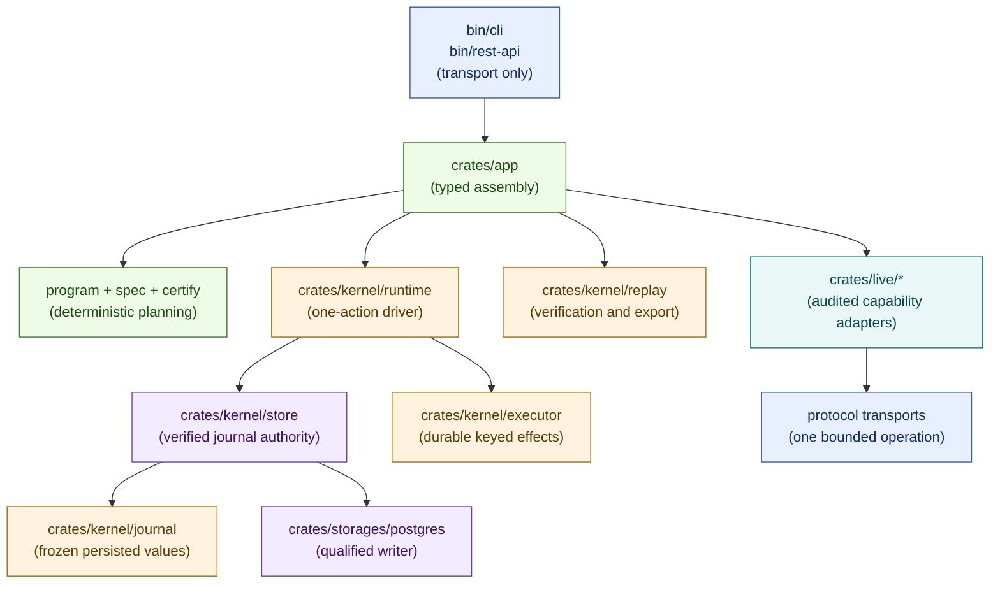

# MFM

Experimental, WIP toolkit for recoverable on-chain operations built around a certified typed-state
runtime and one append-only committed journal.

> WARNING: Not production-ready. Do not use on mainnet.

## Architecture at a glance



Typed state programs are the semantic executable surface. Certification deterministically expands
them into the one runtime graph. States own reusable semantics; adapters bind their intent to
explicit capabilities; transports, executors, and signers remain reusable platform primitives.
Binaries only parse input, invoke the application facade, and render its reviewed outputs.

## Core capabilities

- Certified typed runs with five append-only journal record kinds.
- Stateless, crash-safe `drive_once` scheduling derived from verified history.
- Audited reads and durable keyed effects with authorization-before-access and
  observation-before-settlement.
- Content-addressed manifests, snapshots, facts, and outputs.
- Callback-free recorded-history verification and deterministic portable export.
- Purpose-bound tenant authorization at the application boundary.
- Security-hardened Ethereum keystore (tamper checks + signing utilities).
- Atomic in-memory conformance storage and a deployment-qualified PostgreSQL writer.

## Current workflow surface

The compiled application exposes exactly one public run objective:
`mfm.portfolio/snapshot@1`. It composes an audited, anchor-confirmed EVM read graph and a pure
portfolio aggregation. Bitcoin collection remains unregistered until its provider work and
concurrency behavior qualify. Commit 5 contains no production mutation registration; EVM writes
qualify separately through the durable keyed executor.

## Documentation

Start here:

- Design contract (source of truth): [`docs/design.md`](docs/design.md)
- Architecture taxonomy + placement rules: [`docs/architecture.md`](docs/architecture.md)
- Rust build and verification contract: [`docs/build-and-verification.md`](docs/build-and-verification.md)
- AI-agent contribution rules: [`AGENTS.md`](AGENTS.md)
- Code quality policy: [`docs/code-quality.md`](docs/code-quality.md)

User-facing docs:

- Run execution from admission through fan-out and public output:
  [`docs/run-execution.md`](docs/run-execution.md)
- CLI docs + output contract: [`bin/cli/README.md`](bin/cli/README.md)
- REST API docs: [`bin/rest-api/README.md`](bin/rest-api/README.md)
- Portfolio snapshot workflow: [`docs/portfolio-snapshot.md`](docs/portfolio-snapshot.md)
- EVM runtime routing runbook: [`docs/evm-rpc-routing.md`](docs/evm-rpc-routing.md)
- EVM transaction contract: [`docs/evm-transactions.md`](docs/evm-transactions.md)
- Persisted/public surface inventory: [`docs/persisted-public-surfaces.md`](docs/persisted-public-surfaces.md)

Crate docs:

- Keystore and crypto primitives: [`crates/keystore/README.md`](crates/keystore/README.md)
- Frozen journal values: [`crates/kernel/journal/README.md`](crates/kernel/journal/README.md)
- Typed runtime: [`crates/kernel/runtime/README.md`](crates/kernel/runtime/README.md)
- Typed store contract: [`crates/kernel/store/README.md`](crates/kernel/store/README.md)
- Typed replay: [`crates/kernel/replay/README.md`](crates/kernel/replay/README.md)
- Pure EVM domain: [`crates/domains/evm/README.md`](crates/domains/evm/README.md)
- Pure portfolio domain: [`crates/domains/portfolio/README.md`](crates/domains/portfolio/README.md)
- EVM audited transport bindings: [`crates/live/evm/README.md`](crates/live/evm/README.md)
- Qualified journal storage (PostgreSQL): [`crates/storages/postgres/README.md`](crates/storages/postgres/README.md)

Development and operations:

- Nixfied project model: [`nixfied.nix`](nixfied.nix)
- Nixfied integration and upgrade guide:
  [upstream adopter guide](https://github.com/willyrgf/nixfied/blob/HEAD/docs/GUIDE.md)

## Development

Use the pinned default Nix shell for Rust development. The
[build and verification contract](docs/build-and-verification.md) owns the focused commands, task
selection, gate composition, and artifact policy.

Discover runnable flake apps and run binaries locally:

```bash
nix run .#help
nix run .#mfm -- --help
nix run .#mfm -- ops list
nix develop -c cargo run -p mfm -- --help
nix develop -c cargo run -p mfm-rest-api
```

The [CLI reference](bin/cli/README.md) owns commands, output behavior, and the custom `.#mfm`
app's managed PostgreSQL lifecycle.

## License
MIT (see [`LICENSE`](LICENSE)).
