# MFM

MFM is a typed, append-only execution core for deterministic State sequences with explicit
observational Reads, retained Effects, and bounded recovery. Runtime owns continuation transitions
and local validation, Journal seals exact canonical frames, and Store provides mechanical
admission/latest/optional-probe load and atomic exact-head append.

## Using MFM as a platform and framework

MFM has three public usage paths. They are activities a developer can combine, rather than
separate kinds of users:

| Activity | What the caller should express |
| --- | --- |
| Select an existing operation | Its inputs and supported options |
| Compose existing Operations or States | Their order, valid connections, and any intentional policy |
| Implement a new State | Its actual semantics and typed contracts |

An Operation packages reusable composition; a State defines one deterministic step. Reads and
Effects perform external IO through explicit adapters. All three paths use the same checked
Program and Runtime. Caller-owned choices and new semantics belong in authoring code; reusable
assembly, execution, and result handling should not be reimplemented by each caller.

These paths guide the public API, not a claim that every convenience interface already exists.
The [public interfaces and tests RFC](RFC_RESHAPING_PUBLIC_FACING_N_TESTS.md) records current
friction, proposed requirements, test responsibilities, and unresolved API decisions. Rust framework
composition and extension remain first-class uses alongside configured product entry points.

## Current products and documentation

The current product composition is Portfolio snapshots and explicit candidate-asset enrichment over
secret-free EVM balance Reads. Enrichment can publish an immutable snapshot configuration revision.
Application owns a typed stored-config, discovery, and run surface over one checked multi-route
composition. Callers supply an explicit `RunId`; the CLI may generate one at its client boundary.
The CLI drives exact-revision config import/list/delete and run start/progress/show/list, documented in
[bin/cli/README.md](bin/cli/README.md). [The REST API](bin/rest-api/README.md) serves the same typed
use cases over an unauthenticated Unix socket. The shared production bootstrap and complete
`deployment.toml` example are documented by [`mfm-app`](crates/app/README.md).

Start with [design](docs/design.md), [architecture](docs/architecture.md), and
[build and verification](docs/build-and-verification.md).

## High level workflow of the Platform

```mermaid
flowchart TB
      subgraph INPUTS["0 - Config"]
          CONTRACT["Smart contract definition"]
          CONFIG["Toml config file:</br>network, chainid, wallets, contracts refs"]
      end
      CONTRACT-->CONFIG

      subgraph DSL["1 · DSL / definition"]
          TCONFIG["Checked input and configs"]
          SOURCE["Select or compose concrete States and Operations:</br> Deploy → Configure → Observe → Validate → Report"]
      end
      CONFIG-->TCONFIG


      subgraph EXPANSION["Expansion and assembly — before execution"]
          ERESOLVE["Resolve capability implementations and public bindings"]
          
          subgraph NETWORK["Network-dependent implementation"]
              CONSTRUCT["Construct the selected capability implementation for the State, including concrete impl and codecs"]
          end
          classDef native fill:#fff0d9,stroke:#b96812,color:#33210b;
          class CONSTRUCT native;

          EXPAND["Expand the State sequence, inject capability States,<br/>and assemble implementations with supplied live resources"]
          BUILD["Build the immutable Program<br/>Record resolved choices and bind its exact starting input"]
          READY["Produce the Program and assembled Runtime"]

          ERESOLVE --> CONSTRUCT
          CONSTRUCT --> EXPAND
          EXPAND --> BUILD
          BUILD --> READY
      end

      TCONFIG --> ERESOLVE
      SOURCE --> ERESOLVE
      READY --> RUNTIME_ADMIT

     
      subgraph RUNTIME_EXECUTION["Runtime execution"]
          RUNTIME_ADMIT["Admit the exact Program and typed initial input"]
          RUNTIME_NEXT["Determine the next step from the recorded run state"]
          RUNTIME_KIND{"Select the next expanded State"}

          RUNTIME_STATE["Execute the domain State<br/>Evaluate a Pure State or prepare a Read / Effect request"]

          subgraph RUNTIME_NETWORK["Execute network-dependent implementation"]
              RUNTIME_SUPPORT["Execute the injected supporting State<br/>For example: reserve nonce or prepare transaction"]
              RUNTIME_IO["Invoke the selected native adapter<br/>Use supplied provider, signer and authority resources"]
              RUNTIME_NATIVE_EVIDENCE["Encode and bind exact native evidence<br/>Preserve its original contents and identity"]
              RUNTIME_PROJECT["Project native evidence into the capability's typed semantic evidence<br/>Keep network-specific interpretation here"]
          end

          RUNTIME_REQUEST{"Check the request mode"}
          RUNTIME_COMMAND["Record the exact Effect command before adapter execution"]
          RUNTIME_SETTLEMENT{"Check whether this is an Effect"}
          RUNTIME_RECORD["Record the accepted native settlement"]

          RUNTIME_INTERPRET["Interpret semantic evidence in the State<br/>Apply domain rules without network-specific code"]
          RUNTIME_RESULT{"Inspect the State's typed outcome"}

          RUNTIME_ERROR["Retain the exact original domain or operational failure"]
          RUNTIME_RECOVERY["Apply the original error's classification<br/>Invoke the handler and authorize recovery"]
          RUNTIME_ADVANCE{"Check whether more States remain"}
          RUNTIME_SUCCESS["Return checked terminal success"]
          RUNTIME_STOP["Return terminal failure or RecoveryStopped"]

          RUNTIME_INVOCATION["Return the invocation failure<br/>Preserve causes, known acknowledgements and retained authority"]

          RUNTIME_ADMIT --> RUNTIME_NEXT
          RUNTIME_NEXT --> RUNTIME_KIND
          RUNTIME_KIND --> RUNTIME_STATE
          RUNTIME_KIND --> RUNTIME_SUPPORT

          RUNTIME_STATE -->|"Pure outcome"| RUNTIME_RESULT
          RUNTIME_SUPPORT -->|"Pure outcome"| RUNTIME_RESULT
          RUNTIME_STATE -->|"Prepared request"| RUNTIME_REQUEST
          RUNTIME_SUPPORT -->|"Prepared request"| RUNTIME_REQUEST

          RUNTIME_REQUEST -->|"Read"| RUNTIME_IO
          RUNTIME_REQUEST -->|"Effect"| RUNTIME_COMMAND
          RUNTIME_COMMAND --> RUNTIME_IO

          RUNTIME_IO -->|"Receive native evidence"| RUNTIME_NATIVE_EVIDENCE
          RUNTIME_IO -->|"Remain pending: await readiness<br/>and reconcile the same command"| RUNTIME_IO
          RUNTIME_IO -->|"Receive an original operational failure"| RUNTIME_ERROR

          RUNTIME_NATIVE_EVIDENCE --> RUNTIME_SETTLEMENT
          RUNTIME_SETTLEMENT -->|"Effect"| RUNTIME_RECORD
          RUNTIME_SETTLEMENT -->|"Read"| RUNTIME_PROJECT
          RUNTIME_RECORD --> RUNTIME_PROJECT

          RUNTIME_PROJECT --> RUNTIME_INTERPRET
          RUNTIME_INTERPRET --> RUNTIME_RESULT

          RUNTIME_NATIVE_EVIDENCE -->|"Fail encoding or binding"| RUNTIME_INVOCATION
          RUNTIME_PROJECT -->|"Fail semantic projection"| RUNTIME_INVOCATION
          RUNTIME_COMMAND -->|"Fail or lose acknowledgement"| RUNTIME_INVOCATION
          RUNTIME_RECORD -->|"Fail or lose acknowledgement"| RUNTIME_INVOCATION

          RUNTIME_RESULT -->|"Domain failure"| RUNTIME_ERROR
          RUNTIME_ERROR --> RUNTIME_RECOVERY
          RUNTIME_RECOVERY -->|"Continue through an authorized transition"| RUNTIME_NEXT
          RUNTIME_RECOVERY -->|"Terminate or stop recovery"| RUNTIME_STOP

          RUNTIME_RESULT -->|"Success"| RUNTIME_ADVANCE
          RUNTIME_ADVANCE -->|"Continue"| RUNTIME_NEXT
          RUNTIME_ADVANCE -->|"Finish"| RUNTIME_SUCCESS
      end



      classDef RUNTIME_native fill:#fff0d9,stroke:#b96812,color:#33210b;
      class RUNTIME_SUPPORT,RUNTIME_IO,RUNTIME_NATIVE_EVIDENCE,RUNTIME_PROJECT RUNTIME_native;
```

