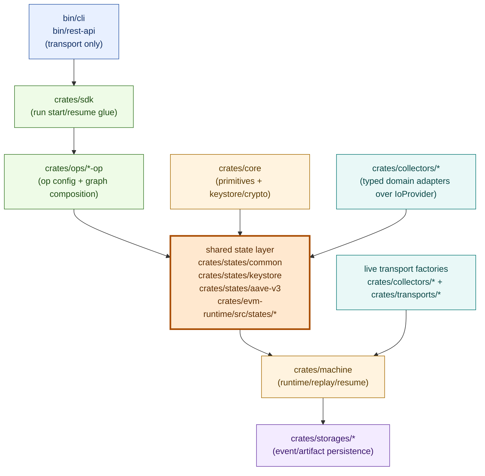

# MFM

Experimental, WIP toolkit for on-chain operations built around an event-sourced state machine runtime.

> WARNING: Not production-ready. Do not use on mainnet.

## Architecture at a glance



States are the core execution unit. Ops are planners (`expand` builds deterministic graphs); shared states are executors (`handle` performs one step via `IoProvider`), and binaries stay transport-only.

## Core capabilities

- Event-sourced runs with append-only execution history.
- Crash-resume and replay-aware execution semantics.
- Content-addressed manifests, snapshots, facts, and outputs.
- Deterministic state-machine orchestration for ops/pipelines.
- Thin CLI and REST transport layers for stable automation surfaces.
- Security-hardened Ethereum keystore (tamper checks + signing utilities).
- Swappable storage backends (in-memory, Postgres, fs, S3/MinIO).

## Documentation

Start here:

- Design contract (source of truth): [`docs/design.md`](docs/design.md)
- One-page overview + invariants: [`docs/architecture.md`](docs/architecture.md)
- Current ops/states inventory: [`docs/ops-and-states.md`](docs/ops-and-states.md)
- Contribution rules / CI parity: [`AGENTS.md`](AGENTS.md)

User-facing docs:

- CLI docs + output contract: [`bin/cli/README.md`](bin/cli/README.md)
- REST API docs: [`bin/rest-api/README.md`](bin/rest-api/README.md)

Crate docs:

- Core primitives (keystore + config models): [`crates/core/README.md`](crates/core/README.md)
- Runtime: [`crates/machine/README.md`](crates/machine/README.md)
- Proc macros: [`crates/machine-derive/README.md`](crates/machine-derive/README.md)
- SDK (orchestration helpers): [`crates/sdk/README.md`](crates/sdk/README.md)
- Ops (proof op): [`crates/ops/proof-op/README.md`](crates/ops/proof-op/README.md)
- Storage (StreamStore, mem): [`crates/storages/stream-store-mem/README.md`](crates/storages/stream-store-mem/README.md)
- Storage (StreamStore, Postgres): [`crates/storages/stream-store-postgres/README.md`](crates/storages/stream-store-postgres/README.md)
- Storage (ArtifactStore, fs): [`crates/storages/artifact-store-fs/README.md`](crates/storages/artifact-store-fs/README.md)
- Storage (ArtifactStore, S3/MinIO): [`crates/storages/artifact-store-s3/README.md`](crates/storages/artifact-store-s3/README.md)

Design notes / planning:

- Nixfied vendoring boundaries: [`nixfied/VENDORED.txt`](nixfied/VENDORED.txt)
- Framework upgrade notes: [`docs/UPGRADE.md`](docs/UPGRADE.md)

## Development

Canonical entrypoints:

```bash
nix run .#help
nix run .#dev
nix run .#check
nix run .#test
nix run .#ci -- --mode basic --summary
nix run .#ci -- --mode audit --summary
nix run .#ci -- --mode parity --summary
nix run .#ci -- --mode full --summary
nix run .#ci -- --mode <mode> --summary
```

### Behavioral changes (workflow modes)

- `--mode <value>` is the canonical interface for workflow mode selection.
- Shorthand `--<mode>` is only accepted for simple mode names matching `[a-z0-9-]+`.
- Dotted/complex modes must use `--mode` (for example `--mode parallel.smoke`).
- Unknown mode errors now print expected modes derived from the compiled model.

### Contract notes:

- Framework service hooks and model-level service tasks share the same launcher/runtime policy path, but this repo does not currently expose public `service::*::start` apps.
- Local supervisor wrappers in `nixfied/local/default.nix` (`up`, `down`, `svc-*`) are intentional prod-only overrides.
- `mfm::portfolio::snapshot` is a strict json app that owns process/bootstrap orchestration, stdout envelope
  validation, and readiness mediation via `SVC_*` hooks while forwarding validated `mfm_cli` payloads unchanged.
- `nix run .#help` lists exposed core apps; invoke `mfm::portfolio::snapshot` directly by name.
- CI help/docs metadata comes from task/app metadata in `nixfied/project/module.nix`, and is mirrored into `apps.<system>.ci.meta.nixfied.api`.
- Project scripts should prefer framework policy helpers and `task.ops.ready`/`task.ops.health` surfaces over duplicating service policy or readiness logic.
- `nix run .#dev` intentionally uses `start_service ... --cleanup` for deterministic teardown.

### Reliability improvements:

- Explicit shell app classes are now enforced:
  - `typed` for strict text commands (`check`, `test`, `build`, `mfm_rest_api`, `svc-*`)
  - `json` for machine-output workflows (`mfm::portfolio::snapshot`, and other machine-output apps)
  - `batch-runner` for `ci`
- Unknown args are rejected at the shell-contract boundary for typed/json commands before domain execution.
- `mfm::portfolio::snapshot` preserves `mfm_cli` as the output-contract authority and returns the validated
  `mfm_cli` payload unchanged.
- CI now validates command class policies and runtime behavior (including unknown-arg probes and JSON-shape checks) in `shell-app-contracts`.

### Process-first ops:

- Runtime visibility:
  - `nix run .#process::status`
  - `nix run .#process::status -- --all`
  - `nix run .#process::runs -- --all`
  - `nix run .#process::inspect -- <id>`
  - `nix run .#process::stop -- --run-id <id>`
  - `nix run .#process::stop -- --run-id <id> --scope slot-env`
  - `nix run .#process::stop -- --run-id <id> --dry-run`
- Service model surfaces:
  - `nix run .#services`
  - `nix run .#ready -- --service postgres --source local`
  - `nix run .#ready -- --service helios --source local`
  - `nix run .#health -- --service all`
- Policy controls (optional overrides):
  - `SERVICE_OWNER_SCOPE=ephemeral|persistent`
  - `SERVICE_DISCOVERY_SCOPE=local|global`
- Migration note:
  - `SERVICE_REUSE_POLICY` and `MFM_KEEP_SERVICES` are rejected by `mfm::portfolio::snapshot`.
- Preserve or tear down snapshot-managed services via `SERVICE_*` policy envs on `mfm::portfolio::snapshot`; the direct-task
  launch and lifecycle handling remain internal.

### Run binaries:

```bash
nix build .#mfm-cli
./result/bin/mfm_cli --help
nix run .#mfm_rest_api
nix run .#mfm::portfolio::snapshot -- <ADDRESS>
```

## License
MIT (see [`LICENSE`](LICENSE)).
