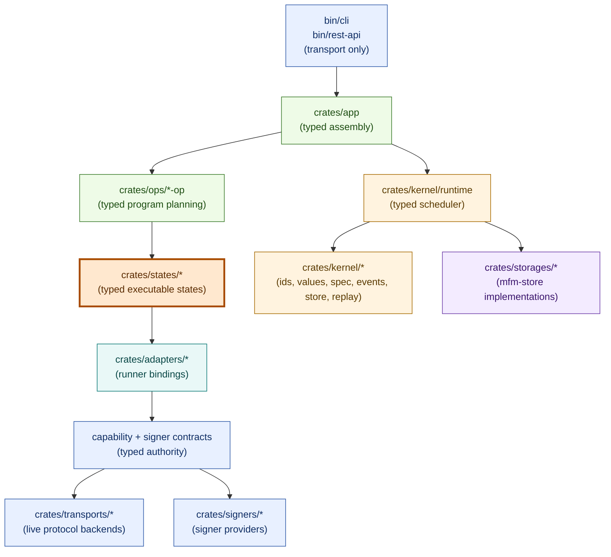

# MFM

Experimental, WIP toolkit for on-chain operations built around an event-sourced state machine runtime.

> WARNING: Not production-ready. Do not use on mainnet.

## Architecture at a glance



Typed state programs are the semantic executable surface. Ops plan typed programs, the certified typed execution spec is the runtime contract, states declare reusable semantics, adapters bind state intent to capability contracts, transports/signers provide reusable platform implementations, and binaries stay transport-only.

## Core capabilities

- Event-sourced certified typed runs with append-only execution history.
- Crash-resume and replay-aware typed execution semantics.
- Certified saga remediation with signed manual authorization decisions.
- Content-addressed manifests, snapshots, facts, and outputs.
- Deterministic typed-state orchestration for ops/pipelines.
- Thin CLI and REST transport layers for typed automation surfaces.
- Security-hardened Ethereum keystore (tamper checks + signing utilities).
- Typed storage backends for run events and artifacts.

## Current workflow surface

The compiled application exposes exactly one public run objective:
`mfm.portfolio/snapshot@2`. Its root composes reusable Bitcoin and EVM collector operations, then
passes their typed receipts to one store-backed portfolio report operation. EVM contract validation
and transaction submission remain reusable library/test foundations, but production app
certification, runner, and replay assembly does not register them.

## Documentation

Start here:

- Design contract (source of truth): [`docs/design.md`](docs/design.md)
- Certified saga contract: [`docs/saga.md`](docs/saga.md)
- Architecture taxonomy + placement rules: [`docs/architecture.md`](docs/architecture.md)
- Rust build and verification contract: [`docs/build-and-verification.md`](docs/build-and-verification.md)
- AI-agent contribution rules: [`AGENTS.md`](AGENTS.md)
- Code quality policy: [`docs/code-quality.md`](docs/code-quality.md)

User-facing docs:

- CLI docs + output contract: [`bin/cli/README.md`](bin/cli/README.md)
- REST API docs: [`bin/rest-api/README.md`](bin/rest-api/README.md)
- Portfolio snapshot workflow: [`docs/portfolio-snapshot.md`](docs/portfolio-snapshot.md)
- EVM runtime routing runbook: [`docs/evm-rpc-routing.md`](docs/evm-rpc-routing.md)
- EVM transaction contract: [`docs/evm-transactions.md`](docs/evm-transactions.md)
- Persisted/public surface inventory: [`docs/persisted-public-surfaces.md`](docs/persisted-public-surfaces.md)

Crate docs:

- Core primitives (keystore + crypto): [`crates/core/README.md`](crates/core/README.md)
- Typed runtime: [`crates/kernel/runtime/README.md`](crates/kernel/runtime/README.md)
- Typed store contract: [`crates/kernel/store/README.md`](crates/kernel/store/README.md)
- Typed replay: [`crates/kernel/replay/README.md`](crates/kernel/replay/README.md)
- Pure EVM domain: [`crates/domains/evm/README.md`](crates/domains/evm/README.md)
- Portfolio snapshot/report operations: [`crates/ops/portfolio-snapshot-op/README.md`](crates/ops/portfolio-snapshot-op/README.md)
- EVM runtime/replay adapters: [`crates/adapters/evm/README.md`](crates/adapters/evm/README.md)
- Storage (typed run events and current configuration, Postgres): [`crates/storages/postgres/README.md`](crates/storages/postgres/README.md)

Development and operations:

- Nixfied v2 project model: [`nixfied.nix`](nixfied.nix)
- Framework upgrade notes: [`docs/UPGRADE.md`](docs/UPGRADE.md)

## Development

All developer-invoked Rust tools run in the pinned default Nix shell. Enter it
once, then use package- or test-scoped Cargo commands:

```bash
nix develop
cargo fmt --all -- --check
cargo check -p <package>
cargo test -p <package> <test-filter>
```

For a non-interactive one-off, use `nix develop -c cargo ...`; never rely on
host-installed Rust tooling. For a one-off managed check, run the exact current
Nixfied task:

```bash
nix run .#run -- --task <task-id>
```

Use the smallest check that covers the change. The selection matrix, exact gate
composition, managed-leaf caveats, and artifact policy live only in the
[build and verification contract](docs/build-and-verification.md).

Run binaries locally:

```bash
nix run .#mfm -- --help
nix run .#mfm -- ops list
nix run .#mfm -- setup import examples/setup/organization.toml
nix run .#mfm -- setup list
nix develop -c cargo run -p mfm -- --help
nix develop -c cargo run -p mfm-rest-api
```

The `.#mfm` app runs the packaged CLI with a Nixfied-managed PostgreSQL process
in slot 9. It keeps the development database under the Nixfied state root for
`mfm/dev/9`, applies the typed store migrations idempotently, sets `DATABASE_URL`,
delegates all arguments to the raw binary, and stops PostgreSQL afterward without
removing its data. Separate `nix run .#mfm` commands therefore share setup and run
state. For raw execution with caller-managed infrastructure, use
`nix develop -c cargo run -p mfm -- <ARGS>` or the binary produced by
`nix build .#mfm`.

## License
MIT (see [`LICENSE`](LICENSE)).
