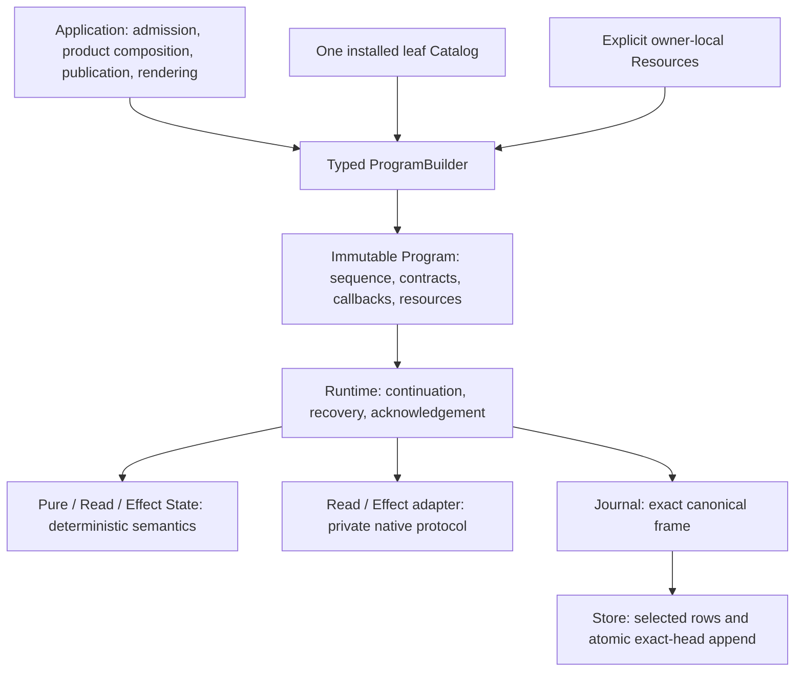
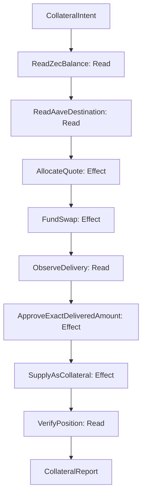

# RFC: simplify MFM around semantic execution boundaries

**Status:** proposed implementation of the agreed architectural direction.
**Reviewed baseline:** `f6d2afc568f59e6a733623e73022e66b476d5654`.
**Scope:** Program construction, State/adapter contracts, Portfolio Reads, EVM Effects,
execution observations, error custody, and PostgreSQL persistence/configuration. The
ZEC→Ethereum WBTC→Aave scenario is a design exercise for integration growth.

This RFC records the problems and one target design. It does not claim that the proposed behavior
is implemented. [docs/design.md](docs/design.md) remains the current contract until each coherent
implementation cutover updates it and its tests. [docs/architecture.md](docs/architecture.md) owns
placement; [docs/code-quality.md](docs/code-quality.md) owns cutover and quality rules.

The review used separate requirements, composition, execution, persistence, diagnostics, and Effect
architects, followed by an integrating architect. The collection-sized Read is the selected target;
batching the entire Portfolio into one Read was considered and rejected because collections already
define useful independent route, coherence, failure, and recovery boundaries.

The [core composition example](#7-core-example-zcash-to-ethereum-bitcoin-collateral-in-aave-v4)
reads a ZEC balance, exchanges ZEC through NEAR Intents for WBTC on Ethereum, and supplies it as
Aave v4 collateral. It tests implementation ownership and reuse through a concrete proposed
workflow. It is not an integration implementation commitment: this RFC does not schedule Zcash,
NEAR Intents, Aave, or a live route, and implementing the refactor does not require implementing
that example. The sketches exercise the target boundaries; current consumers own refactor checks.

## 1. Decision

MFM should execute a linear sequence of meaningful domain transformations. It should not expose
every provider query, nonce reservation, signing preparation, or internal context handoff as a
generic State merely because those steps happen in order.

The target has five central decisions:

1. Construct Programs with ordinary Rust composition and a consuming typed builder. Publish
   installed leaf implementations once in one integration-owned Catalog. Delete source lowering,
   injection, default inheritance, and recursive discovery machinery.
2. Give Read and Effect States direct typed request/command and observation contracts. Keep native
   protocol orchestration inside adapters, with exact native receipt and operational-failure custody.
3. Observe one Portfolio collection per Read. Preserve asset identity and real denomination; remove
   fictitious monetary valuation and heterogeneous balance aggregation.
4. Execute one semantic transaction Effect. Retain nonce reservation and exact signed-wire custody
   as necessary private physical durability boundaries.
5. Use the current RunRecord, its qualified RunView, and exact Journal frames as the existing
   representations of execution facts. Delete FailureReport and Application mirrors. Reduce Store
   work and PostgreSQL checks to the facts required for its mechanical guarantees.

These changes intentionally break pre-release APIs and changed wire contracts. Every cutover replaces
all current producers, consumers, examples, fixtures, and documentation and physically removes the
superseded design. There is no legacy decoder, compatibility wrapper, history rewrite, or permanent
parallel implementation.

## 2. Requirements before mechanisms

The necessary system can be described without the current authoring machinery:

- A caller supplies one RunId, an exact immutable Program, and its checked initial input.
- The Program associates each occurrence with exact typed code, semantic revisions, public
  bindings, selected recovery policy, and explicit resources.
- Deterministic States transform admitted values. Reads observe external facts through explicit
  adapters. Effects act only after Runtime acknowledges their complete command.
- Runtime owns continuation, transitions, recovery, cancellation boundaries, and local safety checks.
- Exact original outcomes and their available causes are retained before recovery classification.
- Journal owns canonical opaque frame bytes and content identity. Store atomically appends those
  bytes against an exact head and mechanically loads the selected rows needed for qualification.
- Cold continuation qualifies the retained facts against the selected current contracts. Inspection
  does not require an available provider, signer, or source configuration.
- Domain and kernel libraries remain usable without the CLI or a live environment.

The following complexity is necessary and remains:

| Necessary boundary | Why it exists |
| --- | --- |
| Typed admission and selected decoders | Stored and external data are untrusted; construction invariants must survive decoding. |
| Program semantic identity | A continuation must not silently execute a different contract. |
| Command acknowledgement | External mutation needs a stable authorized identity before IO. |
| Exact signed-wire custody | A repeated transaction attempt must use the retained winner, not a newly signed candidate. |
| Settlement acknowledgement | Interpretation must not outrun the retained native outcome. |
| Exact-head atomic append | Competing writers cannot overwrite or splice acknowledged history. |
| Indeterminate acknowledgement | A connection failure cannot prove that COMMIT or another write did not happen. |
| Causal error custody | Public classification cannot replace the available original failure chain. |
| Explicit secret custody | Canonical ProgramDocument, admitted context, history and diagnostics cannot become a deliberate secret transport; authorized process-local handles retain their own custody. |

Reducing LOC is evidence of removing duplicated responsibilities. It is not permission to remove
these boundaries, weaken validation, compress readable code, or hide losses in a generic error.

## 3. Root problems

### 3.1 The generic execution model exposes protocol implementation details

An EVM balance observation currently expands into chain qualification, anchor selection, optional
token denomination observation, balance observation, confirmation, and caller handoff. A transaction
expands into reservation and preparation States around its designated semantic Effect.

The framework then needs a compiler to insert those stages, expanded endpoint contracts, generic
caller contexts to cross them, and reconstruction logic to explain their failures. Those mechanisms
compensate for an incorrectly chosen public boundary.

A State boundary is justified by independently meaningful continuation, recovery, authorization, or
domain outcome. A new RPC call is not sufficient justification. Private adapter steps can be
sequential and causally attributable without becoming generic public States.

Evidence: [native balance injection](crates/domains/evm/src/balance/native.rs),
[balance stages](crates/domains/evm/src/balance/stages.rs),
[transaction stages](crates/domains/evm/src/transaction/stages.rs), and
[Program construction](crates/kernel/program/src/construction.rs).

### 3.2 Source authoring became a second language

The current source model describes structure, traverses it, discovers families, plans expansions,
inherits defaults, resolves native families, and then associates the expanded declarations with
callbacks and resources. Rust already supplies composition, sequencing, loops, generic constraints,
and ownership.

The extra language is paying for protocol-stage injection and automatic recursive publication.
Once private protocols stop expanding the sequence, an ordinary typed builder can express the
required construction directly. Installed-code selection still needs an explicit owner, but it does
not need a runtime registry or another planning interpreter.

Evidence: [typed source machinery](crates/kernel/program/src/typed_source.rs),
[construction and association](crates/kernel/program/src/construction.rs), and
[native ABI](crates/kernel/program/src/native_abi.rs).

### 3.3 Product representations confuse numerical scale with units

Portfolio exposes USD/EUR quotes and collection totals without a price or FX observation contract.
Aligning decimal scales does not convert ETH, tokens, or other assets into a common currency.
Native EVM raw balances are returned unchanged, while surrounding scale choices can label them
incorrectly. The frozen snapshot contract even presents a native balance as a USD result.

For a concrete counterexample, adding one ETH to one unit of an unrelated token does not produce
two units of a meaningful portfolio asset. Changing both decimal representations cannot fix that.
Similarly, enrichment needs the predicate `required || raw_units != 0`; a nonzero token amount of
1500 raw units at denomination 3 need not fail because a target precision of zero cannot represent
1.5 exactly.

Evidence: [Portfolio QuoteCode and consolidation](crates/domains/portfolio/src/lib.rs),
[balance arithmetic](crates/domains/chain/src/balance/arithmetic.rs),
[enrichment](crates/domains/portfolio/src/enrichment.rs),
[native reads](crates/live/evm/src/json_rpc.rs), and
[snapshot fixture](docs/contracts/evm-portfolio/portfolio-snapshot.json).

### 3.4 Repeated representations create repeated validation and change sites

PolicyParams duplicates the checked canonical value container already owned by Object. Generic
balance contexts carry caller continuations through native protocol stages. Application recreates
originals, incidents, decisions, and pending failures already represented by Runtime. FailureReport
re-encodes terminal facts, hashes them again, and becomes another mandatory artifact.

Each extra representation needs constructors, conversion errors, schemas, validation, rendering,
tests, and documentation. Keeping wrappers over them would preserve the actual complexity.

Evidence: [PolicyParams](crates/kernel/program/src/recovery/bindings.rs),
[balance context](crates/domains/chain/src/balance/context.rs),
[terminal report](crates/kernel/runtime/src/report.rs),
[Application run views](crates/app/src/run_view.rs), and
[Application reporting](crates/app/src/reporting.rs).

### 3.5 Reporting can prevent execution from reaching its intended stop

FailureReport combines already-admitted facts into another bounded serialized object before the
terminal append. Its constructor explicitly permits report encoding to fail after the original
failure was acknowledged, leaving the run AwaitingRecovery. A presentation artifact therefore
controls execution liveness.

The terminal frame and retained originals already establish provenance. A renderer should consume
those facts after acknowledgement. It should not create another prerequisite for stopping.

This does not imply unlimited liveness: a real Object, frame, or cumulative history limit can still
prevent a necessary append. The proposal removes the additional report prerequisite, not physical
capacity constraints.

Evidence: [FailureReport construction](crates/kernel/runtime/src/report.rs) and
[Runtime sealing and failure progression](crates/kernel/runtime/src/engine.rs).

### 3.6 Mechanical persistence is overqualified while some outcome claims are underqualified

Store receives a privately qualified exact frame, yet append work repeats qualifications of old
bytes. PostgreSQL catalogue admission mirrors physical installation details that need not affect
atomicity, such as exact index definitions or default tablespace choices. Meanwhile, treating every
database-shaped COMMIT error as definite noncommit lacks an established protocol proof.

The imbalance is architectural: effort is spent reproducing a physical template rather than
precisely defining the authority and evidence needed at the transaction boundary.

Configuration listing is unbounded. Import uses conflict avoidance followed by another observation
that can race with deletion. Run/configuration use cases also inherit live EVM composition even
when their work requires only persistence.

Evidence: [PostgreSQL catalogue checks](crates/storages/postgres/src/catalog.rs),
[run append and COMMIT handling](crates/storages/postgres/src/lib.rs),
[configuration queries](crates/storages/postgres/src/config.rs), and
[Application bootstrap](crates/app/src/lib.rs).

### 3.7 Error handling sometimes confuses classification, rendering, and custody

A public Internal or Unavailable classification is useful, but it cannot replace the underlying
causes. Reconstructing classifiable originals from presentation JSON, retrying a failed original
serializer, or returning a success-shaped fallback view creates another source of truth.

The live HTTP owner also accepts locator paths and queries that may contain credentials. The pinned
reqwest error can include its request URL; capturing its Display text can deliberately carry that
owner-known private field into retained originals and public output. Ordinary userinfo is handled
differently by reqwest, so this finding is specifically about retained URL path/query fields, not a
claim that every username/password URL is printed.

Evidence: [HTTP locator and send boundary](crates/live/evm/src/json_rpc.rs),
[HTTP diagnostic capture](crates/live/evm/src/json_rpc/capture.rs),
[Application reporting](crates/app/src/reporting.rs), and the pinned dependency in
[Cargo.lock](Cargo.lock).

### 3.8 Nominal typing, instance identity, evidence and authority are different guarantees

A typed sequence establishes declared adjacency. It does not prove that a State told the truth,
that an ordinary Operation preserved its incoming prefix, or that an observed balance remains
spendable. A semantic content reference likewise does not authenticate executable bytes or prove
that a fresh leaf selected the same concrete Rust owner. A valid binding schema cannot determine
whether unknown future calldata agrees with caller intent.

The deeper flaw is treating one representation as proof of facts owned by another boundary. Doing
so either overstates the guarantee or creates layers that repeatedly try to reconstruct missing
evidence. Keep each fact at its strongest owner: private fresh identity claims in construction,
checked plans and business interpretation in the domain, native command/binding/resource checks
in adapters, and command/settlement acknowledgement in Runtime. Cold execution relies on admitted
originals and reviewed semantic revisions; it does not regain external truth from a type name.

This separation also prevents a service response or provider-selected network from defining what
the caller authorized. Expected instance/asset/owner facts are independent admitted inputs. External
observations qualify against those expectations under explicit trust policies; caller authentication
and durable native custody remain their own contracts.

## 4. Target ownership



The diagram describes ownership and use, not permission for domains to import live composition.
Existing crate boundaries remain. In particular:

| Owner | Target responsibility |
| --- | --- |
| Values / IDs / Canonical | Checked identities, canonical Object, descriptors, shared value validation and diagnostic data. |
| Capabilities | Typed adapter ports, checked public bindings, native receipts, operational faults, Pending/Settled. |
| Program | Typed builder, leaf descriptors, installed association, State contracts, pure callback containment. |
| Runtime | Current facts, deterministic transitions, acknowledgement ordering, recovery and local safety. |
| Journal | Opaque exact canonical frame wire and hash. |
| Store | Selected-row loading and physical exact-head all-or-nothing append. |
| Chain | Nongeneric collection intent, holdings, ledger, and observation-point contracts. |
| EVM domain | EVM native qualification, request/command semantics, receipts, deterministic projection. |
| Live EVM | Explicit provider/signer/authority handles, private protocol IO, wire codecs. |
| Portfolio | Checked progress, collection selection, snapshot and enrichment projection. |
| Application | Product configuration/admission, composition, publication, pure public views. |
| Binaries | Supported transport parsing and rendering of one Application surface. |

Move Portfolio-specific client/configuration composition out of Live EVM into Application. Live EVM
must not need the Portfolio domain to implement an EVM collection adapter. Transports and signers
remain reusable platform primitives. Keystore remains thread-affine; this RFC does not make it Send
or Sync.

### 4.1 Integration growth and execution scale are separate requirements

Supporting many chains and application protocols means growing installed semantic implementations,
network bindings, and product composition. Running many requests means controlling concurrency,
provider pressure, signing/custody capacity, and physical history growth. The proposed design must
address the first without pretending it has already solved the second.

The scaling objective is locality: adding a supported integration changes its owning implementation,
composition entry, and consuming tests. It does not add branches to Runtime, Journal, Store,
Program's generic association algorithm, or every existing product. Necessary implementation code
grows with genuinely distinct supported semantics. It must not grow with every combination of
network, endpoint, account, asset, policy, and operation instance.

### 4.2 Distinguish protocol semantics from deployed instances

| Addition | Representation / owner | Required framework change |
| --- | --- | --- |
| Another network satisfying an installed protocol contract | Checked ledger identity, network facts, public bindings, and explicit owner resources | None; validate the supported behavior and binding. |
| Another endpoint, account, asset, or deployed protocol address | Checked request/configuration data | None; qualify it through the selected owner. |
| A genuinely different ledger or transaction protocol | Native domain contracts, codecs, adapter orchestration, and authority where required | Install actual typed semantic leaves; keep the generic execution and persistence algorithms unchanged. |
| Another application protocol with different business meaning | Its domain values/States and selected adapters; ordinary Rust Operations compose them | Add its semantics locally; reuse existing platform primitives where their contracts match. |
| Another transport for an already-supported contract | Reusable transport primitives and its selected native owner | No new business State merely because HTTP, WebSocket, or another wire path changes. |
| Another retry policy or configured allowance | Selected handler contract and parameter Object, or policy instance data | Publish new handler code only when behavior changes; do not register each parameter instance. |

For example, deploying a compatible EVM integration on another admitted network should not create
another State family or duplicate balance adapter implementation. A newly supported application
protocol may need its own receipt decoder and meaningful business operation while reusing the EVM
transport and transaction primitives. Neither the network name nor a deployed address justifies
another generic execution layer.

Compatibility is an admitted contract, not an inference from an EVM label or shared RPC spelling.
Different units, selectors, transaction authority, or evidence semantics require explicit support
or rejection. No default capability flags or silent fallbacks manufacture equivalent behavior.

### 4.3 One Catalog, with contributions owned by integrations

Make Catalog nongeneric. Integration modules contribute exact typed factories to the one immutable
Catalog through ordinary Rust composition. Typed installation fixes the selected State, adapter,
binding, native receipt, operational fault, and resource-owner contracts. Erasure occurs privately
at that installation boundary so the Catalog need not carry a giant tuple of all protocol types.

Each integration owns its factory definitions and native validators. Application selects the
installed integration modules at one composition root. Installed-component inspection derives from
those same entries. There is no second component manifest, global protocol enum, recursive source
inventory, ambient plugin discovery, or mutable Runtime registration.

Only actual supported State/adapter semantic pairings are installed. Do not enumerate a Cartesian
product of all States and adapters. Networks, endpoint names, addresses, assets, and policy instances
do not create factory entries. Multiple bindings use the same factory after exact qualification.

The resulting growth is approximately the sum of actual installed semantic leaves plus explicit
binding data. This is an ownership/representation objective, not a measured compile-time bound.
Compilation and binary size still include the selected typed implementations; optional deployment
composition can select a smaller installed subset without runtime code loading.

### 4.4 Explicit resources remain local to their native owners

Keep each integration's typed resource table separate from Catalog. For example, EvmResources loses
its Sources phantom and stores checked EVM bindings and handles only. Another protocol owns another
resource-table type; kernel code does not add a field or enum variant for it.

Program association passes explicit tables through private in-process owner slots. A factory's
typed binder retrieves only its own table using checked type/owner association. Missing or mismatched
tables fail with their available cause. Rust type identity is never persisted or used as semantic
identity, and this mechanism adds no universal Any/JSON execution interface.

Pure Catalog installation, metadata inspection, and observation qualification require no live
resource construction. Executable attachment requires only the tables selected by the complete
Program, after all declarations qualify. Installed but unselected integrations do not require
credentials, providers, or signer handles.

Resources retain their existing explicit authority and secret custody. Public bindings identify
supported routes and contracts; private locators and credentials remain with resource owners.
Private resource erasure cannot make Keystore Send/Sync or distribute its key custody. Runtime
receives the bound Program, not Catalog or an owner-resource lookup service.

### 4.5 Share business contracts, preserve native differences

A common CollectionRequest and ObservedHoldings contract is appropriate for integrations that
actually observe the same holding semantics. One CollectHoldings State can use different selected
typed adapter leaves while its Input/Output remain PortfolioProgress. A complete Program may
therefore alternate installed protocols without changing the Runtime or adding a generic caller K.

Native receipts remain exact owner-specific MfmValue types. They enter history as checked Objects
and are decoded/projected only by the selected factory. Existing LedgerIdentity, BalanceTarget,
and ObservationPoint envelopes carry native Objects; they do not certify a native schema or
cross-field correspondence by themselves. Owner validation remains mandatory at admission, use,
and cold qualification where the selected contract requires it.

Do not create a central Ledger enum or switch over all chains to decode these Objects. Do not
promote an EVM address layout, numeric chain ID, denomination, block hash, nonce, or fee model into
a universal blockchain contract. Retained identity includes its exact native schema/namespace and
ledger facts; a short numeric identifier alone is not cross-protocol identity.

The current [EVM balance ledger](crates/domains/evm/src/balance.rs) qualifies chain ID only and
explicitly does not observe genesis.
Do not advertise it as stronger network-instance identity. In the collection cutover, reuse the
existing [EvmChainInstance vocabulary](crates/domains/evm/src/transaction.rs) (chain ID and expected
genesis hash) for EVM ledger/binding
qualification instead of inventing another fingerprint type. The expected identity comes from
admitted public input or explicit trusted operator configuration; learning it from the same queried
endpoint would not provide an independent expectation. Qualify the selected supported identity
externally under the explicit provider trust contract and update all binding/request/receipt/
configuration contracts and rejection fixtures together. Chain ID/genesis agreement distinguishes
those supported identity facts; it neither independently authenticates ledger history nor
distinguishes every possible fork.

Shared quantity bounds such as Unsigned256 and DecimalScale remain explicit supported-product
limits, not proof that every future protocol fits them. Reject unsupported values honestly; extend
the representation only when an actual consuming requirement justifies it. Never truncate or
reinterpret a native value merely to fit the shared contract.

A protocol position, nonfungible object, cross-ledger transfer, or other different business result
need not pretend to be a fungible holding. Give genuinely different semantics their own typed
values and meaningful States. Unify a contract only when its units, identity, evidence, and recovery
meaning match; using the same transport is insufficient.

### 4.6 Coherence and authority do not become global

One collection groups a ledger, route, selected protocol contract, and coherence policy. It is not
every source on a named chain or every application protocol using that provider. Different evidence
requirements may require different collections even when ledger and endpoint coincide.

An EVM anchored receipt supplies that selected EVM guarantee. Another protocol supplies its own
explicit supported observation guarantee. Portfolio retains the per-collection observation points
and policies; it cannot claim one simultaneous global snapshot merely because all collections
appear in one output.

Likewise, the one-Effect rule means one semantic externally authorized action, not every operation
of an arbitrary cross-chain workflow. Independently authorized, irreversible actions on different
ledgers require meaningful durable continuation boundaries. A bridge-like workflow must not be
hidden inside one generic transaction adapter with an invented atomic success/failure promise.
Cross-ledger recovery or compensation requires its own reviewed domain contract.

### 4.7 Honest operational limits

Independent runs can execute concurrently through explicit authorized resources while Store
preserves exact-head atomicity for each RunId. Worker placement, provider quotas/backpressure,
fairness, and distributed custody are deployment/application requirements, not implicit Runtime
features. Scaling Effect workers also requires their actual retained authority and signer contract;
the existing ephemeral-keystore fixture does not establish distributed production signing.

A Program remains linear. The current Portfolio admission ceiling of 64 sources and EVM resource
ceiling of 256 bindings are bounds on one admitted product/environment, not counts of all networks
the software can support. Keep support breadth separate from how many resources a worker or one
run must hold. Do not raise those limits as a substitute for a workload model.

Full inline continuation snapshots have a real cost. If a run retains a progress value proportional
to n collections/sources across a number of acknowledged transitions proportional to n, its
history can grow quadratically in those counts. Removing nested K and dense zero counters does not
remove that snapshot tradeoff. This is a conditional representation analysis, not a benchmark.

For a product needing thousands of independent observations, evaluate bounded independent runs
and Application-owned result aggregation with explicit RunId/head/output provenance, completeness,
freshness, and failure rules. Do not silently split a run that requires shared sequential authority.
If the real requirement is parallel work or huge continuation within one durable run, the linear
Program/inline-record design needs a separate reviewed change. This RFC supplies neither a DAG
executor nor an object store, and makes no throughput or simultaneous-snapshot guarantee.

### 4.8 Integration growth acceptance

The construction cutover must include consuming evidence beyond another EVM binding:

1. Reuse one installed adapter on two different network bindings without adding a second factory.
2. Contribute a second, genuinely different protocol adapter through its owning module and compose
   it with the first using the same actual holding contract; Runtime, Journal, Store, and generic
   association need no protocol branch.
3. Preserve distinct native receipts, identities, and causal errors through hot/cold observations;
   reject a receipt, binding, or resource table from the wrong owner.
4. Select different bindings and policy instances without duplicating installation. Reject duplicate
   or conflicting intrinsic factory claims before any live resource attachment.
5. Construct and inspect a Program with an unselected integration's resources absent, and inspect
   retained facts with every live table absent. Missing selected resources still block execution.
6. Demonstrate differing business semantics require an explicit typed State rather than accidental
   coercion into holdings. Independent collection points remain visible in the final result.
7. Measure provider calls, attachment work, frame/history bytes, and cold restoration for defined
   workloads at current bounds. Exercise independent concurrent runs and retained custody; a
   successful multi-network output proves neither simultaneous observation nor atomic mutation.

Use a minimal structurally different consuming fixture where a live second protocol is not yet
supported. Such a test proves framework extensibility and owner isolation; it does not certify a
production chain implementation or require the illustrative route. Add real protocol interoperability
evidence only when supporting that protocol becomes an implementation requirement.

## 5. Ordinary typed Program construction

### 5.1 Builder contract

Use a consuming `ProgramBuilder<Current>`. Current is the declared success-output contract of the
built prefix, conditional on trusted execution establishing it.
Each append consumes the builder, requires the new State input to equal Current, and returns a
builder whose Current is that State's output. The builder retains the mandatory admitted initial
contract and exact input commitment internally; finish includes them in the immutable Program.
An additional public Root parameter supplies no adjacency proof and is removed.

Construct with `ProgramBuilder::new(&input)` and retain caller-owned input for the existing Runtime
start API. Initial owner qualification establishes its value invariants before committing its
reference. The builder does not acquire new initial-value custody, and Runtime independently
checks the supplied input against that exact commitment before admission/provider entry.

The following is schematic API notation, not a second configurable language or a claim that these
signatures already compile:

```text
pure::<S>(recovery)                 where S::Input = Current
read::<S>(leaf, binding, recovery)  where S::Input = Current
effect::<S>(leaf, binding, recovery) where S::Input = Current

each returns ProgramBuilder<S::Output>
```

Operations are ordinary Rust functions that accept and return an appropriately typed builder.
Repeated endomorphic States use ordinary loops. Rust proves nominal adjacency and mode/type
compatibility, not external truth, ambient-IO freedom, or that an ordinary function extended the
same builder rather than discarding it. Authors and installed implementations remain trusted.
Explicit recovery values replace nested default inheritance. Checkpoints use checked builder-created
handles with private originating-builder membership; finish validates their origin, positions,
contracts, and static declaration constraints. Runtime checks acknowledged Effect barriers when
authorizing recovery: those barriers are dynamic execution facts, not builder authority. There is
no authoring-depth concept once authoring is ordinary Rust composition.

The final immutable Program remains a complete linear State sequence, including exact initial
commitment, descriptors, selected policies, bindings, callbacks, and explicit resource associations.
Runtime receives that complete Program and performs no assembly, discovery, or code registration.
Its canonical ProgramDocument excludes private locators, credentials, executable pointers, and
resource handles. Process-local callbacks may capture authorized handles; immutability fixes the
sequence and associations, not the state or availability of a provider, signer, or wallet.

Read takes a checked ReadLeaf<S> selected from Catalog; Effect takes the analogous EffectLeaf<S>.
Typed factory installation fixes the adapter contract, and selection verifies the exact State owner
and semantic ABI. The builder accepts a checked canonical binding Object that the selected native
Binding codec qualifies during whole-document association. There is one public append path per
mode; do not retain a parallel static-adapter append API as a convenience.

Fresh leaves retain private concrete factory/State/resource-owner claims, and Pure append retains
its State owner claim. Finish compares these with its Catalog before attachment. A content ref plus
PhantomData is insufficient: another Catalog can contain a different Rust owner claiming the same
semantic descriptors. Preserve existing in-process TypeId checks without persisting Rust identity
or adding a public Catalog-identity interface. Cold association still relies on reviewed semantic
revisions and the installed trusted code.

For config-driven collections, Application obtains a ReadLeaf<CollectHoldings> from the exact
installed leaf reference and builds the endomorphic sequence with an ordinary loop. It does not
need a global match naming every concrete adapter type. This is checked construction-time selection;
Runtime still invokes only already-associated callbacks.

### 5.2 One installed Catalog

One immutable nongeneric Catalog publishes typed leaf factories and selected handler factories.
Integration-owned contributions and explicit owner-local Resources follow section 4. Fresh
construction and cold loading use the same association owner. A new semantic implementation is
published once; selecting installed components or composing another Operation does not require
publishing another structural source family.

Schematic installation is `register_read::<S, A, R>(owner_binder)` and its Effect counterpart, where
R is the native owner's typed resource table. It checks intrinsic ownership and contracts before
privately erasing A/R. `select_read::<S>(exact_leaf_ref)` returns ReadLeaf<S> only for the installed
matching State ABI. The exact leaf reference identifies the intrinsic executable contract, not
each occurrence's binding or recovery-policy value. No opaque live original or executable callback
is serialized as part of selection.

Catalog lookup uses the intrinsic executable contract: mode, semantic revisions, and selected value
and binding contract schemas. Per-occurrence binding Objects, recovery selections, and parameter
instances are committed declaration facts validated against that contract, not additional factory
registration keys. Handler factories qualify through the same Catalog using their intrinsic
contracts; arbitrary binding/policy combinations do not require new publication.

The Catalog is not a Runtime registry or cache. It does not execute providers, hold a mutable
plugin lifecycle, or discover ambient resources. Program owns the associated executable occurrences
after construction.

Association has two ordered phases:

1. Qualify the complete document: descriptors, semantic revisions, value contracts, adjacency,
   parameter Objects, public bindings, selected handlers, checkpoints, and limits.
2. Attach the selected explicit resources and construct callbacks only after every declaration
   passes the first phase.

Construction and loading perform no provider IO. Missing code, revisions, or resources fail with
their available cause and context; they never silently select a fallback implementation.

Qualification rejects malformed declarations, unsupported contracts, and wrong owners. It cannot
evaluate unknown future State outputs. A well-formed network-B binding can pass generic association
while a future request expects network A. Reject known intent/selection disagreements at their
Application/domain boundary; mandatory invocation checks reject the remaining request/command
mismatches before provider IO, and before command acknowledgement for Effects. Association does
not certify remote network truth, deployed protocol behavior, or future signer availability.

Installed-component inspection derives leaf metadata from this same Catalog. Application owns its
entry-point descriptions; inspection does not plan a Program or require live handles. Do not replace
recursive discovery with another duplicate registration table for the same leaf facts.

### 5.3 Deletions

Delete `AuthoringSource`, `Plan`, `Walk`, `Discover`, `OperationDefinition`, the Operation wrapper and
default machinery, `Inherit`, `OperationDefaults`, `ResolveDefaults`, `PolicyValues`, family
`Resolve*` traits, `InjectRead`, `InjectEffect`, expanded endpoints, tuple-family authoring, recursive
source traversal, and source-depth enforcement.

Delete obsolete authoring examples and tests in the same cutover. Retain consumer composition,
extension, cold association, wrong-owner rejection, and compile-fail adjacency guarantees through
the new public API.

## 6. Direct State and adapter contracts

### 6.1 State semantics

`State` continues to own Input, Output, and its domain Failure. Pure evaluation remains deterministic.
A Read State declares Request and Observation; an Effect State declares Command and Observation.
Preparation derives the request/command once within an invocation. Interpretation receives that
already-prepared value and the qualified observation, rather than calling preparation again. This
does not remove necessary pure cold validation against an acknowledged command.

Preparation returns the prepared value or a source-preserving InvocationDiagnostic. This target
does not introduce a command-free domain-failure transition. Caller-plan rejection belongs in
admission; meaningful observed refusals belong in the interpretation that establishes the next
phase. Checked phases must establish deterministic command-construction preconditions. If an actual
consumer requires recoverable domain preparation failure, it needs a separately reviewed change to
the existing origin/acknowledgement/recovery contract before implementation.

State evaluation, preparation, receipt projection, and interpretation perform no ambient IO.
Callback boundaries retain panic containment, selected decoding/encoding rejection, and the actual
Decode/Execute/Encode and Bind/Interpret provenance. Classifiable domain failures remain distinct
from internal invocation failures.

### 6.2 Adapter semantics

Capabilities owns direct `ReadAdapter<Request, Observation>` and
`EffectAdapter<Command, Observation>` contracts. Their selected implementations provide:

- A checked public Binding and an author-maintained semantic revision.
- The exact native Receipt and declared operational Fault, each an admitted MfmValue.
- Async invocation through explicitly supplied resources.
- Pure native receipt qualification and typed observation projection.
- For Effects, a pure complete command/binding check before command acknowledgement and IO.

Program requires selected operational Faults to implement ClassifyError. Capabilities does not
acquire a dependency on Program to express classification.

Operational Fault and internal InvocationDiagnostic are separate alternatives. Missing execution
invariants, codec errors, or local mismatch must not be manufactured into a recoverable external
incident just to obtain an append.

The exact native receipt remains the admitted canonical original. Decode and qualify it once at the
selected boundary, and pass the typed observation within that invocation. Do not persist another
projected observation Object. Effect settlement still separates durable receipt acknowledgement
from interpretation, so cold interpretation rematerializes the retained receipt as required.

Preserve the existing exact-identity inputs when deleting the generic capability/native pipeline.
The selected owner's pure qualification/projection boundary is schematically:

```text
Read:   binding, request_ref, request, receipt_ref, receipt -> Observation
Effect: binding, effect_id, command_ref, command,
        receipt_ref, receipt -> Observation
```

Program callbacks supply EffectId and refs from their already-admitted Objects; a provider cannot
define them, and deriving them needs no second serialization or ambient Runtime context. Reads
qualify before interpretation. Effects qualify the exact native settlement before its append,
interpret only after acknowledgement, and repeat only pure projection for cold interpretation.
Keep mandatory pure command/binding validation before Effect acknowledgement and native IO.

Private HTTP requests need no framework-level ABI. Native command references that transaction
authority actually consumes remain: removing generic NativeAbi is not permission to erase custody
identity or necessary native command materialization.

### 6.3 Intrinsic leaf identity and occurrence declarations

Delete capability-marker/binder identity types, `ReadImplementation`, `EffectImplementation`, and
the generic framework `NativeAbi`. Use one intrinsic LeafDescriptor committing to:

- Execution mode and State/adapter semantic revisions.
- Actual Input, Output, domain Failure, Request or Command, Observation, Receipt, operational
  Fault, and Binding contracts.

Catalog selection keys the intrinsic executable contract. The complete Program declaration commits
the selected leaf plus occurrence bindings, recovery, handler contracts, and parameter values in
the existing StateDeclaration. Do not put policy or binding instances into the intrinsic leaf ref.
Handler factories qualify by their own intrinsic contracts in the same Catalog. Reusing a leaf
with another policy or binding does not create another installed executable identity.
This clarifies existing declaration ownership; it adds no second descriptor hierarchy or manifest.

Descriptors describe contracts; they do not authenticate executable machine bytes. Decoder, binder,
handler, projection, or adapter changes that alter semantics require a reviewed revision change.
This RFC does not add reproducible-build attestation or pretend a StableId proves byte identity.

## 7. Core example: Zcash to Ethereum Bitcoin collateral in Aave v4

This is an architecture exercise for supporting multiple native protocols and network instances.
Imagine reading a transparent Zcash wallet's eligible balance, exchanging a selected amount of ZEC
through NEAR Intents for WBTC on Ethereum, and supplying that WBTC as collateral in Aave v4.
There is no borrowing step. Use the example to expose ownership, composition, evidence, and custody
requirements; implementing it is not part of this refactor or its completion criteria.

All new protocol/module names, States, phase values, adapters, and signatures below are illustrative.
They are neither compiled APIs nor a commitment to create these integrations now. Current supported
consumers exercise the framework cutover. Future support for this route would require a separate
product decision and review of its native capabilities. No live quote, transaction, deployment,
production finality policy, or wallet-custody implementation is required to finish this RFC.

### 7.1 Distinguish protocol semantics, asset identity, and instance data

Ethereum collateral must be a particular supported representation of Bitcoin. This exercise chooses
WBTC; it does not introduce a Bitcoin-chain execution leg. Asset symbols cannot supply identity.
The reviewed NEAR Intents inventory illustrates three different native identities:

| Meaning | NEAR Intents asset ID | Base units |
| --- | --- | --- |
| Source ZEC | `nep141:zec.omft.near` | Zatoshis; 8 decimal places |
| Bitcoin-chain BTC, outside this route | `nep141:btc.omft.near` | Satoshis; 8 decimal places |
| Ethereum WBTC | `nep141:eth-0x2260fac5e5542a773aa44fbcfedf7c193bc2c599.omft.near` | WBTC token units; 8 decimal places |

Inventory presence does not establish pair liquidity or Aave eligibility. The example restricts its
source to a transparent wallet; shielded funding is a different wallet authority contract. Sources:
[supported tokens](https://docs.near-intents.org/api-reference/oneclick/get-supported-tokens),
[token inventory](https://1click.chaindefuser.com/v0/tokens), and
[supported chains](https://docs.near-intents.org/resources/chain-support).

Three independent inputs supply the intended execution:

| Input / owner | Contents and obligation |
| --- | --- |
| Public intent / domain admission | Expected networks, exact assets, recipient/position owner, Spoke/reserve, amounts, fee/gas/time bounds, refund destination, and accepted partial exposure |
| Selected implementations and public bindings / Application and Program | Exact State/adapter revisions, public execution routes, expected sender/authority facts, occurrence recovery and parameters |
| Explicit resources / native owners | Actual provider, wallet, service, signer and custody handles; private locators and credentials |

The State fixes business protocol semantics in code. `SupplyAsCollateral` encodes the admitted Aave
v4 recipe; selecting another Ethereum binding does not turn it into another lending protocol.
Data selects a compatible network/deployment instance. The selected adapter supplies the native
execution contract, and resources supply its actual IO authority. Preserve the independent intent
expectation rather than letting a chosen provider define what the caller supposedly authorized.

For the direct-owner exercise, admitted facts must establish:

```text
delivery recipient = Aave position owner = expected EVM sender
expected EVM sender = selected transaction binding sender = verified signer address
```

Known intent/selection disagreements reject before source funding. For EVM Effects, domain admission
and preparation qualify token, Spoke/reserve, amount, zero ETH value and gas/fee bounds against the
admitted plan. Pure native adapter validation separately checks the complete command against the
selected binding's ledger/sender/authority epoch and supported native facts before acknowledgement
and IO. Resource attachment verifies actual signer purpose/address/epoch; the domain owns the
meaning of Aave calldata, rather than asking a generic EVM binding to authorize a lending plan.
Intent bounds and Runtime acknowledgement do not authenticate a customer. This exercise assumes
trusted library composition with already-authorized handles; exposing mutation through a transport
would need its own Application admission/authorization contract.

Aave's upstream direct-owner recipe uses supply plus collateral enabling in a selected Spoke
multicall. Allowance goes to that Spoke, and the ABI uses the on-chain reserve ID. Source-code facts
motivate the illustration, rather than certify a deployed contract:
[reserves](https://www.aave.com/docs/aave-v4/liquidity/reserves),
[Spoke](https://github.com/aave/aave-v4/blob/main/src/spoke/Spoke.sol), and
[multicall](https://github.com/aave/aave-v4/blob/main/src/utils/Multicall.sol).

### 7.2 Put implementation changes at their semantic owner

The hypothetical placement is:

```text
crates/
  kernel/                    generic construction, execution, Journal and Store
  domains/
    evm/                     native identities, anchored calls, transaction commands
    zcash/                   public account/units and native funding contracts
    near_intents/            asset IDs, allocation tickets and delivery contracts
    aave_v4/                 pure ABI recipes and reserve/position qualification
    collateral/              concrete Aave-directed phases and eight business States
  live/
    evm/                     reusable EVM IO and private transaction custody
    zcash/                   selected wallet observations and funding authority
    near_intents/            selected allocation/status IO and delivery qualification
  app/
    src/operations/zec_to_aave.rs   ordinary Rust recipe composition
    src/integrations/              exact contributed State/adapter pairings
```

These are responsibility examples, not new-crate tasks. Existing package boundaries remain.
Protocol domains own native values and pure helpers. The collateral domain uses those contracts
without importing live adapters, Runtime, or Store. Native adapters receive their own request or
command, never the entire workflow phase. Application wires actual supported pairings and handles.

No combined cross-chain adapter, Aave provider/signer wrapper, central chain enum, or protocol branch
in Runtime/Journal/Store is needed. Different business protocols legitimately have different
States and interpretation; matching native execution primitives can share their implementation.
Native protocol modules do not import the collateral workflow merely to register its leaves.

Reuse does not imply an existing capability. Current bounded EVM command/custody primitives exist,
but the maintained [contract-read recipe](crates/domains/evm/src/transaction/read.rs) targets a
scalar fixture, and current [transaction receipts](crates/live/evm/src/transaction.rs) contain no
logs or minted-share evidence. A future implementation would need reviewed bounded anchored calls,
code/deployment observations and native receipt logs, with pure Aave decoding. Current production
settlement and restart-safe signer custody remain outside supported guarantees; see
[known limitations](docs/known-gaps.md). The exercise identifies those obligations without adding
them to this refactor.

### 7.3 Carry only the concrete facts the next phase needs

Phase types describe admitted business facts under selected evidence policies. They do not prove
external truth merely by their names. Fields are private; checked construction and decoding enforce
cross-field invariants. These abbreviated sketches omit metadata and constructors:

```rust
struct CollateralIntent {
    source: TransparentZcashAccount,
    input: Zatoshis,
    max_source_fee: Zatoshis,
    swap_limits: SwapLimits,
    destination: AaveDestination,
}

struct SourceChecked {
    source: TransparentZcashAccount,
    input: Zatoshis,
    max_source_fee: Zatoshis,
    source_point: ZcashObservationPoint,
    swap_limits: SwapLimits,
    destination: AaveDestination,
}

// DestinationChecked carries the qualified allocation request and remaining
// Aave-directed authorization. It contains no parent SourceChecked/root wrapper.

struct FundableSwap {
    ticket: CheckedQuoteTicket,
    source: TransparentZcashAccount,
    funding_destination: ZcashPaymentDestination,
    funding_window: ZcashFundingWindow,
    input: Zatoshis,
    max_source_fee: Zatoshis,
    destination: AaveDestination,
}

struct FundedSwap {
    ticket: CheckedQuoteTicket,
    funding: ZcashFundingProvenance,
    funding_audit: EffectAuditRefs,
    destination: AaveDestination,
}

struct EffectAuditRefs {
    effect_id: EffectId,
    command_ref: ContentRef,
    settlement_ref: ContentRef,
}

struct DeliveredCollateral {
    destination: AaveDestination,
    amount: WbtcUnits,
    funding: EffectAuditRefs,
    delivery: EthereumDeliveryProvenance,
}

// ApprovedCollateral retains qualified exact approval facts and the remaining
// plan. SuppliedCollateral retains needed supply/event facts for verification.

struct CollateralReport {
    ledger: EvmChainInstance,
    owner: EvmAddress,
    token: EvmAddress,
    spoke: EvmAddress,
    reserve: AaveReserveId,
    supplied: WbtcUnits,
    minted_supply_shares: AaveSupplyShares,
    observed_supply_shares: AaveSupplyShares,
    collateral_enabled: bool,
    position_point: EvmObservationPoint,
    funding: EffectAuditRefs,
    delivery: EthereumDeliveryProvenance,
    supply: EthereumTransactionProvenance,
}
```

`AaveDestination` is a concrete downstream plan: native Aave target/deployment expectations,
recipient, expected public EVM transaction binding, transaction bounds and collateral/evidence
constraints. Keeping those still-needed facts is legitimate; this is an Aave-directed recipe.
Do not advertise `DeliveredCollateral` as an arbitrary lending-protocol input. Equivalent alternate
source prefixes could construct it for the same Aave destination. A different lending consumer
would establish its own contract and share only genuinely common delivered-asset facts.

Drop completed balance/preflight details and obsolete quote estimates when later work does not use
them. Retain necessary ticket/funding/native correspondence facts inline while delivery observation
needs them. Allocation interpretation establishes the Zcash-owned destination/window facts and
checks their correspondence to the accepted ticket; native Zcash helpers do not accept NEAR tickets.
Aave helpers likewise receive Aave/EVM contracts rather than workflow-owned phases or failures.

After delivery interpretation checks the exact ticket, source funding, attribution and Ethereum
payout, the collateral suffix needs no Zcash decoder or resource. It keeps audit links plus the
admitted destination and delivery facts. These describe delivery at an accepted observation point;
they do not reserve a future WBTC balance or independently re-prove historical funding.

Funding projection receives the existing callback's known EffectId and exact admitted command and
native settlement Object refs. FundSwap interpretation copies them after settlement acknowledgement.
`settlement_ref` is an Object reference, not a frame hash or acknowledgement certificate. Current
qualification checks the available inline facts and reference correspondence; it never follows the
links to recover missing evidence. Full source originals remain retained by their own boundary.
No generic caller K, native-source envelope, object store, or history replay is introduced.

### 7.4 Use eight business States



| State | Input -> success Output | Boundary exercised |
| --- | --- | --- |
| `ReadZecBalance` | `CollateralIntent` -> `SourceChecked` | Selected wallet-local eligible-output observation and source/fee headroom; no reservation |
| `ReadAaveDestination` | `SourceChecked` -> `DestinationChecked` | Destination deployment/reserve/underlying, recipient authority, market/gas readiness at an admitted point |
| `AllocateQuote` | `DestinationChecked` -> `FundableSwap` | One acknowledged qualified allocation ticket for the authorized route |
| `FundSwap` | `FundableSwap` -> `FundedSwap` | Retained native payment authority and its selected acknowledged funding result |
| `ObserveDelivery` | `FundedSwap` -> `DeliveredCollateral` | Attributable actual WBTC delivery under selected service/provider/finality assumptions |
| `ApproveExactDeliveredAmount` | `DeliveredCollateral` -> `ApprovedCollateral` | Separate bounded approval to the selected Spoke |
| `SupplyAsCollateral` | `ApprovedCollateral` -> `SuppliedCollateral` | Separate Ethereum Effect supplying and enabling collateral in one admitted multicall |
| `VerifyPosition` | `SuppliedCollateral` -> `CollateralReport` | Qualified actual position plus deterministic report projection |

Delete mandatory dry `PreviewSwap` and its `PreviewChecked` phase: live allocation can qualify the
same caller bounds before funding, and no independent preview requirement has been established.
Dry preview remains a possible separate product Read if a consumer needs it. Fuse final verification
and reporting; no `VerifiedCollateral` phase or projection-only final `Report` State is necessary.
Meaningful Pure States remain part of the framework through existing consumers.

Validation belongs in checked admission, preparation, receipt qualification and interpretation.
There are no initialization/handoff or per-RPC/signing States. Four independently authorized Effects
remain. The sequence describes successful progression; any invocation can stop with partial exposure
or unresolved authority. Destination preflight observes readiness, not future market reservation.

### 7.5 Explain exactly what ordinary Operations assemble

Operations are ordinary Rust functions that append State declarations. The builder's Current type
tracks the declared successful endpoint; it holds no future delivered tokens. Construction errors
are returned now; reads, wallet funding and transactions happen later through Runtime.

Use narrow local selection records. For example, the suffix record contains only its own leaves,
public EVM bindings and three recovery selections:

```rust
struct CollateralSelections {
    approve: EffectLeaf<ApproveExactDeliveredAmount>,
    supply: EffectLeaf<SupplyAsCollateral>,
    position: ReadLeaf<VerifyPosition>,
    ethereum_transaction: Object,
    ethereum_read: Object,
    approval_recovery: RecoverySelection,
    supply_recovery: RecoverySelection,
    position_recovery: RecoverySelection,
}
```

`SwapSelections` analogously contains only source balance, destination preflight, allocation,
funding and delivery leaves, their public bindings and recovery values. These are private recipe
arguments, not another component inventory, public configuration catalogue, or optional-field bag.
The suffix can construct with Zcash/Intents factories and resources entirely absent.

```rust
// Hypothetical consuming API; no implementation task is created by this sketch.
fn swap_zec_to_wbtc_for_aave(
    b: ProgramBuilder<CollateralIntent>,
    s: &SwapSelections,
) -> Result<ProgramBuilder<DeliveredCollateral>, BuildError> {
    b.read::<ReadZecBalance>(
        &s.balance, &s.zcash_read, &s.balance_recovery,
    )?
    .read::<ReadAaveDestination>(
        &s.destination, &s.ethereum_read, &s.destination_recovery,
    )?
    .effect::<AllocateQuote>(
        &s.allocate, &s.intents, &s.allocation_recovery,
    )?
    .effect::<FundSwap>(
        &s.fund, &s.zcash_funding, &s.funding_recovery,
    )?
    .read::<ObserveDelivery>(
        &s.delivery, &s.intents_ethereum, &s.delivery_recovery,
    )
}

fn add_wbtc_as_collateral(
    b: ProgramBuilder<DeliveredCollateral>,
    s: &CollateralSelections,
) -> Result<ProgramBuilder<CollateralReport>, BuildError> {
    b.effect::<ApproveExactDeliveredAmount>(
        &s.approve, &s.ethereum_transaction, &s.approval_recovery,
    )?
    .effect::<SupplyAsCollateral>(
        &s.supply, &s.ethereum_transaction, &s.supply_recovery,
    )?
    .read::<VerifyPosition>(
        &s.position, &s.ethereum_read, &s.position_recovery,
    )
}

fn zec_to_aave(
    intent: &CollateralIntent,
    swap: &SwapSelections,
    collateral: &CollateralSelections,
    catalog: &Catalog,
    resources: &ExplicitOwnerResources,
) -> Result<Program, BuildError> {
    check_known_intent_selection_agreement(intent, swap, collateral)?;
    let b = ProgramBuilder::new(intent)?;
    let b = swap_zec_to_wbtc_for_aave(b, swap)?;
    let b = add_wbtc_as_collateral(b, collateral)?;
    b.finish(catalog, resources)
}

// Caller retains the same input for Runtime's independent commitment check.
let program = zec_to_aave(&intent, &swap, &collateral, &catalog, &resources)?;
let view = runtime.start(run_id, &program, &intent).await?;
```

The pure Application admission helper compares available expected network/token/recipient/owner,
public route/sender and authorization facts. It does not inspect live providers or introduce a
workflow interpreter. Future command-dependent checks remain mandatory at invocation.

The first two functions are Operations. The `.read`/`.effect` methods append individual States;
`finish` qualifies and associates the complete Program. No operation registry or separate lowering
language is involved. Passing `ProgramBuilder<FundedSwap>` to the suffix fails nominal adjacency.
A State could still lie about producing `DeliveredCollateral`; trusted implementations, checked
values, native qualification and acknowledged custody establish its actual semantics.

Malformed/wrong-owner bindings fail association before attachment. Well-formed bindings that
conflict with a future request can instead fail local invocation without provider IO; Effects reject
before command append. An ordinary Operation can replace its incoming builder, so type signatures
alone do not prove prefix preservation. Runtime retains the independent exact-input check.

### 7.6 Select exact leaves and keep native protocol code reusable

These hypothetical pairings illustrate the same Catalog used by existing refactor consumers:

```rust
catalog.register_read::<ReadZecBalance, ZcashBalanceAdapter, ZcashResources>(bind_zcash)?;
catalog.register_effect::<FundSwap, ZcashFundingAdapter, ZcashResources>(bind_zcash)?;
catalog.register_effect::<AllocateQuote, OneClickAllocationAdapter, IntentsResources>(bind_intents)?;
catalog.register_read::<ObserveDelivery, OneClickEthereumDeliveryAdapter, IntentsResources>(
    bind_intents_with_explicit_evm_reads,
)?;
catalog.register_read::<ReadAaveDestination, EvmReadAdapter, EvmResources>(bind_evm_reads)?;
catalog.register_effect::<ApproveExactDeliveredAmount, EvmTransactionAdapter, EvmResources>(
    bind_evm_transactions,
)?;
catalog.register_effect::<SupplyAsCollateral, EvmTransactionAdapter, EvmResources>(
    bind_evm_transactions,
)?;
catalog.register_read::<VerifyPosition, EvmReadAdapter, EvmResources>(bind_evm_reads)?;
```

Actual code semantics are installed once; bindings, assets, addresses and recovery instances are
declaration data. State/adapter pairings may share native adapter implementation without being the
same business State. Component metadata derives from these same entries, not from selection records.

Bindings use each selected native codec. A read route and a transaction authority binding are
different contracts even on the same network; use distinct Objects and check their expected native
identity correspondence, rather than assuming one Ethereum or Zcash Object fits every mode.

For delivery, Application explicitly supplies read-only EVM capabilities to `IntentsResources`.
Its binder retrieves only that native owner's table, never arbitrary tables or signer/custody
handles. The composite public binding commits service/EVM routes, native identity and evidence
policy. Resource attachment and invocation check the appropriate correspondence at their boundary.

Native helpers receive their own values, not workflow types:

```rust
impl EffectState for FundSwap {
    type Input = FundableSwap;
    type Output = FundedSwap;
    type Failure = FundingFailure;
    type Command = ZcashPayment;
    type Observation = ZcashFundingObservation;

    fn prepare(input: &FundableSwap) -> Result<ZcashPayment, InvocationDiagnostic> {
        ZcashPayment::checked(
            input.source(), input.funding_destination(), input.input(),
            input.max_source_fee(), input.funding_window(),
        )
        .map_err(|cause| cause.into_diagnostic("prepare_zcash_payment"))
    }
    // Interpretation checks the prepared command and acknowledged native result.
}

impl EffectState for SupplyAsCollateral {
    type Input = ApprovedCollateral;
    type Output = SuppliedCollateral;
    type Failure = CollateralFailure;
    type Command = Eip1559TransactionCommand;
    type Observation = EvmExecution;

    fn prepare(
        input: &ApprovedCollateral,
    ) -> Result<Eip1559TransactionCommand, InvocationDiagnostic> {
        aave_v4::supply_and_enable_collateral(
            input.destination().aave_target(), input.delivered_erc20_amount(),
            input.destination().expected_transaction_binding(),
            input.destination().tx_bounds(),
        )
        .map_err(|cause| cause.into_diagnostic("prepare_aave_supply"))
    }
    // Interpretation qualifies exact reserve/owner/amount/share evidence.
}

// Pure aave_v4 owner helper; ordinary native values and source-bearing errors.
fn supply_and_enable_collateral(
    target: &AaveCollateralTarget,
    amount: Erc20Amount,
    binding: &EvmTransactionBinding,
    bounds: &EvmTransactionBounds,
) -> Result<Eip1559TransactionCommand, AaveError> {
    target.check_supply_and_direct_owner(&amount, binding)?;
    let calls = vec![
        encode_supply(target.reserve_id(), amount.units(), target.owner()),
        encode_set_using_as_collateral(target.reserve_id(), true, target.owner()),
    ];
    Eip1559TransactionCommand::call(
        binding.clone(), target.spoke().clone(), encode_multicall(calls),
        EvmU256::from_u64(0), bounds.gas_limit(),
        bounds.max_priority_fee_per_gas(), bounds.max_fee_per_gas(),
    )
    .map_err(AaveError::Command)
}
```

Use the existing nonce-free EVM command representation, not a parallel `EvmCall`. Owner error
conversion retains the full available concrete causal chain and known operation. Checked phase
invariants establish constructor preconditions; no command-free domain failure or new Runtime
recovery path is implied. Preparation observes no clock, provider, wallet, or secret. The selected
adapter still checks the complete command against the actually associated binding before append.

### 7.7 Exercise evidence, authority, and partial outcomes honestly

**Source observation.** Public address balance is not wallet spendability. The cited address-index
RPC accepts addresses without establishing ownership or eligible spend authority. A hypothetical
wallet adapter must define wallet-local UTXO/account, ownership, confirmations, maturity, safety,
units and observation-point rules. Funding freshly qualifies and reserves eligible inputs; preflight
never reserves them. Sources: [address balance](https://zcash.github.io/rpc/getaddressbalance.html)
and [wallet outputs](https://zcash.github.io/rpc/listunspent.html).

**Allocation.** The reviewed live quote API allocates deposit instructions without establishing
caller-supplied idempotency. A possible contract accepts discarded unfunded tickets and funds only
the Runtime-acknowledged winner. Cancellation or concurrent entry can allocate additional tickets
without an acknowledged failure/recovery decision, so Runtime counters do not bound physical POST
attempts. Accept those locally uncounted orphan allocations only under an explicit upstream/caller
side-effect contract, or leave that hypothetical adapter unsupported. A hard attempt cap needs real
durable authority; it is not supplied by the typed builder. Source:
[quote API](https://docs.near-intents.org/api-reference/oneclick/request-a-swap-quote).

1Click's external-deposit flow lets the service coordinate its NEAR execution. The illustration
needs source wallet, service and destination capabilities, not an invented NEAR handoff State or
signer. Direct signed-intent support would have its own native authority contract. An acknowledged
ticket stays fixed across cold recovery; tracing/session IDs are not payment idempotency.

**Funding.** A hypothetical Zcash authority must reserve eligible inputs, retain one exact signed
winner before broadcast, converge competing attempts and recover ambiguous submission without a
second payment. Its selected result must say whether it acknowledges submission, inclusion or final
settlement; an asynchronous operation ID does not decide that meaning. Existing EVM nonce custody
cannot implement the Zcash spend model. These are unimplemented native prerequisites, not work
scheduled here. Sources: [send RPC](https://zcash.github.io/rpc/z_sendmany.html) and
[operation status](https://zcash.github.io/rpc/z_getoperationstatus.html).

An explicit time capability checks safe new submission against admitted bounds. Expiry cannot erase
an already-broadcast/ambiguous payment or authorize re-quotation and re-funding. Keep upstream
inactivity and refund conditions distinct; observation exhaustion cannot establish a refund.

**Delivery and identity.** Ticket-specific service status plus EVM receipts must establish an
unambiguous payout under named service/provider/attribution/canonicality policies. Qualify exact
ledger, token, recipient, units and observation point, including unique native transaction/log
identity. Reject ambiguous batch attribution, wallet totals, unexplained balance deltas and
service-only success. A signed quote authenticates its selected issuer/fields under upstream signing
rules; MFM canonical hashing supplies content identity, not substitute signature verification.
Sources: [status](https://docs.near-intents.org/api-reference/oneclick/check-swap-execution-status)
and [quote signatures](https://docs.near-intents.org/integration/distribution-channels/1click-api/verify-quote-signature).

Expected chain ID/genesis and observed agreement distinguish supported native identity facts; they
neither distinguish every fork nor make a dishonest provider truthful. An authenticated service
channel is not a cryptographic ticket-to-log proof. Declare the actual trusted assumptions and
reject evidence beyond the supported contract. Keep local zero-IO mismatch separate from remote
observation, which has already performed IO and needs its own qualifying native facts.

Pending status remains an exact native observation, interpreted as a declared `NotReady` failure
whose ClassifyError projects Retryable. The selected handler chooses bounded retry/stop. Read
recovery repeats observation, never funding. A stopped/failed workflow can still have unresolved
financial exposure; later authorized read-only observation must not restart payment.

**Destination and supply.** The destination Read must qualify actual supported code/deployment,
proxy implementation where applicable, reserve underlying and market/account eligibility. Nonempty
code, matching selectors or published addresses alone are insufficient. Preflight cannot lock
future capacity or prevent an upgrade before transaction inclusion. Define accepted deployment/
upgrade trust or a real execution guard if stronger inclusion-time identity is required; do not
attribute that guarantee to binding schemas.

Exact approval to the selected Spoke remains a separate Effect for this reviewed token path. The
immutable Program does not silently drop it based on allowance or add reset/regrant/manager steps.
Supply and collateral enabling share one admitted Ethereum multicall; cross-chain allocation,
funding and approval remain separate financial boundaries. Actual receipt logs must support amount
and minted-share attribution; final total-position deltas cannot establish this contribution.

Position verification produces CollateralReport directly, with supplied token units, qualified
minted shares and independently observed position/flag at the admitted point. Shares are not WBTC
units. Delivery does not reserve later spendability, and verification does not guarantee a perpetual
position. Supply failure leaves delivery/approval exposure; verification failure can follow successful
supply. Preserve those facts and command authority in existing RunView/InvocationFailure semantics.
Failed Store acknowledgement does not establish that an outcome or diagnostic was durably recorded.

### 7.8 Check that integration growth stays local

| Hypothetical extension | Necessary changes | Reusable boundary |
| --- | --- | --- |
| Another compatible EVM destination instance | Admitted network/token/deployment/evidence facts and explicit bindings/resources | Same business recipe where semantics match; native custody; generic kernel |
| Another source ledger for this Aave destination | Native observation/payment/custody and a source-specific prefix | Collateral suffix when the same Aave-directed delivery guarantees are established |
| Another exchange service | Native allocation, attribution, trust and recovery contracts | Business States only where meaning matches; EVM observation/custody primitives |
| Another lending protocol | Its own domain recipes, position semantics and consuming phases/States | Genuinely common delivered-asset facts, EVM primitives, ordinary composition |
| Another compatible asset or deployed address | Exact asset/reserve/approval admission and instance data | Installed leaf implementations where the actual contracts remain equivalent |
| Another transport | Native owner/transport implementation and selected binder | Existing business sequence where the native contract remains equivalent |

Necessary code grows with distinct semantics and actual supported pairings. Instance combinations
are admitted data. Do not invent a workflow language, generic K, global chain enum, or universal
blockchain proof interface to anticipate every route. This concrete recipe deliberately retains its
still-needed Aave authorization. Further generalization requires a real second consumer.

### 7.9 Design questions for the exercise

These are conceptual review scenarios, not current integration tests, refactor CI gates, or tasks
to implement the example. Section 16 owns actual verification against existing consumers. If a
future product selects this route, its owner must separately specify and verify these guarantees:

1. Do independent literals preserve units: 100,000,000 zatoshis is one ZEC, and a scripted 250,000
   WBTC-unit payout is 0.0025 WBTC? This fixture is not a market rate; shares have another oracle.
2. Do recipient/owner/binding/signer equality and exact token/Spoke/reserve/amount/zero-value bounds
   reject locally before financial authority or provider IO, while remote rejection stays distinct?
3. Does wallet observation reject watch-only/ineligible outputs and acknowledge that concurrent
   spending can invalidate preflight, with funding freshly reserving the permitted inputs?
4. Can canceled/unacknowledged/concurrent allocations create orphans without consuming recovery
   counters, and does the selected contract honestly accept or reject that behavior?
5. Does funding recover one retained signed winner across crash/cancellation/acknowledgement loss,
   with no second payment and no false conclusion from ambiguous submission or expired instructions?
6. Does pending delivery repeat only observation, retain native causes and keep financial exposure
   visible even when execution stops? Is later observation separately authorized without repayment?
7. Are wrong-ticket transfers, duplicate logs, ambiguous batches and internally consistent dishonest
   provider replies handled within the explicit supported trust/finality contract?
8. Does code/deployment/reserve qualification reject unsupported behavior, state its upgrade window,
   and preserve delivered assets/allowance when market changes prevent supply?
9. Do actual native logs qualify minted shares separately from units and total positions, including
   prior holdings/concurrent activity and successful supply followed by failed final verification?
10. Can the suffix construct without source integrations/resources; do necessary current facts remain
    inline; and do hot/cold projections preserve exact audit refs without IO or history resolution?
11. Do a real alternate source and lending consumer share only equivalent contracts, with no new
    Runtime/Journal/Store protocol branch or per-instance factory registration?
12. Are private handles excluded from canonical documents/history, owner-known private diagnostic
    fields excluded, and available native cause chains retained with honest acknowledgement limits?

## 8. Portfolio becomes asset observation

### 8.1 One collection per Read

A collection already groups one route, ledger, observation anchor, ordered source set, and failure
domain. Make it the Read unit. The current admission ceiling is **64 total sources across the
Portfolio**, not 64 sources multiplied by 64 collections; preserve that bound unless separately
justified.

Construct one checked PortfolioProgress directly during admission. It owns the remaining demands
and completed collection results, with shared product identity only where needed. Move a demand
from remaining to completed as it succeeds; do not nest another immutable root context, generic
caller `K`, or parallel per-source planning representation inside it.

One repeated endomorphic `CollectHoldings` State prepares the active collection Request, receives
the collection Observation, and advances progress. A final Pure SnapshotProjection or
EnrichmentProjection consumes the completed progress. No initialization, enter, resume, or
consolidation State exists merely to convert between internal context wrappers.

The adapter receives only the checked collection request. It never receives PortfolioProgress,
publication policy, a caller continuation, or the rest of the Portfolio.

### 8.2 Private anchored EVM protocol

The EVM collection adapter performs this private protocol:

1. Qualify the expected binding, route, configured chain, and active request locally. Local mismatch
   returns Internal with no provider call and no operational-outcome append.
2. Observe the endpoint's supported chain-instance identity, including chain ID and expected-genesis
   correspondence, and authenticate it against the admitted ledger before collecting balances.
   Remote identity disagreement has provider IO and retains its authenticated native original;
   it cannot be represented as a zero-call local mismatch. Section 4.5 describes the complete
   chain-ID-only contract cutover.
3. Obtain an initial selected anchor from the supported provider.
4. Read each requested balance and token denomination at that anchor in declared order.
5. Qualify native account, asset, route, anchor, ordering, and complete source coverage.
6. Check that the selected anchor remains canonical, then return one exact native collection receipt.

Use a block-hash selector with `requireCanonical` where the supported provider contract has been
validated. Do not silently weaken the anchor contract through a fallback to an unconstrained latest
read. If hash selection is unavailable, a supported numbered-block implementation needs its own
reviewed equivalent checks, or the adapter rejects that unsupported capability.

An ordinary new block does not invalidate the selected earlier block. A genuine replacement of the
selected anchor fails the authenticated integrity policy. The current equality-to-latest behavior
must not confuse these two events.

Expected and selected facts remain independently checked. Removing duplicate representations does
not mean deleting route comparison, active-request correspondence, occurrence identity, or evidence
qualification.

### 8.3 Recovery and audit granularity

The complete collection becomes the acknowledged Read unit. Cancellation or a late internal read
failure can discard unacknowledged intermediate observations and repeat the unfinished collection.
Previously completed collections remain durable and cold recovery does not reread them.

This deliberately changes the audit/recovery granularity. It does not promise a durable record of
each interrupted physical RPC. Retain every available cause, originating operation, and reviewed
stage context in the returned failure. Only authenticated external evidence may durably represent
an integrity block; local disagreement remains internal.

The design does not introduce provider concurrency, a background scheduler, or per-RPC deadlines.
Those would require separate product and cancellation contracts.

### 8.4 Correct value representation

Each holding preserves exact account and asset identity, ledger, raw units, actual source
denomination, selected anchor, public route, source order, and coverage. Native Ethereum-like
fixtures use their reviewed denomination of 18; another network cannot inherit that convention
without an explicit contract. Token denomination comes from its selected anchored observation.

Delete QuoteCode, USD/EUR output claims, target scale, monetary collection totals, and heterogeneous
sum arithmetic. Snapshot output is a set of observed holdings, not a valuation. If monetary value
becomes a real requirement, add an explicit price/FX source, asset and quote units, observation time,
valuation policy, and independently tested oracle in a separate change.

Enrichment selects a source using `required || raw_units != 0`. It needs no scaling, inexact-decimal
failure, or unrelated aggregate arithmetic. Publication still retains the observed descriptors
needed to build an exact subsequent source configuration after the original configuration is gone.

### 8.5 Deletions

Remove Chain's `BalanceContext<K>`, `PreparedBalance<K>`, `CandidateBalance<K>`,
`BalanceCollectionCompletion<K>`, `BalanceSourceDefinition<K>`, old ObserveBalance handoffs, and
superseded arithmetic. Keep nongeneric checked source/request/holding contracts and reusable
arithmetic that still has an actual consumer.

Remove EVM's `EvmChainChecked<K>`, `EvmTokenAnchored<K>`, chain/anchor/denomination/confirmation
States, native/token injection, and the stage-specific `project_balance_context` dispatcher.

Remove Portfolio's paired continuations, Initialize/Enter/Resume/Consolidate State families, paired
planning expansions, valuation reports, and failures that exist only for the deleted scale/sum model.
Move remaining product client conversion and composition into Application.

## 9. One semantic transaction Effect

### 9.1 Public command boundary

Keep Effect as a framework category even though the shipping Portfolio product is read-only.
Deployment and configuration are useful consuming fixtures for its authority contract; they are
not evidence that production transaction execution, finality, or authentication is solved.

A deployment State's semantic Command is DeploymentRequest itself. A configuration State's semantic
Command is the checked DeployedContract request itself. Their checked contracts supply complete
action, gas, and fee facts; the selected public binding is committed by Program. The adapter derives
the nonce-free Eip1559TransactionCommand deterministically. Do not add another wrapper containing
the request, duplicated native command, and binding. Runtime derives EffectId from RunId, Program
reference, State/visit, and semantic command reference. The Program separately commits to the
selected adapter revision and binding.

Keep these semantic lifecycle Commands in their existing Chain owner. Their EVM-owned adapters
privately derive the same native command and share one private custody routine. An EVM-specific
domain State, such as the hypothetical Aave supply State in section 7, can instead prepare
Eip1559TransactionCommand directly. Different actual typed Commands require their own adapter
pairings; sharing custody code does not make one typed port accept every Command. Native derivation
is ordinary private owner code, not another public translator trait or registry. This removes
generic NativeAbi/implementation machinery without inverting the Chain-to-EVM dependency or adding
a duplicate transaction representation.

The adapter performs pure semantic/native command qualification before append. Runtime acknowledges
the complete semantic command before any provider, authority, signer, or filesystem IO and before
mutation. The same EffectId crosses every subsequent private authority stage.

### 9.2 Necessary private custody protocol

```text
checked semantic command
  -> Runtime command acknowledgement
  -> load or reserve nonce
  -> load retained wire; otherwise sign candidate
  -> retain first winning exact wire
  -> validate retained winner
  -> look up receipt / known transaction
  -> submit only acknowledged retained bytes if required
  -> Pending or Settled
  -> Runtime native settlement acknowledgement
  -> deterministic domain interpretation
```

Nonce reservation and signed-wire retention remain two physical durability boundaries. Their
necessity does not make them separate public generic States. Keep NonceDomain, Reservation,
PreparedRecord, ExactRawTransaction, and the authority tables that own these facts.

Concurrent candidates converge on the first retained winning wire. The adapter validates that wire
against the authorized command and nonce domain before use. It never broadcasts an unacknowledged
candidate. An uncertain authority write is resolved by later exact committed-or-absent loading;
absence must have the authority protocol's explicit meaning, not conceal an observation failure.

A failure after nonce reservation cannot claim that nothing happened. Preserve the full available
reservation/signing/retention/provider causal chain and known stage context. Runtime remains the
owner of recovery and stop decisions; private orchestration introduces no independent retry engine.

### 9.3 Settlement and cold behavior

Native transaction hash and nonce are qualified against the retained winner by the adapter. Cold
settlement projection checks command, EffectId, and receipt correspondence using retained facts.
It does not reopen the provider, signer, or authority after an acknowledged settlement.

The native settlement retains EffectId and the exact native-command reference alongside nonce,
receipt/hash, and outcome. The adapter authenticates nonce/hash against retained wire before
returning settlement. Offline projection checks these retained identities and action correspondence;
it does not invent an independent hash-to-wire proof absent from the custody contract.

For an unresolved Effect, cold resume first performs deterministic input/command consistency
validation, including reprepare-and-compare where the retained contract requires it. It reconstructs
and qualifies the native command from the acknowledged semantic command without refreshing action,
fees, or binding. Before further provider/signing/submission work, it qualifies loaded authority facts
against that exact native command reference and nonce domain. Necessary authority loading remains
explicit IO after the pure command checks. Validation never replaces the acknowledged command.

Preserve command barriers, Pending, AwaitingInterpretation, cancellation safety, and the distinction
between RecoveryStopped and an externally failed mutation. An invocation failure does not certify
that an external transaction failed, and a terminal replay cannot authorize another submission.

The existing managed cold-recovery fixture reconstructs Runtime and database handles while keeping
the same ephemeral keystore owner. Do not describe it as signer process-restart recovery.

### 9.4 Deletions and limits

Delete ReserveEvmNonce, PrepareEvmTransaction, EvmNonceReservationEffect,
EvmTransactionPreparationEffect, PreparedTransaction<R>, ReservedRequest<R>, ReservedEvmTransaction,
PreparedEvmTransaction, PreparedEvmTransactionEvidence, and supporting public ABI/injection/identity
suffix glue. Resource associations used only by those removed public stages go with them.

Do not delete the retained native command identity or exact-byte authority port. This RFC adds no
independent offline signed-wire proof, production chain-finality policy, persistent key custody,
nonce-hole/replacement policy, custody-loss recovery, or authorization layer.

## 10. One execution observation and failure representation

### 10.1 RunRecord and RunView

RunRecord remains Runtime's authoritative current fact representation. RunView is its qualified
observation, not another stored lifecycle model. Return `Result<RunView, InvocationFailure>` rather
than a parallel ExecutionResult/TerminalOutcome hierarchy.

A failed RunView retains the complete Failure, StopReason, RecoveryUsage, and selected declaration
needed for exact product projection. The original failure Objects are acknowledged before
classification. The terminal frame and original content references establish audit provenance.

InvocationFailure retains the primary causal failure and the last qualified observation, when one
exists, without claiming that observation is the latest acknowledged head. Preserve separately known
acknowledgement if a later projection fails. Cold observation of an acknowledged terminal result is
not dependent on a live adapter.

Automatic `execute` that stops while an acknowledged Effect remains unresolved returns
`Err(InvocationFailure::RecoveryStopped { observed })`; the observed run remains EffectPending.
Its command authority and latest acknowledged original/stop decision remain intact. Manual
start/resume may return that same qualified pending view at their deliberate yield. Do not invent
a paused status or terminal Failed result to disguise stopped reconciliation as an externally
failed Effect.

### 10.2 Delete FailureReport, rather than replacing it

Remove FailureReport, its schema, hash, canonical bytes, encoding quota, stop preflight,
SizeResource::FailureReport, and engine/report helpers. Do not replace it with a compact persisted
manifest or another required terminal artifact.

Terminal progression only needs its necessary current record/frame to fit. Product reporting is a
pure Application projection after acknowledgement. A secondary reporting error cannot replace the
primary operational cause or prevent the already-required terminal append.

Real Object/frame/run bounds remain and must still be reported honestly. No finite append-only
Store can promise an unlimited run always has space to stop.

### 10.3 Application and transport

Borrow retained Runtime facts directly. Delete Application Original, Incident, PendingFailure,
Decision and Object mirrors, InvocationWire, lossy FailedView/FailedRun fallback models,
`failed_view_report`/`failed_run_report`, and repeated diagnostic fields.

Use one public error envelope with the factual primary cause and, when relevant, a separate
secondary reporting cause. It must not reconstruct an original from JSON, rerun a failing renderer
while serializing the error, or retry a failed original serializer.

CLI text rendering borrows the typed qualified facts. Delete JSON-to-TextView roundtrips used only
to feed another presentation representation. REST and CLI retain their documented transport
asymmetries and one current redacted Application contract.

### 10.4 Policy Objects and recovery counters

Replace PolicyParams and `executable::parameters` with the existing checked canonical Object.
Typed handler binding decodes the selected Object once and captures the checked parameters.

Store recovery usage as a sorted, unique set of nonzero entries keyed by StatePosition; absent means
zero. Keep total run allowances, retry/restart distinctions, checkpoints, and cold validation. This
removes zero-counter growth proportional to every declared State without weakening recovery policy.

## 11. Persistence is exact frames plus current head metadata

### 11.1 Exact frame ownership

Journal qualifies and seals the canonical frame once and owns its exact opaque bytes and digest.
Composing already-qualified canonical payloads must not require reparsing each payload as generic
JSON. Any necessary composition primitive stays small and checked inside the existing canonical
owner; it does not accept arbitrary unchecked bytes or become another serialization framework.

Store accepts only the privately qualified EncodedRunFrame. Under its append lock/transaction it
compares exact predecessor/head metadata, checks frame/count/cumulative bounds, and atomically
inserts the candidate and advances the head. It does not fetch and rehash the previous frame BLOB
on every append or acquire Program/reducer semantics.

### 11.2 PostgreSQL baseline

The proposed minimum layout is:

```text
frames(run_id, sequence, frame_bytes)
  primary key (run_id, sequence)

heads(run_id, sequence, head_digest, total_bytes)
  primary key (run_id)
  foreign key (run_id, sequence) -> frames(run_id, sequence)
```

Existing baseline markers and required bounds/constraints remain. Move the duplicated per-row head
digest to the current head metadata. Journal envelope chaining still preserves prior frame identity;
Store compares the locked exact head before append. All prior frame bytes remain immutable.

Load admission, latest, and an optional exact-candidate probe in one repeatable-read snapshot.
Journal/Runtime qualify those selected bytes, headers, head, and current continuation. This is not
a proof that every unselected historical row is present or uncorrupted. Correct the PostgreSQL README
language that claims gap-free proof from selected-row loading. Full history verification, if later
required, is an explicit separate read use case, not hot replay or append work.

Keep advisory-locked append, synchronous-commit acknowledgement, exact sequence, all-or-nothing
insertion, selected-row bounds, and precise stale-writer behavior. A changed baseline rejects old
data; provisioning a fresh compatible installation is not permission to reset an existing history.

### 11.3 Acknowledgement is a protocol contract

Preserve NotInserted, definite unavailability, and Indeterminate as distinct outcomes. An exact
candidate probe is permitted only by the existing explicit reconciliation contract. Do not probe
after a Store error to manufacture certainty, and do not convert Indeterminate into noncommit.

The current `as_database_error().is_some()` COMMIT distinction is insufficiently justified. Adopt
this rule: only reviewed protocol evidence establishing rejection is definite noncommit; all other
failures after COMMIT submission remain Indeterminate. Preserve every available SQLx/server/source
cause rather than collapsing it into a category.

Static review identified the classification gap; it did not reproduce every post-COMMIT server-error
race. Independent acknowledgement-loss tests are required before claiming the corrected behavior.

### 11.4 Catalogue checks enforce safety, not a physical template

Retain checks that establish the actual custody contract:

- Required relation/column types and nullability, keys, referential constraints, and permanent
  physical relations.
- No RLS/policies, rewrite rules, or enabled user triggers on owned custody relations. Required
  internal constraint triggers remain. Catalogue admission does not try to prove arbitrary user
  trigger code harmless.
- Required effective DML privileges according to the relation matrix below, without any reachable
  destructive or DDL/ownership authority.
- Current baseline markers, primary-server checks, and required fsync/full_page_writes/
  synchronous_commit settings.
- Schema-qualified `ONLY` access, transaction boundaries, and effective runtime-role qualification.

| Owned relation | Permitted runtime relation privileges |
| --- | --- |
| Baseline/epoch markers | SELECT |
| Run frames | SELECT, INSERT |
| Nonce reservations and prepared-wire authority facts | SELECT, INSERT |
| Run heads | SELECT, INSERT, UPDATE |
| Configuration revisions | SELECT, INSERT, DELETE; never UPDATE |

Each pool qualifies only its required surface, including the separately owned optional transaction
authority. Effective authority includes role memberships and reachable ownership/role paths that
could recover forbidden privileges. No surface gains truncate, destructive frame/authority update
or delete, marker mutation, or DDL authority through a different role path.

Delete exact textual constraint/index-definition policing, incidental object-name equality,
default-tablespace/empty-options requirements, rejection of harmless extra indexes, and database
owner equals schema owner. Accept only physical variation that leaves the retained contract intact.
Do not remove a semantic constraint just because its previous check was expressed as textual equality.

### 11.5 Historical inspection without live resources

Use the existing ProgramDocument concept to qualify the retained Program and selected value/native
validators for historical observation without attaching provider, signer, or authority handles.
Reuse the installed Catalog and association owner; do not introduce a second registry or engine.

Start and resume still require a complete executable Program. A document qualified for observation
is not a partially executable Program and cannot acquire continuation authority. Code/descriptor
qualification may still fail when the required semantic revision is unavailable; unavailable live
resources alone must not prevent inspecting retained facts in any public RunView state: Runnable,
AwaitingRecovery, EffectPending, AwaitingInterpretation, Succeeded, or Failed. Observation uses the
same pure current-record, Object, native-receipt, and binding validators as executable restoration.
Resource-free qualification must not weaken those checks or construct/attach live handles.

## 12. Bounded configuration custody and independent composition

Keep immutable configuration revisions as `(name, digest, canonical)`. Replace complete unbounded
listing with bounded keyset pages of existing revisions. Application derives summaries from those
documents; add no persisted summary columns, projection table, or independently maintained index.
Exact load continues to validate identity and document contracts.

Pages use ascending bytewise `(name, digest)` order over their checked canonical spellings, with
matching database comparison/collation rules. The cursor is an exclusive exact-revision pair. Use
a checked item limit from 1 through 200, matching the current run-enumeration ceiling, without a new
deployment tuning point. Fetch at most the requested count plus one; return a continuation cursor
at the last returned revision only when the additional row establishes more data.

Every returned document remains individually bounded and qualified. Successive requests share no
snapshot: concurrent insertion/deletion can change coverage, and a page cursor is not a retention
lease. Without concurrent mutation, walking pages covers the ordered retained revision set once.
Update the port, Application, CLI/REST schemas, and consuming assertions in the same cutover.

Serialize import and deletion for the same exact `(name, digest)` revision using one normalized
revision-lock recipe within their transactions. Protect import's conflict observation through its
transaction's linearization point; success reports the exact revision at that point, not permanent
availability after another delete. A concurrent delete cannot turn an ordinary race into Corrupt.
Distinct revisions remain independently operable. The exact-revision serialization algorithm and
public outcomes need real concurrent tests, not a test that simply repeats the current SQL sequence.
Preserve ambiguous acknowledgement separately: a lost COMMIT response cannot certify noncommit.

This race is inferred from the current conflict-then-select implementation; it was not reproduced
as a timed integration experiment during this review.

Split Application composition by required explicit resources. Run enumeration, configuration CRUD,
and retained historical inspection compose persistence and selected pure validators only. They do
not require every EVM locator. Execute/resume attach exactly the selected executable resources.
This is normal dependency injection, not a new dependency-container framework.

## 13. Causal errors and secret custody

Preserve concrete owner errors while their interfaces support them. At selected heterogeneous
internal boundaries, adapt available cause layers, operations, protocol/OS codes, and reviewed
fields once into immutable InvocationDiagnostic data. Receivers forward that data without recapture.
Classification and public rendering remain projections, never replacements for the original.

At the reqwest owner boundary, remove the known private request URL using the dependency's
`without_url()` operation before diagnostic capture. Preserve its error kind and available child
causes; explicitly describe the owner-known URL field as withheld. Do not describe the result as
fully lossless or introduce a generic text scrubber, second audit ledger, or native-error bag.

This removes a field deliberately attached by the request owner. Arbitrary dependency-supplied
provider/parser/IO diagnostic text still follows the explicit upstream trust contract in
[docs/design.md](docs/design.md): retain supplied text without generic sanitization or quotas.
That trust is not a certificate that arbitrary supplied text contains no secret. An absolute guarantee
for arbitrary text would require a different custody contract and is outside this simplification.

Audit every secret-bearing owner before deleting lexical secret-marker/mnemonic heuristics or
merging diagnostic and ordinary value profiles. Such removal is conditional on owner-custody
coverage and rejection tests, not an automatic consequence of reducing LOC. Preserve float-free
canonical hashing and all real Object/frame/history admission limits.

The intended owner contract protects known secret inputs and private connection fields of supported
first-party owners. It cannot certify arbitrary persisted strings or downstream MfmValue
implementations as secret-free. Removing marker/mnemonic rejection changes deterministic generic
admission behavior; explicitly identify any withdrawn rejection contract and update its tests/docs
in that cutover. Do not claim source-owner tests reproduce all guarantees of lexical admission.

If the first encoding of a declared original fails, return its encoding cause, known execution and
contract context, and explicitly unavailable original identity/detail. Do not retry that serializer
or retain another opaque native payload. An admitted original becomes the single persistence and
reporting source.

Store/startup/transport failures may remain invocation-only when no acknowledged recording boundary
exists. A failure cannot be durably audited through the same failed Store. Cancellation cannot
certify recording of an interrupted physical attempt. No background finalizer or plaintext fallback
is introduced to hide those limits.

## 14. Complete deletion and retention ledger

| Area | Delete | Retain / replace with |
| --- | --- | --- |
| Authoring | Structural DSL, traversal, injection, default inheritance, expanded endpoints | Ordinary Rust Operations, consuming typed builder, one leaf Catalog |
| Builder proposal | Unnecessary public Root generic and persistent whole-root carry through workflow phases | Current-only adjacency proof; admitted initial contract/commitment retained internally |
| Adapter association | Marker/binder identity types, implementation wrappers, generic NativeAbi | Direct adapter ports and one complete selected descriptor |
| Integration assembly | Generic Catalog<Resources>, Sources phantoms/giant type tuples, static-adapter append alternatives, central protocol dispatch and per-network code registration | Nongeneric contributed Catalog, checked State-typed leaf selection, explicit owner resource tables |
| Superseded example sketches | Mandatory PreviewSwap/PreviewChecked, VerifiedCollateral and projection-only Report, whole-workflow selection arguments, duplicate EvmCall | Eight illustrative States, concrete phase facts, narrow recipe selections and the existing native EVM command; these are documentation revisions, not production deletions |
| Portfolio | Generic caller contexts, stage handoffs, paired continuation families, initialization/consolidation plumbing | Checked PortfolioProgress and one collection Read |
| Monetary output | QuoteCode, USD/EUR claims, heterogeneous totals, target-scale failures | Exact per-asset holdings with real denomination |
| EVM Read | Public chain/anchor/decimals/confirmation States and stage dispatcher | Private anchored collection protocol with exact receipt |
| EVM Effect | Public reservation/preparation States and prepared-context wrappers | One semantic Effect with retained authority custody |
| Results | ExecutionResult/TerminalOutcome duplication, FailureReport and report preflight | Qualified RunView and InvocationFailure |
| Application | Failure/Object mirrors, lossy fallback views, repeated diagnostics, JSON/text roundtrip | Borrowed pure projections of retained facts |
| Policy and usage | PolicyParams canonical container, dense zero recovery counters | Object and sparse checked nonzero counters |
| Append | Previous frame BLOB reread/rehash and redundant canonical reparsing | Qualified exact frame plus locked head metadata |
| Catalogue | Incidental physical-template equality | Necessary semantic, privilege, durability, and mutation checks |
| Config | Unbounded aggregate listing and conflict/delete race | Bounded revision pages and exact-revision serialization |
| Inspection | Mandatory live attachment for retained observation | Qualified ProgramDocument and selected pure validators |

No deletion in this table removes append-only history, selected schema admission, cryptographic
identity, independent evidence checks, causal originals, or command/settlement authority boundaries.
Every deleted observable test must map to a retained guarantee and its new owning boundary. Tests
that freeze retired helpers, stage counts, or declaration indices are removed rather than rewritten
to bless equivalent internal trivia.

## 15. Ordered implementation commits

Each item below is a coherent logical commit, with affected contracts, public examples, fixtures,
and documentation updated in that same commit. Titles are lowercase. If an item cannot leave a
coherent design independently, combine its inseparable cutover with the adjacent item; do not keep
a compatibility layer merely to satisfy this outline.

| Order / subject | Concrete cutover | Required evidence before completion |
| --- | --- | --- |
| 1. `exclude private request urls from retained transport errors` | Fix reqwest owner custody; preserve kind/child causes and explicit withheld-field status. | Synthetic private path/query fields excluded; distinguishable nested causes retained; classification unchanged where required. |
| 2. `use run views as the single execution result` | Delete FailureReport, report stop preflight, result hierarchies, Application mirrors/fallbacks, and JSON/text roundtrip; retain failed RunView facts and secondary rendering errors. | Terminal stop independent of rendering; causes/acknowledgement survive hot/cold; RecoveryStopped preserves pending authority and explicit resume. |
| 3. `make collection observation the portfolio execution unit` | Introduce nongeneric collection request/result and PortfolioProgress, private anchored EVM protocol, admitted chain-instance identity and corrected holdings output; delete old stages/contexts/valuation model and move product composition. | Independent unit/asset/identity oracle, normal head advance versus selected reorg, earlier-collection cold preservation, no provider call on local mismatch. |
| 4. `make transaction protocols private to one effect` | Move reservation/signing/wire retention into a private EVM custody routine shared by direct semantic adapters; delete public supporting States and wrappers while retaining authority tables/ports. | First winner, acknowledged wire only, cancellation/ambiguous custody, exact settlement and no-IO cold interpretation. |
| 5. `replace source lowering with typed construction` | Cut all current authoring/cold association to the single borrowed-input, leaf-handle builder path, nongeneric contributed Catalog, owner-local resource tables and direct ports. Separate intrinsic leaf contracts from existing occurrence declarations; preserve private fresh owner claims and explicit projection identity inputs; use Object parameters; delete DSL/NativeAbi. | Existing consuming composition/extension, compile-fail adjacency, two owner-distinct adapters through one genuine State contract, binding/policy reuse without factory growth, foreign checkpoint/cross-Catalog shadow-owner rejection, exact initial-input check, no IO or early attachment, source-preserving preparation failure without command append, and hot/cold identity projection without extra encoding. |
| 6. `store only nonzero recovery usage` | Replace dense usage with checked sparse counters throughout current records, recovery, cold decoding, and the changed wire baseline. | Retry/restart and allowance equivalence; malformed duplicate/zero entries rejected; independent large zero-recovery scenario. |
| 7. `reduce persistence to exact frames and head metadata` | Change run baseline/query metadata, qualified canonical seal and append/load ownership; shrink catalogue checks; correct COMMIT classification and history claims. | PostgreSQL exact-head atomicity, selected snapshot/probe semantics, hostile privileges/features, independent acknowledgement-loss observations. |
| 8. `bound configuration listing and serialize exact revisions` | Change port/Application/transports to keyset pages and coherent revision import/delete transactions; delete aggregate list and stale-query metadata. | Page coverage and bounds, exact-load validation, concurrent import/delete linearization and full cause retention. |
| 9. `inspect retained runs without live resources` | Qualify ProgramDocument/selected validators without executable handle attachment; make persistence-only Application composition explicit. | Inspection/publication after config deletion and with unavailable provider/signer; resume still requires complete executable association. |

Commits 3 and 4 can use the current compiler with identity-only association while their old product
protocol stages are removed. Commit 5 then deletes the remaining authoring machinery across all
consumers in one cutover. This temporary sequence is an implementation dependency, not a permanent
dual API. Sparse usage is separated because it is an independent persisted representation change.

The URL custody and report-liveness corrections come first because they fix concrete correctness
gaps independently of the larger compiler deletion. Do not defer an independently complete fix
solely to make the architectural diff larger.

Section 7 exercises the construction API and ownership boundaries; it is not an integration roadmap
or an additional set of implementation commits. Validate the core cutovers with existing Portfolio
and lifecycle consumers and a minimal consuming extension fixture where the public composition
contract needs it. No live route, Zcash wallet custody, NEAR Intents adapter, Aave deployment or
example-specific CI gate is a prerequisite for completing this refactor.

Adding an actual protocol later requires a separate product decision and a coherent change at its
owning boundary, with its own capability, custody and evidence contracts. The hypothetical types,
native gaps and questions in section 7 explain where such work would belong; they neither authorize
nor schedule that work now.

Changed persistence baselines reject prior incompatible data. The implementation does not mutate an
existing run history, install a legacy reader, or silently reprovision a live schema. Current
hostile-input fixtures still test explicit rejection of retired wires.

## 16. Verification and independent acceptance oracles

Use [docs/build-and-verification.md](docs/build-and-verification.md) for executable commands and
[nixfied.nix](nixfied.nix) for task composition. All direct Cargo/Rust tools run in the default Nix
development shell. Start with affected focused tests; expand for the actual cross-crate/persistence
boundary and run one final `nix run .#ci` on the complete implementation candidate. Do not repeat
broad component gates immediately before CI when CI composes them.

The implementation checks below belong to the existing refactor consumers and framework extension
contracts. Section 7.9 contains conceptual review questions, not another executable acceptance gate.
Proving integration growth may use a minimal owner-distinct consuming fixture; it does not require
building the illustrative ZEC→WBTC→Aave route or implementing another live protocol.

| Boundary | Scenario / independent oracle |
| --- | --- |
| Product units | Assert raw native `1000000000000000000` at the reviewed denomination is one ETH; unrelated assets remain separate and are never called USD without valuation evidence. |
| Enrichment | Literal raw 1500, denomination 3, optional source is selected because nonzero; no target precision can cause an inexact-scaling failure. |
| Collection coherence | Script normal later-head advance and genuine selected-block replacement separately; assert only the latter violates canonical selected-anchor policy. |
| Local integrity | Wrong local binding/route/configured chain/active request makes zero provider calls and no operational append, with the exact internal cause. |
| External chain qualification | Remotely observed wrong chain ID or genesis retains authenticated native failure evidence and provider/stage causes; same-ID wrong-genesis data cannot pass the new instance contract. It is distinct from local zero-call disagreement. |
| Read recovery | Complete one collection, fail/cancel the next, cold-resume; instrument that the completed collection is not reread and the unfinished collection may repeat. |
| Collection receipt | Wrong account/asset/order/coverage/anchor/route cannot become success; retained native original and causes survive cold inspection. |
| Effect authority | Exercise cancellation/acknowledgement loss at command, reservation, wire custody, submission, settlement, and interpretation; no unretained candidate is broadcast. |
| Concurrent preparation | Competing candidate signings converge on one retained exact wire and only that winner may be submitted. |
| Effect cold projection | Settled replay uses retained command/receipt and performs no provider, signer, or authority IO; instrument the no-IO claim. |
| Preparation | Distinguishable checked-constructor failures preserve the causal InvocationDiagnostic and acknowledge no command; no command-free domain-failure transition is added. |
| Typed construction | Consumer composes existing Operations and adds a new semantic State; incompatible adjacent contracts fail compilation. Caller retains borrowed initial input; Runtime rejects a changed input. Foreign-builder checkpoints reject without claiming that ordinary function signatures preserve the prefix. |
| Association | Unknown revision, wrong decoder/binder/handler/binding, malformed retained objects and same-reference/different-owner fresh handles reject before live attachment; no unavailable-code substitution. A valid binding conflicting with a later prepared command rejects before its append or IO. |
| Projection identity | Read and Effect projections receive admitted request/command and native-receipt references, plus EffectId for Effects; hot/cold facts agree without reencoding originals, ambient Runtime context or live authority lookup. |
| Integration growth | Contribute two owner-distinct adapters for one actual semantic State without central protocol dispatch; many compatible bindings/policies reuse the same factories; wrong owners and unsupported contracts reject with full causes. |
| Defined scale | At stated workloads/bounds, measure native calls, resource attachment, frame/history bytes and cold qualification; independent concurrent runs preserve exact-head/custody facts without global snapshot or atomicity claims. |
| Causal custody | Inject distinguishable nested causes through every changed adapter and public conversion; assert layers/fields, classification, hot/cold preservation, and honest unavailable detail. |
| Secret custody | Use synthetic locator path/query tokens and deliberately supplied MFM secret inputs; assert owner-known private fields never enter canonical ProgramDocument, admitted context, history or public output. Authorized process-local handles retain their existing owner custody. |
| Reporting | Fail the renderer after acknowledged terminal progression; inspect the unchanged terminal head and original primary cause independently. |
| Stopped unresolved Effect | Render RecoveryStopped, cold-inspect the unchanged pending command authority and retained decision/original, then explicitly resume the same command; no terminal Failed or paused status is invented. |
| Sparse counters | Exercise a large zero-recovery sequence and retained nonzero retry/restart allowances; do not assert implementation-derived byte counts. |
| Physical append | Competing stale writers, atomic rollback, exact-candidate probes, bounded rows, and locked metadata checks use independently observed database rows. |
| Ambiguous COMMIT | Lose acknowledgement around COMMIT and inspect storage from an independent connection; no returned category invents noncommit or acknowledgement. |
| Catalogue | Harmless supported physical variation succeeds; user triggers/rules/RLS, destructive or reachable ownership/role privileges, marker/authority mutation, and weakened durability reject. |
| Configuration pages | Literal independent revisions establish bytewise order, exclusive cursor, checked count and extra-row continuation; concurrent changes carry no shared-snapshot guarantee. |
| Configuration transactions | Concurrent exact import/delete outcomes have a valid serialized order; deletion may commit after import's COMMIT and before its response arrives; no response-time retention lease is claimed. |
| Historical use cases | Cold inspect and publish retained output after source config deletion and unavailable live locators; persisted code revision still qualifies explicitly. |
| Resource-free qualification | Inspect every public RunView state with unavailable resources; tampered current facts/Objects/native correspondence/bindings reject through shared pure restoration validators. Instrument zero live construction/attachment; the observation-qualified document cannot enter start/resume. |

Preserve meaningful unit, regression, compile-fail, and consuming integration coverage. Do not replace
product tests with a parallel synthetic product. Keep one minimal Runtime synthetic program only
where its inward dependency boundary requires it. Test small explicit size limits rather than
allocating production maxima.

SQL or baseline changes regenerate and review `.sqlx` metadata with `nix run .#sqlx-prepare`, then
verify it with `nix run .#sqlx-check`. Managed `postgres-test`, `client-e2e`, and `effect-e2e` own real
service evidence. The RFC itself is documentation-only: link/command review and `git diff --check`
are its selected checks, not evidence that the implementation acceptance scenarios already pass.

## 17. LOC and complexity accounting

The reviewed production source footprint below is nonoverlapping and includes comments and portions
that may remain. It is a measurement of the affected mechanisms, not a promised net deletion:

| Reviewed files / mechanism | Physical source lines |
| --- | ---: |
| Program typed_source.rs + construction.rs | 1,419 |
| Program native.rs + native_abi.rs | 289 |
| Program recovery/bindings.rs | 130 |
| Chain balance context/completion/planning/observe/arithmetic | 856 |
| EVM balance native.rs + stages.rs | 809 |
| EVM transaction stages.rs | 432 |
| Runtime report.rs, including retained InvocationFailure work | 228 |
| PostgreSQL catalog.rs | 753 |
| **Total reviewed footprint** | **4,916** |

Additional Portfolio and Application mirror/client deletions are not counted here. Avoid combining
overlapping architectural estimates. Replacement builder, collection receipt, adapter orchestration,
and necessary validation code must be subtracted before reporting a net reduction.

For every implementation commit, report production LOC added/deleted/net separately from tests,
fixtures, generated SQL metadata, and docs. Name removed concepts, APIs, schemas, code paths,
configuration points, and future change sites. Explain necessary new complexity. No exact net-LOC
claim is available before implementation; this RFC changes production code by zero lines.

Performance claims need measured allocations, pure blocking-job submissions, serialized bytes, or
provider calls for a defined scenario. Static redundant-work analysis is not measured latency.
The design removes repeated context wrapping, scale arithmetic, receipt projection, zero-counter
encoding, report encoding, and old-BLOB append work; it does not yet quantify wall-clock savings.

## 18. Rejected alternatives and non-goals

- **One Read for the whole Portfolio:** discards the existing useful collection failure/coherence
  boundary and repeats more completed work after interruption. Select one Read per collection.
- **Keep injection behind a nicer API:** preserves expanded States, wrappers, and their change sites.
  Remove the representation and lowering machinery instead.
- **Persist a smaller FailureReport:** still makes another artifact part of terminal progression.
  Use retained originals and terminal frames directly.
- **Replay all history to derive the current head:** adds work and semantic authority to the wrong
  layer. Keep self-contained current records and selected-row qualification.
- **Introduce an object store or reference resolver:** adds custody and loading mechanisms. Keep
  bounded inline current records; acknowledge their snapshot-space tradeoff.
- **Cache projected observations or mirror failures:** creates another representation to validate.
  Keep native originals and invocation-local typed projections.
- **Drop transaction custody to save States:** loses command authority and exact-wire replay.
  Keep physical custody privately inside the one Effect.
- **Generic diagnostic sanitization or universal native-error custody:** conflicts with explicit
  owner responsibility and the reviewed upstream trust contract. Fix known private owner fields and
  preserve selected causes once.
- **Authenticate executable code with semantic IDs:** IDs require revision discipline and cannot
  establish executable-byte identity. Attestation is a separate requirement.
- **One universal Chain trait or global protocol enum:** makes unrelated native semantics everyone's
  change site. Use exact owner contracts and contributed typed factories for actual shared business
  semantics.
- **A factory per network, asset, or policy instance:** confuses installed code with data. Qualify
  instance Objects against one selected intrinsic contract.
- **Increase run limits to claim massive scale:** leaves inline snapshot amplification and provider/
  custody limits unaddressed. Measure workloads and define large-product aggregation explicitly.

No new dependency, execution engine, config DSL, autoload plugin system, background scheduler,
timeout policy, legacy migration reader, destructive rollback, framework-wide chain-finality policy,
authentication layer, or keystore redesign is part of this RFC. Keep the existing package boundaries and libraries
usable without binaries. Programs, inputs, values, receipts, outputs, and frames remain content
addressed under float-free canonical structured hashing.

## 19. Material uncertainties

### 19.1 Framework refactor

These uncertainties affect the proposed core cutovers. Resolve each at its owning boundary using
existing consumers or focused extension fixtures; the illustrative route is not required evidence.

| Uncertainty | Assumption | Why uncertain | Consequence if wrong | Validation / resolution |
| --- | --- | --- | --- | --- |
| Borrowed initial input | The consuming builder can qualify an input by reference while the caller retains it for unchanged Runtime start. | The replacement API is schematic and has not yet consumed every current authoring path. | Implementation may accidentally move input custody into Program or require another start API. | Cut over existing Portfolio/lifecycle recipes with borrowed input, independently reject changed input at Runtime and remove superseded authoring paths. |
| Fresh exact implementation ownership | Private factory/State/resource claims and builder membership can reject shadow-owner substitution while persisted identity remains semantic. | The proposed leaf-handle and checkpoint representation is not implemented. | Matching references could select different Rust owners, or a foreign checkpoint could pass nominal typing. | Consuming cross-Catalog shadow-owner and foreign-checkpoint tests; compare fresh private claims before attachment and retain cold revision trust explicitly. |
| Preparation totality | Checked phase inputs make valid request/command preparation possible; remaining failures use the existing causal InvocationDiagnostic. | Current consuming constructors and new direct State ports must be audited together. | Expected business refusal may be forced into an Internal failure or motivate an unnecessary command-free Runtime transition. | Review each retained constructor/admission invariant, place expected refusal at its owning admission or interpretation boundary, and test preparation failure with no command append. |
| Audit identity projection | Direct projections receive exact admitted request/command/native settlement Object identities and EffectId from the existing canonical boundary. | Proposed port signatures remain schematic. | Implementers may reconstruct identities or add unnecessary context/serialization machinery. | Specify origin/correspondence in each selected factory contract; assert hot/cold equality with no extra encoding or IO. |
| Workload shape | Growth mainly adds integrations and independent bounded runs. | Expected accounts/assets, per-run collections, run rate, and latency/freshness targets are unspecified. | Huge individual runs may make linear execution and inline snapshot history unsuitable. | Measure representative workloads before increasing limits or claiming throughput; review another continuation design only for a demonstrated requirement. |
| Cross-protocol semantic overlap | Some adapters faithfully share a holding Request/Observation contract. | Native units, identities, evidence/coherence policies, and nonholding positions are not yet reviewed across supported protocols. | Forced normalization drops meaning or supplies false successful output. | Consume two owner-distinct adapters through the same genuine contract; review each native mapping and reject unsupported semantics; add distinct States where meanings differ. |
| Large-product aggregation | Independent bounded runs can satisfy a large observation product with explicit provenance. | Completeness, freshness, partial failure, and simultaneity requirements are not specified. | Independently correct results may fail the product's consistency requirement. | Specify Application aggregation and independent acceptance before splitting a logical run or claiming a cross-chain snapshot. |
| Deployment topology | Current Store, provider, signer, and transaction-authority assumptions remain valid for the chosen deployment. | Cross-host worker placement, custody restoration, provider quotas, and production scale targets are unresolved. | Adapter extensibility is mistaken for distributed durability or production signing support. | Validate topology/custody separately, instrument contention and exact-head outcomes, and retain all current ambiguity/secret boundaries. |
| Supported network-instance identity | Reusing admitted EvmChainInstance and external chain/genesis checks supplies the chosen EVM identity guarantee. | Existing balance contracts check chain ID only; identity admission/configuration and fork-distinguishing requirements still need explicit consuming agreement. | Stronger identity may remain unimplemented or still fail an intended network distinction. | Complete the binding/request/receipt/config cutover, test same-ID wrong-genesis endpoints, and document exactly which native identity facts are guaranteed. |
| Collection audit granularity | Completed collections, rather than each RPC stage, are the required durable Read units. | Existing tests encode finer stages; no independent product requirement establishes a need to resume within one collection. | A product requiring per-source acknowledgement needs an explicitly meaningful smaller Read boundary. | Review consuming requirements and interrupted-run acceptance; do not silently restore generic stage injection. |
| Supported anchor selectors | Supported providers can supply a reviewed anchored balance/denomination and canonicality contract. | Actual block-hash selector and `requireCanonical` support varies by method/provider. | The collection cannot claim coherent success with unconstrained reads. | Test pinned Reth and supported production provider methods; reject unsupported capability or review one equivalent anchored protocol. |
| Removal of monetary claims | Current product requires holdings and enrichment, not an actual valued Portfolio. | Current USD/EUR fields suggest intent but no price/FX contract supplies their meaning. | A true valuation requirement is unimplemented after removing false output. | Confirm product acceptance against exact holdings; specify independent price/FX semantics before adding valuation. |
| Non-Ethereum native units | The reviewed denomination-18 convention applies only to the supported Ethereum-like fixture/network contract. | Generic EVM transport does not prove every network uses the same native denomination. | Incorrect amount rendering on a newly supported network. | Admit explicit reviewed network denomination and literal unit fixtures when extending support. |
| Semantic revisions | Authors update revisions for all semantic decoder/binder/handler/adapter changes. | Current IDs do not authenticate executable bytes. | Cold execution could change behavior under an unchanged revision. | Revision review tests and wrong-revision rejection; require an explicit attestation project if stronger assurance is needed. |
| COMMIT failure evidence | Post-submission failures without proven rejection are Indeterminate. | Current SQLx classification is broad; all server/protocol failure races were not reproduced in review. | Incorrect noncommit claims permit unsafe continuation or conceal committed history. | Fault-injected managed PostgreSQL tests with independent storage observations; whitelist definite rejection only with protocol evidence. |
| Exact-revision config race | Serializing import/delete on the same normalized revision yields coherent public outcomes. | The existing race is inferred statically and lock/cancellation behavior is not yet implemented. | Import may falsely report corruption, deadlock, or misstate retained revision availability. | Concurrent real PostgreSQL tests, reviewed lock identity/order, and cancellation/COMMIT ambiguity coverage. |
| Owner-level secret custody | Known first-party secret inputs/private fields can be excluded while supplied diagnostics follow the explicit upstream trust contract; removing lexical checks intentionally changes generic admission behavior. | Arbitrary persisted strings, downstream value implementations, and dependency messages cannot be certified by the incomplete owner audit. | Cleanup may withdraw a required rejection guard or make an unsupported secret-free/losslessness claim. | Inventory rejection contracts and first-party owners; test synthetic private fields/nested causes; retain checks until any withdrawn behavior is explicitly agreed and documented. |
| Resource-free historical qualification | Selected descriptor/value/receipt validators can qualify RunView without live handles. | The current association path constructs a complete executable Program and intertwines attachment. | Inspection remains unnecessarily unavailable, or an observation-only value accidentally gains execution authority. | Consuming tests with failed resource attachment; prove start/resume still requires the complete Program. |
| Terminal capacity | Removing report preflight improves stop liveness within real Object/frame/run bounds. | Full inline records and bounded history still have finite space. | A necessary terminal append may remain impossible near a real physical limit. | Small-limit independent tests; state the retained capacity contract rather than promising all admitted runs terminate. |
| Net code/performance savings | Deleting the identified layers reduces concepts and likely source/work footprint. | Replacement implementations and measurements do not yet exist. | Net LOC or latency savings may be smaller than expected. | Report actual per-commit production deltas and defined-scenario measurements; revise representations if equivalent behavior still needs excessive duplication. |

### 19.2 Illustrative route, outside implementation scope

These assumptions make the example useful as a design exercise; they are not validated capabilities,
refactor blockers, integration tasks or requests to obtain live quotes. If a future product decision
selects this route, its owners must establish the relevant contracts before claiming support.

| Uncertainty | Assumption | Why uncertain | Consequence if wrong | Validation / resolution if the route is later selected |
| --- | --- | --- | --- | --- |
| Executable ZEC/WBTC/Aave route | A quote could deliver the exact selected Ethereum token to an eligible Aave v4 reserve. | Published token/source-code inventories do not establish pair liquidity, deployed interface identity, reserve eligibility or account capacity. | This particular route cannot execute even though the composition design may remain useful. | Qualify the chosen deployment, bounded quote and reserve/account facts in a separate integration change; reject unavailable or changed contracts. |
| Unfunded quote allocation | Caller/provider accept unfunded orphan allocations without a promised local bound on physical attempts. | The reviewed API does not establish caller idempotency or all allocation-side costs; cancellation/concurrent POSTs can occur outside acknowledged Runtime retry counters. | One acknowledged winning ticket does not prevent unacceptable allocation costs or unlimited local orphan attempts. | Review upstream/caller terms and attempt authority; accept explicitly uncounted orphans, require stronger recovery/idempotency, or design durable attempt authority for a hard bound. |
| Zcash spendability and funding custody | Wallet-local qualification and durable exact signed-wire custody can establish supported spend authority and one retained winner. | No Zcash custody port is implemented here; address-index balance and asynchronous operation IDs are insufficient. | Funding may fail after observation or duplicate under cancellation/acknowledgement loss. | Separate native wallet/key-custody design, owned safe/mature UTXO qualification and independent crash/concurrency/ambiguous-broadcast evidence. |
| Native EVM evidence and deployment identity | An explicitly extended native observation contract can retain the needed logs, reserve/owner/share facts and supported code/proxy identity under a stated provider/finality trust contract. | Current reads target a scalar fixture and ProviderReceipt omits logs; existing production finality and signer process-restart custody remain unsupported. Preflight cannot lock inclusion-time upgrades or market readiness. | Reusing current primitives alone cannot establish delivery or the intended Aave position; stronger execution-time guarantees may need a real guard. | Define native evidence and deployment/proxy trust only in a separate integration change; qualify real observations and review any stronger guard/custody requirement. |
| Payout attribution | Service status plus qualified Ethereum evidence can attribute this funding to the delivered WBTC under an explicit trust policy. | Real batching/log shapes are not admitted, and unsigned service status is not a cryptographic ticket-to-log proof. | Unrelated or reversible funds could be treated as swap delivery. | Review native receipts and service/provider guarantees; reject ambiguous mappings, duplicates and unsupported finality/attribution claims. |
| Delivered-phase reuse | The Aave-directed suffix needs no source-native semantics after qualified delivery, while retaining its exact Aave plan. | No second actual source prefix consumes this phase. | Different attribution/recovery semantics could invalidate reuse, or callers may mistake it for a generic lending input. | Share only with an actual equivalent consumer; keep AaveDestination explicit and introduce no generic continuation parameters merely to erase it. |
| Destination authority and partial exposure | The caller authorizes delivery/allowance exposure if supply later becomes unavailable; direct owner, recipient, expected sender, actual signer and selected reserve/spender agree. | Caller authentication is outside Runtime, and preflight cannot reserve future eligibility, gas or implementation behavior. | A successful exchange or approval would not establish collateral, or wrong account authority could act. | Review product authorization separately; enforce complete command/binding/signer correspondence and report acknowledged partial exposure without cross-chain rollback claims. |
| Observation recovery budget | Bounded Reads and an explicitly authorized read-only follow-up could meet product waiting requirements. | Swap latency, polling budget and follow-up UX are unspecified. | Execution may stop while financial delivery remains unresolved. | Select bounds from future measured requirements; preserve unresolved authority and avoid repeating funding during follow-up. |
| Optional preview or separate report | This exercise requires neither a separately admitted preview nor another durable reporting transformation. | A future consumer could demand a meaningful boundary absent from this example. | Eight States might not satisfy that additional product behavior. | Add a boundary only for the concrete requirement; retain existing meaningful Pure consumers for framework coverage. |

These uncertainties do not authorize weakening current guarantees. Core implementation uncertainties
have an explicit owning boundary and acceptance check; example uncertainties remain conditional on
future product scope. If implementation reveals an unresolved ownership or
architecture question, obtain one dedicated architect's target design and complete deletion scope
before continuing that cutover, as required by [AGENTS.md](AGENTS.md).
