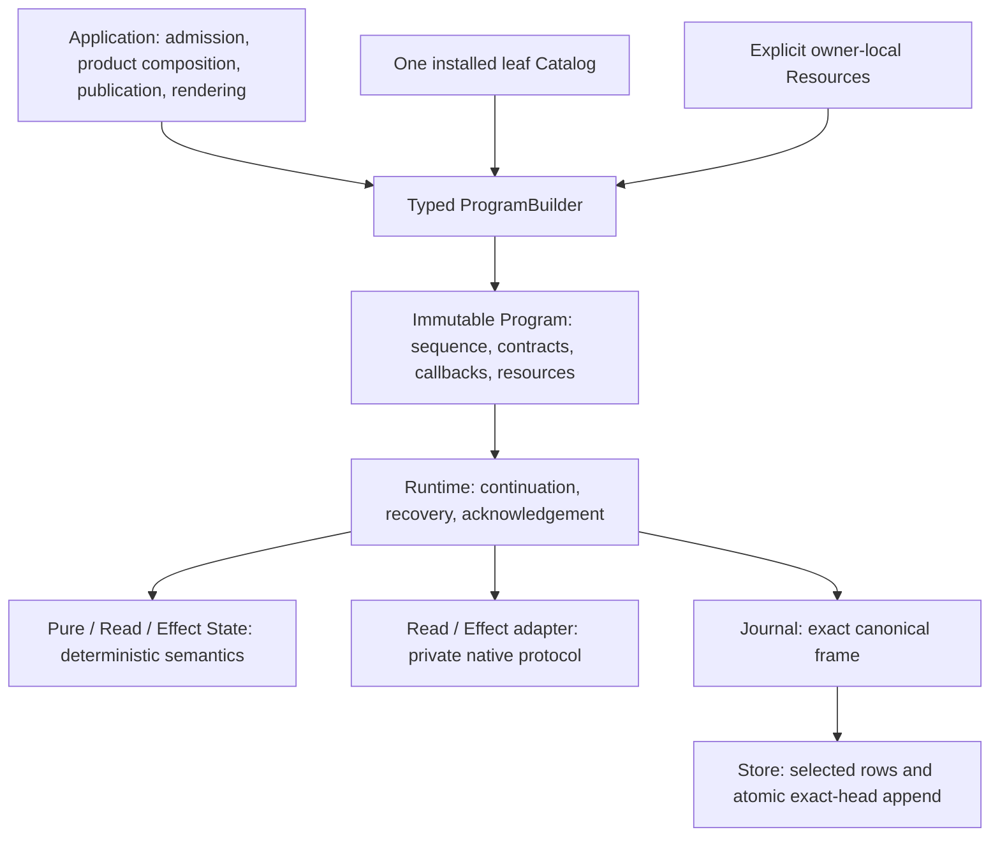
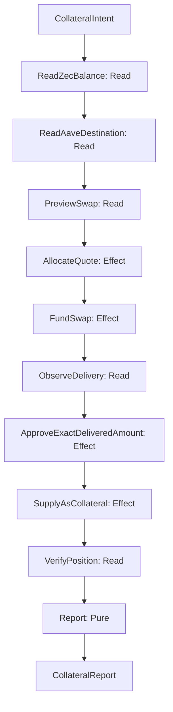

# RFC: simplify MFM around semantic execution boundaries

**Status:** proposed implementation of the agreed architectural direction.
**Reviewed baseline:** `f6d2afc568f59e6a733623e73022e66b476d5654`.
**Scope:** Program construction, State/adapter contracts, Portfolio Reads, EVM Effects,
execution observations, error custody, PostgreSQL persistence/configuration, and a concrete
ZEC→WBTC→Aave composition blueprint.

This RFC records the problems and one target design. It does not claim that the proposed behavior
is implemented. [docs/design.md](docs/design.md) remains the current contract until each coherent
implementation cutover updates it and its tests. [docs/architecture.md](docs/architecture.md) owns
placement; [docs/code-quality.md](docs/code-quality.md) owns cutover and quality rules.

The review used separate requirements, composition, execution, persistence, diagnostics, and Effect
architects, followed by an integrating architect. The collection-sized Read is the selected target;
batching the entire Portfolio into one Read was considered and rejected because collections already
define useful independent route, coherence, failure, and recovery boundaries.

The [core composition example](#7-core-example-zcash-to-ethereum-bitcoin-collateral-in-aave-v4)
reads a ZEC balance, exchanges ZEC through NEAR Intents for WBTC on Ethereum, and supplies it as
Aave v4 collateral. It tests implementation ownership and reuse through a concrete proposed
workflow. Its prospective live integrations are not claimed as current MFM functionality.

## 1. Decision

MFM should execute a linear sequence of meaningful domain transformations. It should not expose
every provider query, nonce reservation, signing preparation, or internal context handoff as a
generic State merely because those steps happen in order.

The target has five central decisions:

1. Construct Programs with ordinary Rust composition and a consuming typed builder. Publish
   installed leaf implementations once in one integration-owned Catalog. Delete source lowering,
   injection, default inheritance, and recursive discovery machinery.
2. Give Read and Effect States direct typed request/command and observation contracts. Keep native
   protocol orchestration inside adapters, with exact native receipt and operational-failure custody.
3. Observe one Portfolio collection per Read. Preserve asset identity and real denomination; remove
   fictitious monetary valuation and heterogeneous balance aggregation.
4. Execute one semantic transaction Effect. Retain nonce reservation and exact signed-wire custody
   as necessary private physical durability boundaries.
5. Use the current RunRecord, its qualified RunView, and exact Journal frames as the existing
   representations of execution facts. Delete FailureReport and Application mirrors. Reduce Store
   work and PostgreSQL checks to the facts required for its mechanical guarantees.

These changes intentionally break pre-release APIs and changed wire contracts. Every cutover replaces
all current producers, consumers, examples, fixtures, and documentation and physically removes the
superseded design. There is no legacy decoder, compatibility wrapper, history rewrite, or permanent
parallel implementation.

## 2. Requirements before mechanisms

The necessary system can be described without the current authoring machinery:

- A caller supplies one RunId, an exact immutable Program, and its checked initial input.
- The Program associates each occurrence with exact typed code, semantic revisions, public
  bindings, selected recovery policy, and explicit resources.
- Deterministic States transform admitted values. Reads observe external facts through explicit
  adapters. Effects act only after Runtime acknowledges their complete command.
- Runtime owns continuation, transitions, recovery, cancellation boundaries, and local safety checks.
- Exact original outcomes and their available causes are retained before recovery classification.
- Journal owns canonical opaque frame bytes and content identity. Store atomically appends those
  bytes against an exact head and mechanically loads the selected rows needed for qualification.
- Cold continuation qualifies the retained facts against the selected current contracts. Inspection
  does not require an available provider, signer, or source configuration.
- Domain and kernel libraries remain usable without the CLI or a live environment.

The following complexity is necessary and remains:

| Necessary boundary | Why it exists |
| --- | --- |
| Typed admission and selected decoders | Stored and external data are untrusted; construction invariants must survive decoding. |
| Program semantic identity | A continuation must not silently execute a different contract. |
| Command acknowledgement | External mutation needs a stable authorized identity before IO. |
| Exact signed-wire custody | A repeated transaction attempt must use the retained winner, not a newly signed candidate. |
| Settlement acknowledgement | Interpretation must not outrun the retained native outcome. |
| Exact-head atomic append | Competing writers cannot overwrite or splice acknowledged history. |
| Indeterminate acknowledgement | A connection failure cannot prove that COMMIT or another write did not happen. |
| Causal error custody | Public classification cannot replace the available original failure chain. |
| Explicit secret custody | Program, context, history, and diagnostics cannot become a deliberate secret transport. |

Reducing LOC is evidence of removing duplicated responsibilities. It is not permission to remove
these boundaries, weaken validation, compress readable code, or hide losses in a generic error.

## 3. Root problems

### 3.1 The generic execution model exposes protocol implementation details

An EVM balance observation currently expands into chain qualification, anchor selection, optional
token denomination observation, balance observation, confirmation, and caller handoff. A transaction
expands into reservation and preparation States around its designated semantic Effect.

The framework then needs a compiler to insert those stages, expanded endpoint contracts, generic
caller contexts to cross them, and reconstruction logic to explain their failures. Those mechanisms
compensate for an incorrectly chosen public boundary.

A State boundary is justified by independently meaningful continuation, recovery, authorization, or
domain outcome. A new RPC call is not sufficient justification. Private adapter steps can be
sequential and causally attributable without becoming generic public States.

Evidence: [native balance injection](crates/domains/evm/src/balance/native.rs),
[balance stages](crates/domains/evm/src/balance/stages.rs),
[transaction stages](crates/domains/evm/src/transaction/stages.rs), and
[Program construction](crates/kernel/program/src/construction.rs).

### 3.2 Source authoring became a second language

The current source model describes structure, traverses it, discovers families, plans expansions,
inherits defaults, resolves native families, and then associates the expanded declarations with
callbacks and resources. Rust already supplies composition, sequencing, loops, generic constraints,
and ownership.

The extra language is paying for protocol-stage injection and automatic recursive publication.
Once private protocols stop expanding the sequence, an ordinary typed builder can express the
required construction directly. Installed-code selection still needs an explicit owner, but it does
not need a runtime registry or another planning interpreter.

Evidence: [typed source machinery](crates/kernel/program/src/typed_source.rs),
[construction and association](crates/kernel/program/src/construction.rs), and
[native ABI](crates/kernel/program/src/native_abi.rs).

### 3.3 Product representations confuse numerical scale with units

Portfolio exposes USD/EUR quotes and collection totals without a price or FX observation contract.
Aligning decimal scales does not convert ETH, tokens, or other assets into a common currency.
Native EVM raw balances are returned unchanged, while surrounding scale choices can label them
incorrectly. The frozen snapshot contract even presents a native balance as a USD result.

For a concrete counterexample, adding one ETH to one unit of an unrelated token does not produce
two units of a meaningful portfolio asset. Changing both decimal representations cannot fix that.
Similarly, enrichment needs the predicate `required || raw_units != 0`; a nonzero token amount of
1500 raw units at denomination 3 need not fail because a target precision of zero cannot represent
1.5 exactly.

Evidence: [Portfolio QuoteCode and consolidation](crates/domains/portfolio/src/lib.rs),
[balance arithmetic](crates/domains/chain/src/balance/arithmetic.rs),
[enrichment](crates/domains/portfolio/src/enrichment.rs),
[native reads](crates/live/evm/src/json_rpc.rs), and
[snapshot fixture](docs/contracts/evm-portfolio/portfolio-snapshot.json).

### 3.4 Repeated representations create repeated validation and change sites

PolicyParams duplicates the checked canonical value container already owned by Object. Generic
balance contexts carry caller continuations through native protocol stages. Application recreates
originals, incidents, decisions, and pending failures already represented by Runtime. FailureReport
re-encodes terminal facts, hashes them again, and becomes another mandatory artifact.

Each extra representation needs constructors, conversion errors, schemas, validation, rendering,
tests, and documentation. Keeping wrappers over them would preserve the actual complexity.

Evidence: [PolicyParams](crates/kernel/program/src/recovery/bindings.rs),
[balance context](crates/domains/chain/src/balance/context.rs),
[terminal report](crates/kernel/runtime/src/report.rs),
[Application run views](crates/app/src/run_view.rs), and
[Application reporting](crates/app/src/reporting.rs).

### 3.5 Reporting can prevent execution from reaching its intended stop

FailureReport combines already-admitted facts into another bounded serialized object before the
terminal append. Its constructor explicitly permits report encoding to fail after the original
failure was acknowledged, leaving the run AwaitingRecovery. A presentation artifact therefore
controls execution liveness.

The terminal frame and retained originals already establish provenance. A renderer should consume
those facts after acknowledgement. It should not create another prerequisite for stopping.

This does not imply unlimited liveness: a real Object, frame, or cumulative history limit can still
prevent a necessary append. The proposal removes the additional report prerequisite, not physical
capacity constraints.

Evidence: [FailureReport construction](crates/kernel/runtime/src/report.rs) and
[Runtime sealing and failure progression](crates/kernel/runtime/src/engine.rs).

### 3.6 Mechanical persistence is overqualified while some outcome claims are underqualified

Store receives a privately qualified exact frame, yet append work repeats qualifications of old
bytes. PostgreSQL catalogue admission mirrors physical installation details that need not affect
atomicity, such as exact index definitions or default tablespace choices. Meanwhile, treating every
database-shaped COMMIT error as definite noncommit lacks an established protocol proof.

The imbalance is architectural: effort is spent reproducing a physical template rather than
precisely defining the authority and evidence needed at the transaction boundary.

Configuration listing is unbounded. Import uses conflict avoidance followed by another observation
that can race with deletion. Run/configuration use cases also inherit live EVM composition even
when their work requires only persistence.

Evidence: [PostgreSQL catalogue checks](crates/storages/postgres/src/catalog.rs),
[run append and COMMIT handling](crates/storages/postgres/src/lib.rs),
[configuration queries](crates/storages/postgres/src/config.rs), and
[Application bootstrap](crates/app/src/lib.rs).

### 3.7 Error handling sometimes confuses classification, rendering, and custody

A public Internal or Unavailable classification is useful, but it cannot replace the underlying
causes. Reconstructing classifiable originals from presentation JSON, retrying a failed original
serializer, or returning a success-shaped fallback view creates another source of truth.

The live HTTP owner also accepts locator paths and queries that may contain credentials. The pinned
reqwest error can include its request URL; capturing its Display text can deliberately carry that
owner-known private field into retained originals and public output. Ordinary userinfo is handled
differently by reqwest, so this finding is specifically about retained URL path/query fields, not a
claim that every username/password URL is printed.

Evidence: [HTTP locator and send boundary](crates/live/evm/src/json_rpc.rs),
[HTTP diagnostic capture](crates/live/evm/src/json_rpc/capture.rs),
[Application reporting](crates/app/src/reporting.rs), and the pinned dependency in
[Cargo.lock](Cargo.lock).

## 4. Target ownership



The diagram describes ownership and use, not permission for domains to import live composition.
Existing crate boundaries remain. In particular:

| Owner | Target responsibility |
| --- | --- |
| Values / IDs / Canonical | Checked identities, canonical Object, descriptors, shared value validation and diagnostic data. |
| Capabilities | Typed adapter ports, checked public bindings, native receipts, operational faults, Pending/Settled. |
| Program | Typed builder, leaf descriptors, installed association, State contracts, pure callback containment. |
| Runtime | Current facts, deterministic transitions, acknowledgement ordering, recovery and local safety. |
| Journal | Opaque exact canonical frame wire and hash. |
| Store | Selected-row loading and physical exact-head all-or-nothing append. |
| Chain | Nongeneric collection intent, holdings, ledger, and observation-point contracts. |
| EVM domain | EVM native qualification, request/command semantics, receipts, deterministic projection. |
| Live EVM | Explicit provider/signer/authority handles, private protocol IO, wire codecs. |
| Portfolio | Checked progress, collection selection, snapshot and enrichment projection. |
| Application | Product configuration/admission, composition, publication, pure public views. |
| Binaries | Supported transport parsing and rendering of one Application surface. |

Move Portfolio-specific client/configuration composition out of Live EVM into Application. Live EVM
must not need the Portfolio domain to implement an EVM collection adapter. Transports and signers
remain reusable platform primitives. Keystore remains thread-affine; this RFC does not make it Send
or Sync.

### 4.1 Integration growth and execution scale are separate requirements

Supporting many chains and application protocols means growing installed semantic implementations,
network bindings, and product composition. Running many requests means controlling concurrency,
provider pressure, signing/custody capacity, and physical history growth. The proposed design must
address the first without pretending it has already solved the second.

The scaling objective is locality: adding a supported integration changes its owning implementation,
composition entry, and consuming tests. It does not add branches to Runtime, Journal, Store,
Program's generic association algorithm, or every existing product. Necessary implementation code
grows with genuinely distinct supported semantics. It must not grow with every combination of
network, endpoint, account, asset, policy, and operation instance.

### 4.2 Distinguish protocol semantics from deployed instances

| Addition | Representation / owner | Required framework change |
| --- | --- | --- |
| Another network satisfying an installed protocol contract | Checked ledger identity, network facts, public bindings, and explicit owner resources | None; validate the supported behavior and binding. |
| Another endpoint, account, asset, or deployed protocol address | Checked request/configuration data | None; qualify it through the selected owner. |
| A genuinely different ledger or transaction protocol | Native domain contracts, codecs, adapter orchestration, and authority where required | Install actual typed semantic leaves; keep the generic execution and persistence algorithms unchanged. |
| Another application protocol with different business meaning | Its domain values/States and selected adapters; ordinary Rust Operations compose them | Add its semantics locally; reuse existing platform primitives where their contracts match. |
| Another transport for an already-supported contract | Reusable transport primitives and its selected native owner | No new business State merely because HTTP, WebSocket, or another wire path changes. |
| Another retry policy or configured allowance | Selected handler contract and parameter Object, or policy instance data | Publish new handler code only when behavior changes; do not register each parameter instance. |

For example, deploying a compatible EVM integration on another admitted network should not create
another State family or duplicate balance adapter implementation. A newly supported application
protocol may need its own receipt decoder and meaningful business operation while reusing the EVM
transport and transaction primitives. Neither the network name nor a deployed address justifies
another generic execution layer.

Compatibility is an admitted contract, not an inference from an EVM label or shared RPC spelling.
Different units, selectors, transaction authority, or evidence semantics require explicit support
or rejection. No default capability flags or silent fallbacks manufacture equivalent behavior.

### 4.3 One Catalog, with contributions owned by integrations

Make Catalog nongeneric. Integration modules contribute exact typed factories to the one immutable
Catalog through ordinary Rust composition. Typed installation fixes the selected State, adapter,
binding, native receipt, operational fault, and resource-owner contracts. Erasure occurs privately
at that installation boundary so the Catalog need not carry a giant tuple of all protocol types.

Each integration owns its factory definitions and native validators. Application selects the
installed integration modules at one composition root. Installed-component inspection derives from
those same entries. There is no second component manifest, global protocol enum, recursive source
inventory, ambient plugin discovery, or mutable Runtime registration.

Only actual supported State/adapter semantic pairings are installed. Do not enumerate a Cartesian
product of all States and adapters. Networks, endpoint names, addresses, assets, and policy instances
do not create factory entries. Multiple bindings use the same factory after exact qualification.

The resulting growth is approximately the sum of actual installed semantic leaves plus explicit
binding data. This is an ownership/representation objective, not a measured compile-time bound.
Compilation and binary size still include the selected typed implementations; optional deployment
composition can select a smaller installed subset without runtime code loading.

### 4.4 Explicit resources remain local to their native owners

Keep each integration's typed resource table separate from Catalog. For example, EvmResources loses
its Sources phantom and stores checked EVM bindings and handles only. Another protocol owns another
resource-table type; kernel code does not add a field or enum variant for it.

Program association passes explicit tables through private in-process owner slots. A factory's
typed binder retrieves only its own table using checked type/owner association. Missing or mismatched
tables fail with their available cause. Rust type identity is never persisted or used as semantic
identity, and this mechanism adds no universal Any/JSON execution interface.

Pure Catalog installation, metadata inspection, and observation qualification require no live
resource construction. Executable attachment requires only the tables selected by the complete
Program, after all declarations qualify. Installed but unselected integrations do not require
credentials, providers, or signer handles.

Resources retain their existing explicit authority and secret custody. Public bindings identify
supported routes and contracts; private locators and credentials remain with resource owners.
Private resource erasure cannot make Keystore Send/Sync or distribute its key custody. Runtime
receives the bound Program, not Catalog or an owner-resource lookup service.

### 4.5 Share business contracts, preserve native differences

A common CollectionRequest and ObservedHoldings contract is appropriate for integrations that
actually observe the same holding semantics. One CollectHoldings State can use different selected
typed adapter leaves while its Input/Output remain PortfolioProgress. A complete Program may
therefore alternate installed protocols without changing the Runtime or adding a generic caller K.

Native receipts remain exact owner-specific MfmValue types. They enter history as checked Objects
and are decoded/projected only by the selected factory. Existing LedgerIdentity, BalanceTarget,
and ObservationPoint envelopes carry native Objects; they do not certify a native schema or
cross-field correspondence by themselves. Owner validation remains mandatory at admission, use,
and cold qualification where the selected contract requires it.

Do not create a central Ledger enum or switch over all chains to decode these Objects. Do not
promote an EVM address layout, numeric chain ID, denomination, block hash, nonce, or fee model into
a universal blockchain contract. Retained identity includes its exact native schema/namespace and
ledger facts; a short numeric identifier alone is not cross-protocol identity.

The current [EVM balance ledger](crates/domains/evm/src/balance.rs) qualifies chain ID only and
explicitly does not observe genesis.
Do not advertise it as stronger network-instance identity. In the collection cutover, reuse the
existing [EvmChainInstance vocabulary](crates/domains/evm/src/transaction.rs) (chain ID and expected
genesis hash) for EVM ledger/binding
qualification instead of inventing another fingerprint type. The expected identity comes from
admitted public input or explicit trusted operator configuration; learning it from the same queried
endpoint would not provide an independent expectation. Authenticate the selected supported identity
externally and update all binding/request/receipt/configuration contracts and rejection fixtures
together. This distinguishes the supported identity facts; it does not authenticate every possible
fork or network history beyond those facts.

Shared quantity bounds such as Unsigned256 and DecimalScale remain explicit supported-product
limits, not proof that every future protocol fits them. Reject unsupported values honestly; extend
the representation only when an actual consuming requirement justifies it. Never truncate or
reinterpret a native value merely to fit the shared contract.

A protocol position, nonfungible object, cross-ledger transfer, or other different business result
need not pretend to be a fungible holding. Give genuinely different semantics their own typed
values and meaningful States. Unify a contract only when its units, identity, evidence, and recovery
meaning match; using the same transport is insufficient.

### 4.6 Coherence and authority do not become global

One collection groups a ledger, route, selected protocol contract, and coherence policy. It is not
every source on a named chain or every application protocol using that provider. Different evidence
requirements may require different collections even when ledger and endpoint coincide.

An EVM anchored receipt supplies that selected EVM guarantee. Another protocol supplies its own
explicit supported observation guarantee. Portfolio retains the per-collection observation points
and policies; it cannot claim one simultaneous global snapshot merely because all collections
appear in one output.

Likewise, the one-Effect rule means one semantic externally authorized action, not every operation
of an arbitrary cross-chain workflow. Independently authorized, irreversible actions on different
ledgers require meaningful durable continuation boundaries. A bridge-like workflow must not be
hidden inside one generic transaction adapter with an invented atomic success/failure promise.
Cross-ledger recovery or compensation requires its own reviewed domain contract.

### 4.7 Honest operational limits

Independent runs can execute concurrently through explicit authorized resources while Store
preserves exact-head atomicity for each RunId. Worker placement, provider quotas/backpressure,
fairness, and distributed custody are deployment/application requirements, not implicit Runtime
features. Scaling Effect workers also requires their actual retained authority and signer contract;
the existing ephemeral-keystore fixture does not establish distributed production signing.

A Program remains linear. The current Portfolio admission ceiling of 64 sources and EVM resource
ceiling of 256 bindings are bounds on one admitted product/environment, not counts of all networks
the software can support. Keep support breadth separate from how many resources a worker or one
run must hold. Do not raise those limits as a substitute for a workload model.

Full inline continuation snapshots have a real cost. If a run retains a progress value proportional
to n collections/sources across a number of acknowledged transitions proportional to n, its
history can grow quadratically in those counts. Removing nested K and dense zero counters does not
remove that snapshot tradeoff. This is a conditional representation analysis, not a benchmark.

For a product needing thousands of independent observations, evaluate bounded independent runs
and Application-owned result aggregation with explicit RunId/head/output provenance, completeness,
freshness, and failure rules. Do not silently split a run that requires shared sequential authority.
If the real requirement is parallel work or huge continuation within one durable run, the linear
Program/inline-record design needs a separate reviewed change. This RFC supplies neither a DAG
executor nor an object store, and makes no throughput or simultaneous-snapshot guarantee.

### 4.8 Integration growth acceptance

The construction cutover must include consuming evidence beyond another EVM binding:

1. Reuse one installed adapter on two different network bindings without adding a second factory.
2. Contribute a second, genuinely different protocol adapter through its owning module and compose
   it with the first using the same actual holding contract; Runtime, Journal, Store, and generic
   association need no protocol branch.
3. Preserve distinct native receipts, identities, and causal errors through hot/cold observations;
   reject a receipt, binding, or resource table from the wrong owner.
4. Select different bindings and policy instances without duplicating installation. Reject duplicate
   or conflicting intrinsic factory claims before any live resource attachment.
5. Construct and inspect a Program with an unselected integration's resources absent, and inspect
   retained facts with every live table absent. Missing selected resources still block execution.
6. Demonstrate differing business semantics require an explicit typed State rather than accidental
   coercion into holdings. Independent collection points remain visible in the final result.
7. Measure provider calls, attachment work, frame/history bytes, and cold restoration for defined
   workloads at current bounds. Exercise independent concurrent runs and retained custody; a
   successful multi-network output proves neither simultaneous observation nor atomic mutation.

Use a minimal structurally different consuming integration where a live second protocol is not yet
supported. Such a test proves framework extensibility and owner isolation; it does not certify a
production chain implementation. Add real protocol interoperability evidence only when supporting
that protocol becomes an implementation requirement.

## 5. Ordinary typed Program construction

### 5.1 Builder contract

Use a consuming `ProgramBuilder<Current>`. Current is the output contract of the built prefix.
Each append consumes the builder, requires the new State input to equal Current, and returns a
builder whose Current is that State's output. The builder retains the mandatory admitted initial
contract and exact input commitment internally; finish includes them in the immutable Program.
An additional public Root parameter supplies no adjacency proof and is removed.

The following is schematic API notation, not a second configurable language or a claim that these
signatures already compile:

```text
pure::<S>(recovery)                 where S::Input = Current
read::<S>(leaf, binding, recovery)  where S::Input = Current
effect::<S>(leaf, binding, recovery) where S::Input = Current

each returns ProgramBuilder<S::Output>
```

Operations are ordinary Rust functions that accept and return an appropriately typed builder.
Repeated endomorphic States use ordinary loops. Explicit recovery values replace nested default
inheritance. Checkpoints use checked builder-created handles; finish validates their positions,
contracts, and static declaration constraints. Runtime checks acknowledged Effect barriers when
authorizing recovery: those barriers are dynamic execution facts, not builder authority. There is
no authoring-depth concept once authoring is ordinary Rust composition.

The final immutable Program remains a complete linear State sequence, including exact initial
commitment, descriptors, selected policies, bindings, callbacks, and explicit resource associations.
Runtime receives that complete Program and performs no assembly, discovery, or code registration.

Read takes a checked ReadLeaf<S> selected from Catalog; Effect takes the analogous EffectLeaf<S>.
Typed factory installation fixes the adapter contract, and selection verifies the exact State owner
and semantic ABI. The builder accepts a checked canonical binding Object that the selected native
Binding codec qualifies during whole-document association. There is one public append path per
mode; do not retain a parallel static-adapter append API as a convenience.

For config-driven collections, Application obtains a ReadLeaf<CollectHoldings> from the exact
installed leaf reference and builds the endomorphic sequence with an ordinary loop. It does not
need a global match naming every concrete adapter type. This is checked construction-time selection;
Runtime still invokes only already-associated callbacks.

### 5.2 One installed Catalog

One immutable nongeneric Catalog publishes typed leaf factories and selected handler factories.
Integration-owned contributions and explicit owner-local Resources follow section 4. Fresh
construction and cold loading use the same association owner. A new semantic implementation is
published once; selecting installed components or composing another Operation does not require
publishing another structural source family.

Schematic installation is `register_read::<S, A, R>(owner_binder)` and its Effect counterpart, where
R is the native owner's typed resource table. It checks intrinsic ownership and contracts before
privately erasing A/R. `select_read::<S>(exact_leaf_ref)` returns ReadLeaf<S> only for the installed
matching State ABI. The exact leaf reference identifies the intrinsic executable contract, not
each occurrence's binding or recovery-policy value. No opaque live original or executable callback
is serialized as part of selection.

Catalog lookup uses the intrinsic executable contract: mode, semantic revisions, and selected value
and binding contract schemas. Per-occurrence binding Objects, recovery selections, and parameter
instances are committed declaration facts validated against that contract, not additional factory
registration keys. Handler factories qualify through the same Catalog using their intrinsic
contracts; arbitrary binding/policy combinations do not require new publication.

The Catalog is not a Runtime registry or cache. It does not execute providers, hold a mutable
plugin lifecycle, or discover ambient resources. Program owns the associated executable occurrences
after construction.

Association has two ordered phases:

1. Qualify the complete document: descriptors, semantic revisions, value contracts, adjacency,
   parameter Objects, public bindings, selected handlers, checkpoints, and limits.
2. Attach the selected explicit resources and construct callbacks only after every declaration
   passes the first phase.

Construction and loading perform no provider IO. Missing code, revisions, or resources fail with
their available cause and context; they never silently select a fallback implementation.

Installed-component inspection derives leaf metadata from this same Catalog. Application owns its
entry-point descriptions; inspection does not plan a Program or require live handles. Do not replace
recursive discovery with another duplicate registration table for the same leaf facts.

### 5.3 Deletions

Delete `AuthoringSource`, `Plan`, `Walk`, `Discover`, `OperationDefinition`, the Operation wrapper and
default machinery, `Inherit`, `OperationDefaults`, `ResolveDefaults`, `PolicyValues`, family
`Resolve*` traits, `InjectRead`, `InjectEffect`, expanded endpoints, tuple-family authoring, recursive
source traversal, and source-depth enforcement.

Delete obsolete authoring examples and tests in the same cutover. Retain consumer composition,
extension, cold association, wrong-owner rejection, and compile-fail adjacency guarantees through
the new public API.

## 6. Direct State and adapter contracts

### 6.1 State semantics

`State` continues to own Input, Output, and its domain Failure. Pure evaluation remains deterministic.
A Read State declares Request and Observation; an Effect State declares Command and Observation.
Preparation derives the request/command once within an invocation. Interpretation receives that
already-prepared value and the qualified observation, rather than calling preparation again. This
does not remove necessary pure cold validation against an acknowledged command.

State evaluation, preparation, receipt projection, and interpretation perform no ambient IO.
Callback boundaries retain panic containment, selected decoding/encoding rejection, and the actual
Decode/Execute/Encode and Bind/Interpret provenance. Classifiable domain failures remain distinct
from internal invocation failures.

### 6.2 Adapter semantics

Capabilities owns direct `ReadAdapter<Request, Observation>` and
`EffectAdapter<Command, Observation>` contracts. Their selected implementations provide:

- A checked public Binding and an author-maintained semantic revision.
- The exact native Receipt and declared operational Fault, each an admitted MfmValue.
- Async invocation through explicitly supplied resources.
- Pure native receipt qualification and typed observation projection.
- For Effects, a pure complete command/binding check before command acknowledgement and IO.

Program requires selected operational Faults to implement ClassifyError. Capabilities does not
acquire a dependency on Program to express classification.

Operational Fault and internal InvocationDiagnostic are separate alternatives. Missing execution
invariants, codec errors, or local mismatch must not be manufactured into a recoverable external
incident just to obtain an append.

The exact native receipt remains the admitted canonical original. Decode and qualify it once at the
selected boundary, and pass the typed observation within that invocation. Do not persist another
projected observation Object. Effect settlement still separates durable receipt acknowledgement
from interpretation, so cold interpretation rematerializes the retained receipt as required.

Private HTTP requests need no framework-level ABI. Native command references that transaction
authority actually consumes remain: removing generic NativeAbi is not permission to erase custody
identity or necessary native command materialization.

### 6.3 One complete leaf descriptor

Delete capability-marker/binder identity types, `ReadImplementation`, `EffectImplementation`, and
the generic framework `NativeAbi`. Use one complete selected leaf descriptor committing to:

- Execution mode and State/adapter semantic revisions.
- Actual Input, Output, domain Failure, Request or Command, Observation, Receipt, operational
  Fault, Binding, and selected handler/parameter contracts.
- Public binding facts and exact recovery selection needed for that occurrence.

Catalog selection keys the intrinsic executable contract. The complete Program declaration commits
the selected leaf plus occurrence bindings, recovery, handler selection, and parameter values.
Handler factories qualify by their own intrinsic contracts in the same Catalog. Reusing a leaf
with another policy or binding does not create another installed executable identity.

Descriptors describe contracts; they do not authenticate executable machine bytes. Decoder, binder,
handler, projection, or adapter changes that alter semantics require a reviewed revision change.
This RFC does not add reproducible-build attestation or pretend a StableId proves byte identity.

## 7. Core example: Zcash to Ethereum Bitcoin collateral in Aave v4

Use this example as the consuming architecture test for the RFC: read a transparent Zcash wallet's
spendable balance, exchange a caller-selected amount of ZEC through NEAR Intents for WBTC delivered
to Ethereum, and supply that WBTC as collateral in a selected Aave v4 Spoke. There is no borrowing
step. The implementation must make protocol integration reusable without pretending the whole
journey is atomic or that all protocols share one transaction model.

Everything below is a proposed implementation sketch. The Rust names and signatures illustrate the
target contracts; they are not currently compiled APIs or evidence of a working production route.
Existing crate boundaries remain. Directory names show responsibility placement, not a requirement
to create a crate for every module. Live integrations need their own reviewed contracts and tests
before enablement.

### 7.1 Admit the actual assets and route

Native BTC belongs to Bitcoin. Ethereum collateral must be a specific supported representation of
Bitcoin; this example chooses WBTC. Changing to cbBTC changes the admitted token and its associated
qualification, rather than renaming an undifferentiated `BTC` value.

The public NEAR Intents token inventory reviewed for this RFC contains these distinct asset IDs:

| Meaning | NEAR Intents asset ID | Native base units |
| --- | --- | --- |
| Source ZEC | `nep141:zec.omft.near` | Zatoshis; 8 decimal places |
| Bitcoin-chain BTC, excluded from this route | `nep141:btc.omft.near` | Satoshis; 8 decimal places |
| Destination Ethereum WBTC | `nep141:eth-0x2260fac5e5542a773aa44fbcfedf7c193bc2c599.omft.near` | WBTC token units; 8 decimal places |

Inventory presence does not prove that a ZEC/WBTC quote is available or that a chosen Aave reserve
admits WBTC. Validate the actual route and deployment. NEAR's documented Zcash receiving surface
uses transparent addresses; this example selects transparent wallet funding explicitly. Shielded
funding would require a separately reviewed wallet authority contract. Sources:
[supported tokens](https://docs.near-intents.org/api-reference/oneclick/get-supported-tokens),
[token inventory](https://1click.chaindefuser.com/v0/tokens), and
[supported chains](https://docs.near-intents.org/resources/chain-support).

Public intent fixes the source network/account reference, positive ZEC input amount, maximum source
fee, minimum delivered WBTC, maximum collateral amount, absolute time bounds, refund address,
Ethereum instance, recipient, WBTC contract, and selected Spoke/reserve. It also authorizes the
specified Ethereum gas bounds and the possible partial result of owning delivered WBTC before
collateral supply succeeds. Wallet keys, viewing keys, signer handles, RPC credentials, and private
locators remain explicit resources outside the intent and Program.

Supply and enabling collateral are distinct Aave calls. For the direct owner path, the selected
Spoke's multicall can combine `supply(reserveId, amount, owner)` and
`setUsingAsCollateral(reserveId, true, owner)` into one Ethereum transaction. ERC-20 allowance is
granted to that Spoke, which pulls the underlying asset. Use the on-chain reserve ID, not an opaque
API identifier. These are upstream source facts, not proof of an admitted deployed revision:
[reserves](https://www.aave.com/docs/aave-v4/liquidity/reserves),
[Spoke](https://github.com/aave/aave-v4/blob/main/src/spoke/Spoke.sol), and
[multicall](https://github.com/aave/aave-v4/blob/main/src/utils/Multicall.sol).

### 7.2 Organize by semantic owner, not network/protocol combinations

```text
crates/
  kernel/                    unchanged generic execution and persistence algorithms
  domains/
    evm/                     EVM identity, anchored requests, transaction commands
    zcash/                   transparent account, zatoshis, funding contracts
    near_intents/            asset IDs, quote requests/tickets, delivery contracts
    aave_v4/                 ABI recipes, reserve/position qualification
    collateral/              concrete workflow phases and ten business States
  live/
    evm/                     existing reusable EVM reads and transaction custody
    zcash/                   wallet observations and exact funding custody
    near_intents/            quote/status IO and selected delivery qualification
  app/
    src/operations/zec_to_aave.rs   ordinary Rust composition
    src/integrations/              selected typed leaf contributions
```

Protocol domains own checked native request/command/observation values. The collateral domain uses
those contracts and pure helpers, but does not import live adapters, Runtime, or Store. Live owners
bind native intent to explicit resources; they do not accept `CollateralIntent` or a workflow phase.
Application imports the selected domains and live owners at its composition boundary. Transports
and signers retain their reusable platform ownership.

There is no `ZcashToNearToEthereumToAaveAdapter`, `AaveLive` provider wrapper, chain-wide protocol enum,
or protocol-specific Runtime branch. Aave's domain helpers encode calls and qualify EVM evidence;
the existing EVM adapter executes them. The NEAR Intents Ethereum-delivery adapter privately combines
its selected service contract with explicit reusable EVM observation capabilities. Supporting a new
destination family can require another delivery adapter; another WBTC address or compatible EVM
network does not require one by itself.

Application wiring knows which concrete State/adapter pairs it installs. Native protocol modules do
not import the collateral workflow just to register it. Their contracts and binders remain reusable
by other Operations; integration wiring contributes the actual pairs to the same Catalog.

### 7.3 Use concrete phase values with bounded downstream facts

The phase types describe the business facts established so far. They are not generic caller-context
wrappers, parent-phase nesting, or separate stored copies of projected observations. Each transition
keeps only facts required by later preparation, interpretation, reporting, or cold qualification.
Native receipts retain their separate exact-original contract from section 6.

The following abbreviated declarations omit value metadata and checked constructors. Fields are
private; direct construction and decoding must establish the actual cross-field invariants.
`EthereumDestination` includes the reviewed token, Spoke/reserve, deployment expectations, owner,
collateral bounds, and transaction authorizations. It is a downstream plan, not the entire root input.

```rust
// domains/collateral: concrete business values, no live handles
struct CollateralIntent {
    source: TransparentZcashAccount,
    input: Zatoshis,
    max_source_fee: Zatoshis,
    swap_limits: SwapLimits,
    destination: EthereumDestination,
}

struct SourceChecked {
    source: TransparentZcashAccount,
    input: Zatoshis,
    max_source_fee: Zatoshis,
    source_point: ZcashObservationPoint,
    swap_limits: SwapLimits,
    destination: EthereumDestination,
}

// DestinationChecked and PreviewChecked carry the checked downstream request
// and bounds. Neither contains SourceChecked or the complete root input.

struct FundableSwap {
    ticket: CheckedQuoteTicket,
    source: TransparentZcashAccount,
    funding_destination: ZcashPaymentDestination,
    funding_window: ZcashFundingWindow,
    input: Zatoshis,
    max_source_fee: Zatoshis,
    destination: EthereumDestination,
}

struct FundedSwap {
    ticket: CheckedQuoteTicket,
    funding: ZcashFundingProvenance,
    funding_audit: EffectAuditRefs,
    destination: EthereumDestination,
}

// Local audit links; no native source schema or decoder.
struct EffectAuditRefs {
    effect_id: EffectId,
    command_ref: ContentRef,
    settlement_ref: ContentRef,
}

struct DeliveredCollateral {
    destination: EthereumDestination,
    amount: WbtcUnits,
    funding: EffectAuditRefs,
    delivery: EthereumDeliveryProvenance,
}

// ApprovedCollateral additionally establishes the acknowledged exact approval.
// SuppliedCollateral additionally establishes the acknowledged supply multicall.
// VerifiedCollateral retains qualified position facts and final observation point.

struct CollateralReport {
    ledger: EvmChainInstance,
    owner: EvmAddress,
    token: EvmAddress,
    spoke: EvmAddress,
    reserve: AaveReserveId,
    supplied: WbtcUnits,
    minted_supply_shares: AaveSupplyShares,
    observed_supply_shares: AaveSupplyShares,
    collateral_enabled: bool,
    position_point: EvmObservationPoint,
    funding: EffectAuditRefs,
    delivery: EthereumDeliveryProvenance,
    supply: EthereumTransactionProvenance,
}
```

Do not put preview amounts, whole wallet balances, or completed source preflight details into every
later phase. Funding must requalify current spendability within its own retained authority. Quote
and delivery facts needed to qualify the current continuation stay inline in that continuation;
historical IDs provide provenance, not an implicit resolver for missing data. No runtime phase flag,
optional-field bag, generic `K`, or replay of the complete history is introduced.

Allocation interpretation establishes the Zcash-owned destination/window facts and their exact
correspondence to the accepted ticket. Cold qualification checks that correspondence too. A NEAR
ticket does not become an argument to a Zcash domain helper. Likewise, the downstream destination
contains an Aave-owned target and EVM-owned transaction bounds; workflow types do not become native
protocol APIs.

The delivery boundary deliberately ends the source dependency. `ObserveDelivery::interpret` still
has `FundedSwap` when it qualifies the winning ticket, native funding, service attribution, and
Ethereum payout. It then admits `DeliveredCollateral`, dropping Zcash-specific funding semantics.
The Ethereum collateral suffix consumes actual delivered WBTC and never decodes Zcash. Another
source prefix may construct this same contract when it establishes equivalent delivery guarantees.

`FundSwap` interpretation establishes the audit links after settlement acknowledgement. Its
qualified observation receives the existing boundary's known EffectId and exact admitted command
and native settlement Object references, preserving their correspondence without another encoding
pass or an ambient Runtime argument. `settlement_ref` names the native Object, not a Journal frame
or an acknowledgement certificate. The links provide provenance, not standalone proof of funding.
Cold qualification checks their forms and available correspondence, along with the inline
delivery/destination/amount/evidence facts. It neither dereferences them nor claims to re-prove
historical source acknowledgement. Source-native details remain in their exact retained original;
no generic native-source envelope or reference-loading service is introduced.

### 7.4 Make business boundaries the States



| State | Input → Output | Native boundary and established business fact |
| --- | --- | --- |
| `ReadZecBalance` | `CollateralIntent` → `SourceChecked` | A Zcash balance request establishes supported spendable units, source identity/point, and input/fee headroom. It does not reserve spend authority. |
| `ReadAaveDestination` | `SourceChecked` → `DestinationChecked` | Anchored EVM requests qualify the exact destination, reserve eligibility/capacity, recipient authority, and gas readiness before source funding. |
| `PreviewSwap` | `DestinationChecked` → `PreviewChecked` | A duplicate-safe dry quote qualifies route feasibility and caller bounds without allocating funding instructions. |
| `AllocateQuote` | `PreviewChecked` → `FundableSwap` | A live quote allocation yields one acknowledged, qualified funding ticket matching the authorized route. |
| `FundSwap` | `FundableSwap` → `FundedSwap` | A Zcash payment command establishes retained exact funding authority and its acknowledged native result. |
| `ObserveDelivery` | `FundedSwap` → `DeliveredCollateral` | Service status plus qualified Ethereum evidence attributes actual WBTC delivery to this ticket/funding. |
| `ApproveExactDeliveredAmount` | `DeliveredCollateral` → `ApprovedCollateral` | An EVM transaction authorizes the selected Spoke for the actual bounded delivery amount. |
| `SupplyAsCollateral` | `ApprovedCollateral` → `SuppliedCollateral` | One EVM transaction supplies that amount and enables it as collateral through the selected Spoke. |
| `VerifyPosition` | `SuppliedCollateral` → `VerifiedCollateral` | Anchored EVM evidence qualifies actual supply shares, collateral flag, and selected owner/reserve position. |
| `Report` | `VerifiedCollateral` → `CollateralReport` | Pure domain projection reports supplied units, shares, evidence points, and action provenance. |

Validation belongs in checked constructors, deterministic State preparation/interpretation, and
native qualification. There are no extra `Initialize`, `Validate`, `Prepare`, `ReserveNonce`,
`Sign`, `Submit`, or handoff States. A State exists when it establishes meaningful domain progress
or a separately authorized action, rather than because one implementation has another RPC call.

Destination preflight is a qualified observation, not a lock on a future market. Later destination
failure can leave WBTC in the recipient wallet. The caller must authorize that exposure before ZEC
funding. Reporting must distinguish delivered assets from a verified collateral position.

### 7.5 Operations are ordinary Rust functions

The selected handles below are a local composition value obtained from the installed Catalog. They
are not another inventory of component metadata. Bindings are checked canonical Objects; recovery
values explicitly select installed handlers and their parameters. Names abbreviate those values.

```rust
// app/src/operations/zec_to_aave.rs -- proposed API sketch
fn swap_zec_to_wbtc(
    b: ProgramBuilder<CollateralIntent>,
    s: &SelectedWorkflow,
) -> Result<ProgramBuilder<DeliveredCollateral>, BuildError> {
    b.read::<ReadZecBalance>(
        &s.zec_balance, &s.bindings.zcash, &s.recovery.source_read,
    )?
    .read::<ReadAaveDestination>(
        &s.aave_destination, &s.bindings.ethereum, &s.recovery.destination_read,
    )?
    .read::<PreviewSwap>(
        &s.preview, &s.bindings.intents, &s.recovery.preview_read,
    )?
    .effect::<AllocateQuote>(
        &s.allocate, &s.bindings.intents, &s.recovery.quote_allocation,
    )?
    .effect::<FundSwap>(
        &s.fund, &s.bindings.zcash, &s.recovery.source_funding,
    )?
    .read::<ObserveDelivery>(
        &s.delivery, &s.bindings.intents_ethereum, &s.recovery.delivery_read,
    )
}

fn add_wbtc_as_collateral(
    b: ProgramBuilder<DeliveredCollateral>,
    s: &SelectedWorkflow,
) -> Result<ProgramBuilder<VerifiedCollateral>, BuildError> {
    b.effect::<ApproveExactDeliveredAmount>(
        &s.approve, &s.bindings.ethereum, &s.recovery.approval,
    )?
    .effect::<SupplyAsCollateral>(
        &s.supply, &s.bindings.ethereum, &s.recovery.supply,
    )?
    .read::<VerifyPosition>(
        &s.position, &s.bindings.ethereum, &s.recovery.position_read,
    )
}

fn zec_to_aave(
    intent: CollateralIntent,
    s: &SelectedWorkflow,
    catalog: &Catalog,
    resources: &ExplicitOwnerResources,
) -> Result<Program, BuildError> {
    let b = ProgramBuilder::new(intent)?;
    let b = swap_zec_to_wbtc(b, s)?;
    let b = add_wbtc_as_collateral(b, s)?;
    b.pure::<Report>(&s.recovery.report)?.finish(catalog, resources)
}
```

For example, `s.fund` is `EffectLeaf<FundSwap>` and `s.delivery` is
`ReadLeaf<ObserveDelivery>`. Passing `ProgramBuilder<FundedSwap>` to `add_wbtc_as_collateral` fails
the adjacency contract: deposited ZEC is not proven WBTC delivery. Selecting the wrong State leaf
or binding fails Catalog selection/document qualification before resource attachment or provider IO.

`ExplicitOwnerResources` abbreviates the existing proposed owner-slot assembly from section 4.4;
it is not a universal blockchain execution port. `finish` qualifies the complete declarations first,
then attaches only selected resource tables. Runtime receives the complete resulting Program.
The two Operations need no `OperationDefinition`, structural registration, lowering, or wrapper.

Application starts that Program under one explicit caller RunId with the admitted initial input
matching its commitment. Runtime alone advances the continuation through acknowledged frames.
Application observes its qualified RunView for completion, waiting/recovery stops, failures, and
retained partial financial facts. Neither an Operation nor an adapter schedules the next State.

### 7.6 Install exact leaves once; reuse native adapters

During Application composition, selected integration wiring contributes these actual pairings.
Catalog is immutable once assembled. Installation knows concrete adapter and resource types;
Runtime does not. The abbreviated pseudocode uses the same registration contract as section 5.2:

```rust
catalog.register_read::<ReadZecBalance, ZcashBalanceAdapter, ZcashResources>(bind_zcash)?;
catalog.register_effect::<FundSwap, ZcashFundingAdapter, ZcashResources>(bind_zcash)?;

catalog.register_read::<PreviewSwap, OneClickPreviewAdapter, IntentsResources>(bind_intents)?;
catalog.register_effect::<AllocateQuote, OneClickAllocationAdapter, IntentsResources>(bind_intents)?;
catalog.register_read::<ObserveDelivery, OneClickEthereumDeliveryAdapter, IntentsResources>(
    bind_intents_with_explicit_evm_reads,
)?;

catalog.register_read::<ReadAaveDestination, EvmReadAdapter, EvmResources>(bind_evm_reads)?;
catalog.register_effect::<ApproveExactDeliveredAmount, EvmCallAdapter, EvmResources>(bind_evm_calls)?;
catalog.register_effect::<SupplyAsCollateral, EvmCallAdapter, EvmResources>(bind_evm_calls)?;
catalog.register_read::<VerifyPosition, EvmReadAdapter, EvmResources>(bind_evm_reads)?;
catalog.register_pure::<Report>()?;
```

These entries represent distinct State contracts; they do not duplicate the EVM adapter code.
Another Operation reusing these States selects the installed leaves. Another asset, supported
network, account, endpoint, Spoke, reserve, or recovery parameter uses different admitted data.
It does not publish another copy of these factories.

Application constructs `IntentsResources` with the explicitly selected read-only EVM capabilities
needed for delivery qualification, sharing reusable provider handles where appropriate. That binder
retrieves only its own typed table; it does not search arbitrary resource tables or receive EVM
signing/custody authority. The composite public delivery Binding commits the selected service and
EVM routes, native instance identity, and evidence policy. Pure document qualification checks those
facts before attachment; the adapter still checks its actual supported native evidence at use.

The State's adapter-facing data is smaller than its workflow phase. For example:

```rust
// domains/collateral -- deterministic preparation only
impl EffectState for FundSwap {
    type Input = FundableSwap;
    type Output = FundedSwap;
    type Failure = FundingFailure;
    type Command = ZcashPayment;
    type Observation = ZcashFundingObservation;

    fn prepare(input: &FundableSwap) -> Result<ZcashPayment, FundingFailure> {
        ZcashPayment::checked(
            input.source(), input.funding_destination(), input.input(),
            input.max_source_fee(), input.funding_window(),
        )
        .map_err(FundingFailure::Zcash)
    }

    // Interpretation checks the already-prepared command and qualified native
    // result, then constructs FundedSwap without calling prepare again.
}

impl EffectState for SupplyAsCollateral {
    type Input = ApprovedCollateral;
    type Output = SuppliedCollateral;
    type Failure = CollateralFailure;
    type Command = EvmCall;
    type Observation = EvmExecution;

    fn prepare(input: &ApprovedCollateral) -> Result<EvmCall, CollateralFailure> {
        aave_v4::supply_and_enable_collateral(
            input.destination().aave_target(), input.delivered_erc20_amount(),
            input.destination().tx_bounds(),
        )
        .map_err(CollateralFailure::Aave)
    }

    // Interpretation qualifies the prepared call and acknowledged execution,
    // including the expected reserve/owner/supply events, before phase admission.
}

// domains/aave_v4 -- ABI construction, no provider or signer ownership
fn supply_and_enable_collateral(
    target: &AaveCollateralTarget,
    amount: Erc20Amount,
    tx_bounds: &EvmTransactionBounds,
) -> Result<EvmCall, AaveError> {
    target.check_supported_supply(&amount)?;
    let calls = vec![
        encode_supply(target.reserve_id(), amount.units(), target.owner()),
        encode_set_using_as_collateral(target.reserve_id(), true, target.owner()),
    ];
    EvmCall::checked(target.ledger(), target.spoke(), encode_multicall(calls), tx_bounds)
        .map_err(AaveError::EvmCommand)
}
```

The actual owner implementations retain their full typed failure causes. Abbreviated helper return
types are not permission to stringify or replace a child error. State preparation does not inspect
a clock, wallet, provider, or secret. Native adapters enforce changing operational facts through
their explicit capabilities and retain qualified native results before domain interpretation.
The illustrated error variants retain their child as a source; these conversions do not discard it.

### 7.7 Preserve authority and acknowledge partial outcomes

**Quote allocation.** Dry quote and allocation have different effects. The reviewed API documents
live allocation of deposit instructions but does not establish caller-supplied idempotency. This
sketch permits repeated allocation only under an explicit caller/provider contract accepting
discarded unfunded tickets and their bounded nonmonetary effects. Runtime acknowledgement selects
one winning ticket; only its exact instructions can be funded. Cancellation before acknowledgement
may orphan an unfunded ticket. If allocations have unacceptable cost or side effects, that adapter
is unsupported until a stronger recovery contract exists. An acknowledged ticket is reused cold;
neither a session ID nor a tracing ID is treated as payment idempotency. Sources:
[quote API](https://docs.near-intents.org/api-reference/oneclick/request-a-swap-quote) and
[request flow](https://docs.near-intents.org/integration/distribution-channels/1click-api/quickstart/making-a-request).

This selects 1Click's external-deposit flow: the service coordinates its NEAR execution. MFM needs
the source wallet, service, and destination capabilities for that contract, without a separate NEAR
signer or an invented NEAR handoff State. Direct signed-intent integration would require its actual
NEAR command/authority contract and separately meaningful Effects.

**Zcash funding.** `FundSwap` receives the winning supported deposit instructions, exact authorized ZEC input,
fee bound, and funding time constraints. Its private authority must durably reserve selected inputs,
retain one exact signed transaction before broadcast, converge competing preparations on that
winner, and recover ambiguous submission without another payment. Zcash has its own input/spend
model; EVM nonce reservation is not its implementation. A balance read and an asynchronous wallet
operation ID do not supply this custody contract. The live funding port remains future high-risk
work; bare retries of a wallet send are insufficient. Reject deposit memo/address requirements
outside the selected transparent funding format. Sources:
[balance](https://zcash.github.io/rpc/getaddressbalance.html),
[asynchronous send](https://zcash.github.io/rpc/z_sendmany.html), and
[operation status](https://zcash.github.io/rpc/z_getoperationstatus.html).

Absolute bounds enter the Program as admitted data. The owning adapter checks safe new submission
against its explicit time capability. Expiry prevents unsafe new funding; it does not erase an
already-broadcast or ambiguously submitted payment. Different upstream inactivity/refund conditions
must remain distinct. An expired quote never authorizes automatic re-quotation and a second payment.
Recovery must preserve the original financial exposure; refund needs its own qualified evidence.

**Delivery observation.** The selected adapter obtains ticket-specific service status and candidate
payout transactions, then qualifies Ethereum ledger/point, WBTC contract, recipient, and raw units.
Service attribution is an explicit selected trust contract; a signed quote does not itself prove
payout or finality. Successful admission requires unambiguous payout attribution using native
transaction hash/log index and ledger identity. Batched transfers can be aggregated only under a
reviewed attribution rule. Whole-wallet balances, balance deltas, preview amounts, or an unsigned
service success flag alone cannot establish this workflow's delivered collateral. Sources:
[execution status](https://docs.near-intents.org/api-reference/oneclick/check-swap-execution-status) and
[quote signatures](https://docs.near-intents.org/integration/distribution-channels/1click-api/verify-quote-signature).

The native owner verifies quote signatures using the upstream signing representation. MFM's
canonical structured hashing serves content identity; it does not replace upstream signature
verification or establish authenticity for unsigned status fields.

While pending, the adapter returns the native status observation. The State interprets that exact
original as a declared `NotReady` domain failure whose `ClassifyError` implementation projects
`Retryable`; the selected recovery handler then chooses bounded retry or stop. Operational fetch
failures retain their separate native cause chains. Bounded Read
recovery can repeat observation, never source funding. Exhausted observation does not prove swap
failure, nonpayment, or refund; a stopped/failed workflow may still have an unresolved external
payment. Keep RunView's existing execution meanings and expose the financial facts honestly.
If a terminal run needs later observation, use a separately authorized read-only Program with
explicit retained funding/ticket provenance; do not restart the payment workflow.

**Approval.** This example always includes `ApproveExactDeliveredAmount` for the reviewed WBTC
path. It approves the actual delivered amount within caller bounds to the selected Spoke, rather
than granting an unlimited allowance. Existing allowance does not dynamically remove a State from
the immutable Program. Unsupported token approval semantics reject; no hidden reset/regrant,
permit-manager deployment, or runtime branch is introduced. If delivery exceeds the admitted
collateral bound, stop before approval and retain the delivered-assets facts.

**Supply and verification.** The direct recipient owner signs the Spoke multicall. Both Aave calls
share one Ethereum transaction and revert together under the reviewed implementation. Allocation,
Zcash funding, and token approval remain separate acknowledged Effects with their own EffectIds.
No global transaction or automatic cross-ledger compensation is claimed. Aave availability or
deployment changes may prevent supply after delivery or approval; keep the resulting assets and
allowance visible. Before enablement, qualify the exact supported ABI/code/deployment and define
what changing-code checks can actually guarantee.

The final Read verifies actual owner/reserve position and collateral flag at an admitted EVM point.
Supply shares are not raw WBTC units. Report the qualified minted shares/supply evidence and
observed position separately; existing holdings and concurrent transactions forbid deriving this
workflow's supply from an unexplained total-position delta. Successful verification describes that
observation point, not a perpetual collateral guarantee.

Every Effect has a Runtime-assigned identity before mutation, acknowledges its qualified exact
native result before interpretation, and preserves the same command across retry/cold recovery.
Checkpoint/restart handlers cannot cross acknowledged Effect barriers to execute payment again.
Local binding/command mismatches remain Internal with no provider call or operational append;
authenticated external evidence retains its selected durable meaning. Failed Store acknowledgement
does not authorize claiming that financial exposure or its diagnostic was durably recorded.

### 7.8 Keep the change cone local as support grows

| Requested extension | Necessary changes | Reused implementation |
| --- | --- | --- |
| Another admitted compatible Ethereum destination network | Native instance/configuration, token mapping, supported Spoke/reserve and provider/signer bindings; prove route/evidence support | Workflow States, Operations, EVM adapter code, Runtime, Journal, Store |
| cbBTC instead of WBTC | Reviewed token/route/approval/reserve facts; generalize a token-specific quantity only when its consuming semantics actually match | EVM custody, Aave ABI helpers, generic builder/association; no Bitcoin-chain adapter just for an Ethereum token |
| Another source ledger | Its balance/payment contracts, native custody and integration wiring; a source-specific swap prefix where semantics differ | Ethereum collateral suffix and its checked `DeliveredCollateral` contract where genuinely equivalent |
| Another exchange service | Its quote allocation, attribution, receipt/trust and recovery contracts; actual matching leaf registrations | Business States only where those contracts match, destination EVM primitives, generic execution |
| Another lending protocol | Its pure domain recipes, position semantics and meaningful collateral States | Delivered-asset input, EVM transport/signing/custody, ordinary Operation composition |
| Another transport for an existing native contract | Native owner/transport implementation and selected binder | Business workflow and State sequence |

Do not generalize ten concrete phase types into a workflow language to anticipate every possible
route. Reuse the existing delivered-asset boundary first. Extract common source or collateral
contracts only after a second consuming implementation establishes equivalent guarantees. New
semantics legitimately add code locally; new instance combinations do not justify another layer.

### 7.9 Acceptance scenarios for this example

Implementation must exercise the actual Application Operation and native owner boundaries with
scripted or managed external services. These are prospective acceptance requirements, not tests of
this Markdown or a parallel synthetic workflow:

1. Use literal 100,000,000 zatoshis as one ZEC input and an independently scripted payout of 250,000
   WBTC units as 0.0025 WBTC. This is a unit fixture, not a market quote. Approval and supply must
   use the qualified 250,000-unit delivery; minted Aave shares have their own independent oracle.
2. Reject native-BTC destination IDs, the wrong Ethereum instance/token/recipient/Spoke/reserve,
   unsupported deployment revisions, and insufficient admitted bounds before unsafe payment.
   Separate local zero-call mismatch from authenticated external rejection.
3. Permit acceptable competing unfunded allocations under the selected contract, acknowledge one
   winner, and instrument that only its deposit instructions reach funding. Cold restoration uses
   that ticket and does not allocate another after acknowledgement.
4. Cancel/crash or lose acknowledgement at Zcash input reservation, signing, exact-wire retention,
   broadcast, and result admission. Observe the wallet/network independently: no unretained wire
   is broadcast, and recovery cannot create a second payment or erase ambiguous exposure.
5. Expire instructions before a first safe submission and separately after ambiguous submission.
   Only the former forbids initial funding; neither authorizes re-quotation/re-funding or invents a
   refund. Follow selected upstream funding bounds without collapsing them into one timestamp.
6. Return pending and transient status failures, then a qualified delivery. Only delivery Reads may
   repeat. Exhaust observation separately and inspect retained funding authority and honest partial
   output; a financial failure cannot be inferred from the workflow's execution stop.
7. Reject service-only success, unrelated existing WBTC balance, wrong transfer events, duplicate
   log attribution, and ambiguous batched payout mappings. Accept only the reviewed attributable
   amount under the selected evidence/finality policy.
8. Assert exact allowance to the selected Spoke, actual-delivery bounds, and distinct approval
   custody. A reverted supply multicall must not establish supplied collateral; delivery and any
   acknowledged allowance remain visible.
9. Observe the actual owner/reserve shares and collateral flag independently after supply. Prior
   positions or concurrent changes cannot be misreported as this workflow's newly minted shares.
10. Cold-inspect every acknowledged phase with provider/signer resources absent. Resume still
    requires complete association; settled interpretation performs no new quote, wallet send,
    approval, or supply IO, and all available native causal layers survive.
11. Compose another Operation from the same leaves and use another admitted binding without adding
    Runtime/Journal/Store protocol branches or per-instance factories. Compile-fail a collateral
    suffix applied before the delivery contract is established.
12. Inject synthetic wallet keys, viewing keys, private locators, and nested native failures at the
    owning boundaries. Secrets never enter retained public data; available reviewed causes remain
    distinguishable, with explicit acknowledgement/custody limits when recording fails.
13. At the next source integration, construct the same qualified delivery contract from that actual
    source owner and compose the existing collateral suffix without a Zcash decoder or resource
    dependency. Audit links remain exact hot/cold; no extra encoding, provider IO, or history
    resolver is needed. Different delivered-asset guarantees require a distinct contract.

## 8. Portfolio becomes asset observation

### 8.1 One collection per Read

A collection already groups one route, ledger, observation anchor, ordered source set, and failure
domain. Make it the Read unit. The current admission ceiling is **64 total sources across the
Portfolio**, not 64 sources multiplied by 64 collections; preserve that bound unless separately
justified.

Construct one checked PortfolioProgress directly during admission. It owns the remaining demands
and completed collection results, with shared product identity only where needed. Move a demand
from remaining to completed as it succeeds; do not nest another immutable root context, generic
caller `K`, or parallel per-source planning representation inside it.

One repeated endomorphic `CollectHoldings` State prepares the active collection Request, receives
the collection Observation, and advances progress. A final Pure SnapshotProjection or
EnrichmentProjection consumes the completed progress. No initialization, enter, resume, or
consolidation State exists merely to convert between internal context wrappers.

The adapter receives only the checked collection request. It never receives PortfolioProgress,
publication policy, a caller continuation, or the rest of the Portfolio.

### 8.2 Private anchored EVM protocol

The EVM collection adapter performs this private protocol:

1. Qualify the expected binding, route, configured chain, and active request locally. Local mismatch
   returns Internal with no provider call and no operational-outcome append.
2. Observe the endpoint's supported chain-instance identity, including chain ID and expected-genesis
   correspondence, and authenticate it against the admitted ledger before collecting balances.
   Remote identity disagreement has provider IO and retains its authenticated native original;
   it cannot be represented as a zero-call local mismatch. Section 4.5 describes the complete
   chain-ID-only contract cutover.
3. Obtain an initial selected anchor from the supported provider.
4. Read each requested balance and token denomination at that anchor in declared order.
5. Qualify native account, asset, route, anchor, ordering, and complete source coverage.
6. Check that the selected anchor remains canonical, then return one exact native collection receipt.

Use a block-hash selector with `requireCanonical` where the supported provider contract has been
validated. Do not silently weaken the anchor contract through a fallback to an unconstrained latest
read. If hash selection is unavailable, a supported numbered-block implementation needs its own
reviewed equivalent checks, or the adapter rejects that unsupported capability.

An ordinary new block does not invalidate the selected earlier block. A genuine replacement of the
selected anchor fails the authenticated integrity policy. The current equality-to-latest behavior
must not confuse these two events.

Expected and selected facts remain independently checked. Removing duplicate representations does
not mean deleting route comparison, active-request correspondence, occurrence identity, or evidence
qualification.

### 8.3 Recovery and audit granularity

The complete collection becomes the acknowledged Read unit. Cancellation or a late internal read
failure can discard unacknowledged intermediate observations and repeat the unfinished collection.
Previously completed collections remain durable and cold recovery does not reread them.

This deliberately changes the audit/recovery granularity. It does not promise a durable record of
each interrupted physical RPC. Retain every available cause, originating operation, and reviewed
stage context in the returned failure. Only authenticated external evidence may durably represent
an integrity block; local disagreement remains internal.

The design does not introduce provider concurrency, a background scheduler, or per-RPC deadlines.
Those would require separate product and cancellation contracts.

### 8.4 Correct value representation

Each holding preserves exact account and asset identity, ledger, raw units, actual source
denomination, selected anchor, public route, source order, and coverage. Native Ethereum-like
fixtures use their reviewed denomination of 18; another network cannot inherit that convention
without an explicit contract. Token denomination comes from its selected anchored observation.

Delete QuoteCode, USD/EUR output claims, target scale, monetary collection totals, and heterogeneous
sum arithmetic. Snapshot output is a set of observed holdings, not a valuation. If monetary value
becomes a real requirement, add an explicit price/FX source, asset and quote units, observation time,
valuation policy, and independently tested oracle in a separate change.

Enrichment selects a source using `required || raw_units != 0`. It needs no scaling, inexact-decimal
failure, or unrelated aggregate arithmetic. Publication still retains the observed descriptors
needed to build an exact subsequent source configuration after the original configuration is gone.

### 8.5 Deletions

Remove Chain's `BalanceContext<K>`, `PreparedBalance<K>`, `CandidateBalance<K>`,
`BalanceCollectionCompletion<K>`, `BalanceSourceDefinition<K>`, old ObserveBalance handoffs, and
superseded arithmetic. Keep nongeneric checked source/request/holding contracts and reusable
arithmetic that still has an actual consumer.

Remove EVM's `EvmChainChecked<K>`, `EvmTokenAnchored<K>`, chain/anchor/denomination/confirmation
States, native/token injection, and the stage-specific `project_balance_context` dispatcher.

Remove Portfolio's paired continuations, Initialize/Enter/Resume/Consolidate State families, paired
planning expansions, valuation reports, and failures that exist only for the deleted scale/sum model.
Move remaining product client conversion and composition into Application.

## 9. One semantic transaction Effect

### 9.1 Public command boundary

Keep Effect as a framework category even though the shipping Portfolio product is read-only.
Deployment and configuration are useful consuming fixtures for its authority contract; they are
not evidence that production transaction execution, finality, or authentication is solved.

A deployment State's semantic Command is DeploymentRequest itself. A configuration State's semantic
Command is the checked DeployedContract request itself. Their checked contracts supply complete
action, gas, and fee facts; the selected public binding is committed by Program. The adapter derives
the nonce-free Eip1559TransactionCommand deterministically. Do not add another wrapper containing
the request, duplicated native command, and binding. Runtime derives EffectId from RunId, Program
reference, State/visit, and semantic command reference. The Program separately commits to the
selected adapter revision and binding.

The adapter performs pure semantic/native command qualification before append. Runtime acknowledges
the complete semantic command before any provider, authority, signer, or filesystem IO and before
mutation. The same EffectId crosses every subsequent private authority stage.

### 9.2 Necessary private custody protocol

```text
checked semantic command
  -> Runtime command acknowledgement
  -> load or reserve nonce
  -> load retained wire; otherwise sign candidate
  -> retain first winning exact wire
  -> validate retained winner
  -> look up receipt / known transaction
  -> submit only acknowledged retained bytes if required
  -> Pending or Settled
  -> Runtime native settlement acknowledgement
  -> deterministic domain interpretation
```

Nonce reservation and signed-wire retention remain two physical durability boundaries. Their
necessity does not make them separate public generic States. Keep NonceDomain, Reservation,
PreparedRecord, ExactRawTransaction, and the authority tables that own these facts.

Concurrent candidates converge on the first retained winning wire. The adapter validates that wire
against the authorized command and nonce domain before use. It never broadcasts an unacknowledged
candidate. An uncertain authority write is resolved by later exact committed-or-absent loading;
absence must have the authority protocol's explicit meaning, not conceal an observation failure.

A failure after nonce reservation cannot claim that nothing happened. Preserve the full available
reservation/signing/retention/provider causal chain and known stage context. Runtime remains the
owner of recovery and stop decisions; private orchestration introduces no independent retry engine.

### 9.3 Settlement and cold behavior

Native transaction hash and nonce are qualified against the retained winner by the adapter. Cold
settlement projection checks command, EffectId, and receipt correspondence using retained facts.
It does not reopen the provider, signer, or authority after an acknowledged settlement.

The native settlement retains EffectId and the exact native-command reference alongside nonce,
receipt/hash, and outcome. The adapter authenticates nonce/hash against retained wire before
returning settlement. Offline projection checks these retained identities and action correspondence;
it does not invent an independent hash-to-wire proof absent from the custody contract.

For an unresolved Effect, cold resume first performs deterministic input/command consistency
validation, including reprepare-and-compare where the retained contract requires it. It reconstructs
and qualifies the native command from the acknowledged semantic command without refreshing action,
fees, or binding. Before further provider/signing/submission work, it qualifies loaded authority facts
against that exact native command reference and nonce domain. Necessary authority loading remains
explicit IO after the pure command checks. Validation never replaces the acknowledged command.

Preserve command barriers, Pending, AwaitingInterpretation, cancellation safety, and the distinction
between RecoveryStopped and an externally failed mutation. An invocation failure does not certify
that an external transaction failed, and a terminal replay cannot authorize another submission.

The existing managed cold-recovery fixture reconstructs Runtime and database handles while keeping
the same ephemeral keystore owner. Do not describe it as signer process-restart recovery.

### 9.4 Deletions and limits

Delete ReserveEvmNonce, PrepareEvmTransaction, EvmNonceReservationEffect,
EvmTransactionPreparationEffect, PreparedTransaction<R>, ReservedRequest<R>, ReservedEvmTransaction,
PreparedEvmTransaction, PreparedEvmTransactionEvidence, and supporting public ABI/injection/identity
suffix glue. Resource associations used only by those removed public stages go with them.

Do not delete the retained native command identity or exact-byte authority port. This RFC adds no
independent offline signed-wire proof, production chain-finality policy, persistent key custody,
nonce-hole/replacement policy, custody-loss recovery, or authorization layer.

## 10. One execution observation and failure representation

### 10.1 RunRecord and RunView

RunRecord remains Runtime's authoritative current fact representation. RunView is its qualified
observation, not another stored lifecycle model. Return `Result<RunView, InvocationFailure>` rather
than a parallel ExecutionResult/TerminalOutcome hierarchy.

A failed RunView retains the complete Failure, StopReason, RecoveryUsage, and selected declaration
needed for exact product projection. The original failure Objects are acknowledged before
classification. The terminal frame and original content references establish audit provenance.

InvocationFailure retains the primary causal failure and the last qualified observation, when one
exists, without claiming that observation is the latest acknowledged head. Preserve separately known
acknowledgement if a later projection fails. Cold observation of an acknowledged terminal result is
not dependent on a live adapter.

Automatic `execute` that stops while an acknowledged Effect remains unresolved returns
`Err(InvocationFailure::RecoveryStopped { observed })`; the observed run remains EffectPending.
Its command authority and latest acknowledged original/stop decision remain intact. Manual
start/resume may return that same qualified pending view at their deliberate yield. Do not invent
a paused status or terminal Failed result to disguise stopped reconciliation as an externally
failed Effect.

### 10.2 Delete FailureReport, rather than replacing it

Remove FailureReport, its schema, hash, canonical bytes, encoding quota, stop preflight,
SizeResource::FailureReport, and engine/report helpers. Do not replace it with a compact persisted
manifest or another required terminal artifact.

Terminal progression only needs its necessary current record/frame to fit. Product reporting is a
pure Application projection after acknowledgement. A secondary reporting error cannot replace the
primary operational cause or prevent the already-required terminal append.

Real Object/frame/run bounds remain and must still be reported honestly. No finite append-only
Store can promise an unlimited run always has space to stop.

### 10.3 Application and transport

Borrow retained Runtime facts directly. Delete Application Original, Incident, PendingFailure,
Decision and Object mirrors, InvocationWire, lossy FailedView/FailedRun fallback models,
`failed_view_report`/`failed_run_report`, and repeated diagnostic fields.

Use one public error envelope with the factual primary cause and, when relevant, a separate
secondary reporting cause. It must not reconstruct an original from JSON, rerun a failing renderer
while serializing the error, or retry a failed original serializer.

CLI text rendering borrows the typed qualified facts. Delete JSON-to-TextView roundtrips used only
to feed another presentation representation. REST and CLI retain their documented transport
asymmetries and one current redacted Application contract.

### 10.4 Policy Objects and recovery counters

Replace PolicyParams and `executable::parameters` with the existing checked canonical Object.
Typed handler binding decodes the selected Object once and captures the checked parameters.

Store recovery usage as a sorted, unique set of nonzero entries keyed by StatePosition; absent means
zero. Keep total run allowances, retry/restart distinctions, checkpoints, and cold validation. This
removes zero-counter growth proportional to every declared State without weakening recovery policy.

## 11. Persistence is exact frames plus current head metadata

### 11.1 Exact frame ownership

Journal qualifies and seals the canonical frame once and owns its exact opaque bytes and digest.
Composing already-qualified canonical payloads must not require reparsing each payload as generic
JSON. Any necessary composition primitive stays small and checked inside the existing canonical
owner; it does not accept arbitrary unchecked bytes or become another serialization framework.

Store accepts only the privately qualified EncodedRunFrame. Under its append lock/transaction it
compares exact predecessor/head metadata, checks frame/count/cumulative bounds, and atomically
inserts the candidate and advances the head. It does not fetch and rehash the previous frame BLOB
on every append or acquire Program/reducer semantics.

### 11.2 PostgreSQL baseline

The proposed minimum layout is:

```text
frames(run_id, sequence, frame_bytes)
  primary key (run_id, sequence)

heads(run_id, sequence, head_digest, total_bytes)
  primary key (run_id)
  foreign key (run_id, sequence) -> frames(run_id, sequence)
```

Existing baseline markers and required bounds/constraints remain. Move the duplicated per-row head
digest to the current head metadata. Journal envelope chaining still preserves prior frame identity;
Store compares the locked exact head before append. All prior frame bytes remain immutable.

Load admission, latest, and an optional exact-candidate probe in one repeatable-read snapshot.
Journal/Runtime qualify those selected bytes, headers, head, and current continuation. This is not
a proof that every unselected historical row is present or uncorrupted. Correct the PostgreSQL README
language that claims gap-free proof from selected-row loading. Full history verification, if later
required, is an explicit separate read use case, not hot replay or append work.

Keep advisory-locked append, synchronous-commit acknowledgement, exact sequence, all-or-nothing
insertion, selected-row bounds, and precise stale-writer behavior. A changed baseline rejects old
data; provisioning a fresh compatible installation is not permission to reset an existing history.

### 11.3 Acknowledgement is a protocol contract

Preserve NotInserted, definite unavailability, and Indeterminate as distinct outcomes. An exact
candidate probe is permitted only by the existing explicit reconciliation contract. Do not probe
after a Store error to manufacture certainty, and do not convert Indeterminate into noncommit.

The current `as_database_error().is_some()` COMMIT distinction is insufficiently justified. Adopt
this rule: only reviewed protocol evidence establishing rejection is definite noncommit; all other
failures after COMMIT submission remain Indeterminate. Preserve every available SQLx/server/source
cause rather than collapsing it into a category.

Static review identified the classification gap; it did not reproduce every post-COMMIT server-error
race. Independent acknowledgement-loss tests are required before claiming the corrected behavior.

### 11.4 Catalogue checks enforce safety, not a physical template

Retain checks that establish the actual custody contract:

- Required relation/column types and nullability, keys, referential constraints, and permanent
  physical relations.
- No RLS/policies, rewrite rules, or enabled user triggers on owned custody relations. Required
  internal constraint triggers remain. Catalogue admission does not try to prove arbitrary user
  trigger code harmless.
- Required effective DML privileges according to the relation matrix below, without any reachable
  destructive or DDL/ownership authority.
- Current baseline markers, primary-server checks, and required fsync/full_page_writes/
  synchronous_commit settings.
- Schema-qualified `ONLY` access, transaction boundaries, and effective runtime-role qualification.

| Owned relation | Permitted runtime relation privileges |
| --- | --- |
| Baseline/epoch markers | SELECT |
| Run frames | SELECT, INSERT |
| Nonce reservations and prepared-wire authority facts | SELECT, INSERT |
| Run heads | SELECT, INSERT, UPDATE |
| Configuration revisions | SELECT, INSERT, DELETE; never UPDATE |

Each pool qualifies only its required surface, including the separately owned optional transaction
authority. Effective authority includes role memberships and reachable ownership/role paths that
could recover forbidden privileges. No surface gains truncate, destructive frame/authority update
or delete, marker mutation, or DDL authority through a different role path.

Delete exact textual constraint/index-definition policing, incidental object-name equality,
default-tablespace/empty-options requirements, rejection of harmless extra indexes, and database
owner equals schema owner. Accept only physical variation that leaves the retained contract intact.
Do not remove a semantic constraint just because its previous check was expressed as textual equality.

### 11.5 Historical inspection without live resources

Use the existing ProgramDocument concept to qualify the retained Program and selected value/native
validators for historical observation without attaching provider, signer, or authority handles.
Reuse the installed Catalog and association owner; do not introduce a second registry or engine.

Start and resume still require a complete executable Program. A document qualified for observation
is not a partially executable Program and cannot acquire continuation authority. Code/descriptor
qualification may still fail when the required semantic revision is unavailable; unavailable live
resources alone must not prevent inspecting retained facts in any public RunView state: Runnable,
AwaitingRecovery, EffectPending, AwaitingInterpretation, Succeeded, or Failed. Observation uses the
same pure current-record, Object, native-receipt, and binding validators as executable restoration.
Resource-free qualification must not weaken those checks or construct/attach live handles.

## 12. Bounded configuration custody and independent composition

Keep immutable configuration revisions as `(name, digest, canonical)`. Replace complete unbounded
listing with bounded keyset pages of existing revisions. Application derives summaries from those
documents; add no persisted summary columns, projection table, or independently maintained index.
Exact load continues to validate identity and document contracts.

Pages use ascending bytewise `(name, digest)` order over their checked canonical spellings, with
matching database comparison/collation rules. The cursor is an exclusive exact-revision pair. Use
a checked item limit from 1 through 200, matching the current run-enumeration ceiling, without a new
deployment tuning point. Fetch at most the requested count plus one; return a continuation cursor
at the last returned revision only when the additional row establishes more data.

Every returned document remains individually bounded and qualified. Successive requests share no
snapshot: concurrent insertion/deletion can change coverage, and a page cursor is not a retention
lease. Without concurrent mutation, walking pages covers the ordered retained revision set once.
Update the port, Application, CLI/REST schemas, and consuming assertions in the same cutover.

Serialize import and deletion for the same exact `(name, digest)` revision using one normalized
revision-lock recipe within their transactions. Protect import's conflict observation through its
transaction's linearization point; success reports the exact revision at that point, not permanent
availability after another delete. A concurrent delete cannot turn an ordinary race into Corrupt.
Distinct revisions remain independently operable. The exact-revision serialization algorithm and
public outcomes need real concurrent tests, not a test that simply repeats the current SQL sequence.
Preserve ambiguous acknowledgement separately: a lost COMMIT response cannot certify noncommit.

This race is inferred from the current conflict-then-select implementation; it was not reproduced
as a timed integration experiment during this review.

Split Application composition by required explicit resources. Run enumeration, configuration CRUD,
and retained historical inspection compose persistence and selected pure validators only. They do
not require every EVM locator. Execute/resume attach exactly the selected executable resources.
This is normal dependency injection, not a new dependency-container framework.

## 13. Causal errors and secret custody

Preserve concrete owner errors while their interfaces support them. At selected heterogeneous
internal boundaries, adapt available cause layers, operations, protocol/OS codes, and reviewed
fields once into immutable InvocationDiagnostic data. Receivers forward that data without recapture.
Classification and public rendering remain projections, never replacements for the original.

At the reqwest owner boundary, remove the known private request URL using the dependency's
`without_url()` operation before diagnostic capture. Preserve its error kind and available child
causes; explicitly describe the owner-known URL field as withheld. Do not describe the result as
fully lossless or introduce a generic text scrubber, second audit ledger, or native-error bag.

This removes a field deliberately attached by the request owner. Arbitrary dependency-supplied
provider/parser/IO diagnostic text still follows the explicit upstream trust contract in
[docs/design.md](docs/design.md): retain supplied text without generic sanitization or quotas.
That trust is not a certificate that arbitrary supplied text contains no secret. An absolute guarantee
for arbitrary text would require a different custody contract and is outside this simplification.

Audit every secret-bearing owner before deleting lexical secret-marker/mnemonic heuristics or
merging diagnostic and ordinary value profiles. Such removal is conditional on owner-custody
coverage and rejection tests, not an automatic consequence of reducing LOC. Preserve float-free
canonical hashing and all real Object/frame/history admission limits.

The intended owner contract protects known secret inputs and private connection fields of supported
first-party owners. It cannot certify arbitrary persisted strings or downstream MfmValue
implementations as secret-free. Removing marker/mnemonic rejection changes deterministic generic
admission behavior; explicitly identify any withdrawn rejection contract and update its tests/docs
in that cutover. Do not claim source-owner tests reproduce all guarantees of lexical admission.

If the first encoding of a declared original fails, return its encoding cause, known execution and
contract context, and explicitly unavailable original identity/detail. Do not retry that serializer
or retain another opaque native payload. An admitted original becomes the single persistence and
reporting source.

Store/startup/transport failures may remain invocation-only when no acknowledged recording boundary
exists. A failure cannot be durably audited through the same failed Store. Cancellation cannot
certify recording of an interrupted physical attempt. No background finalizer or plaintext fallback
is introduced to hide those limits.

## 14. Complete deletion and retention ledger

| Area | Delete | Retain / replace with |
| --- | --- | --- |
| Authoring | Structural DSL, traversal, injection, default inheritance, expanded endpoints | Ordinary Rust Operations, consuming typed builder, one leaf Catalog |
| Builder proposal | Unnecessary public Root generic and persistent whole-root carry through workflow phases | Current-only adjacency proof; admitted initial contract/commitment retained internally |
| Adapter association | Marker/binder identity types, implementation wrappers, generic NativeAbi | Direct adapter ports and one complete selected descriptor |
| Integration assembly | Generic Catalog<Resources>, Sources phantoms/giant type tuples, static-adapter append alternatives, central protocol dispatch and per-network code registration | Nongeneric contributed Catalog, checked State-typed leaf selection, explicit owner resource tables |
| Portfolio | Generic caller contexts, stage handoffs, paired continuation families, initialization/consolidation plumbing | Checked PortfolioProgress and one collection Read |
| Monetary output | QuoteCode, USD/EUR claims, heterogeneous totals, target-scale failures | Exact per-asset holdings with real denomination |
| EVM Read | Public chain/anchor/decimals/confirmation States and stage dispatcher | Private anchored collection protocol with exact receipt |
| EVM Effect | Public reservation/preparation States and prepared-context wrappers | One semantic Effect with retained authority custody |
| Results | ExecutionResult/TerminalOutcome duplication, FailureReport and report preflight | Qualified RunView and InvocationFailure |
| Application | Failure/Object mirrors, lossy fallback views, repeated diagnostics, JSON/text roundtrip | Borrowed pure projections of retained facts |
| Policy and usage | PolicyParams canonical container, dense zero recovery counters | Object and sparse checked nonzero counters |
| Append | Previous frame BLOB reread/rehash and redundant canonical reparsing | Qualified exact frame plus locked head metadata |
| Catalogue | Incidental physical-template equality | Necessary semantic, privilege, durability, and mutation checks |
| Config | Unbounded aggregate listing and conflict/delete race | Bounded revision pages and exact-revision serialization |
| Inspection | Mandatory live attachment for retained observation | Qualified ProgramDocument and selected pure validators |

No deletion in this table removes append-only history, selected schema admission, cryptographic
identity, independent evidence checks, causal originals, or command/settlement authority boundaries.
Every deleted observable test must map to a retained guarantee and its new owning boundary. Tests
that freeze retired helpers, stage counts, or declaration indices are removed rather than rewritten
to bless equivalent internal trivia.

## 15. Ordered implementation commits

Each item below is a coherent logical commit, with affected contracts, public examples, fixtures,
and documentation updated in that same commit. Titles are lowercase. If an item cannot leave a
coherent design independently, combine its inseparable cutover with the adjacent item; do not keep
a compatibility layer merely to satisfy this outline.

| Order / subject | Concrete cutover | Required evidence before completion |
| --- | --- | --- |
| 1. `exclude private request urls from retained transport errors` | Fix reqwest owner custody; preserve kind/child causes and explicit withheld-field status. | Synthetic private path/query fields excluded; distinguishable nested causes retained; classification unchanged where required. |
| 2. `use run views as the single execution result` | Delete FailureReport, report stop preflight, result hierarchies, Application mirrors/fallbacks, and JSON/text roundtrip; retain failed RunView facts and secondary rendering errors. | Terminal stop independent of rendering; causes/acknowledgement survive hot/cold; RecoveryStopped preserves pending authority and explicit resume. |
| 3. `make collection observation the portfolio execution unit` | Introduce nongeneric collection request/result and PortfolioProgress, private anchored EVM protocol, admitted chain-instance identity and corrected holdings output; delete old stages/contexts/valuation model and move product composition. | Independent unit/asset/identity oracle, normal head advance versus selected reorg, earlier-collection cold preservation, no provider call on local mismatch. |
| 4. `make transaction protocols private to one effect` | Move reservation/signing/wire retention into one adapter; delete public supporting States and wrappers while retaining authority tables/ports. | First winner, acknowledged wire only, cancellation/ambiguous custody, exact settlement and no-IO cold interpretation. |
| 5. `replace source lowering with typed construction` | Cut all current authoring/cold association to the single leaf-handle builder path, nongeneric contributed Catalog, owner-local resource tables, direct ports and complete descriptors; use Object parameters; delete DSL/NativeAbi. | Composition/extension, compile-fail adjacency, two owner-distinct adapters through one State, binding/policy reuse without factory growth, no IO or early attachment, exact owner/revision rejection. |
| 6. `store only nonzero recovery usage` | Replace dense usage with checked sparse counters throughout current records, recovery, cold decoding, and the changed wire baseline. | Retry/restart and allowance equivalence; malformed duplicate/zero entries rejected; independent large zero-recovery scenario. |
| 7. `reduce persistence to exact frames and head metadata` | Change run baseline/query metadata, qualified canonical seal and append/load ownership; shrink catalogue checks; correct COMMIT classification and history claims. | PostgreSQL exact-head atomicity, selected snapshot/probe semantics, hostile privileges/features, independent acknowledgement-loss observations. |
| 8. `bound configuration listing and serialize exact revisions` | Change port/Application/transports to keyset pages and coherent revision import/delete transactions; delete aggregate list and stale-query metadata. | Page coverage and bounds, exact-load validation, concurrent import/delete linearization and full cause retention. |
| 9. `inspect retained runs without live resources` | Qualify ProgramDocument/selected validators without executable handle attachment; make persistence-only Application composition explicit. | Inspection/publication after config deletion and with unavailable provider/signer; resume still requires complete executable association. |

Commits 3 and 4 can use the current compiler with identity-only association while their old product
protocol stages are removed. Commit 5 then deletes the remaining authoring machinery across all
consumers in one cutover. This temporary sequence is an implementation dependency, not a permanent
dual API. Sparse usage is separated because it is an independent persisted representation change.

The URL custody and report-liveness corrections come first because they fix concrete correctness
gaps independently of the larger compiler deletion. Do not defer an independently complete fix
solely to make the architectural diff larger.

Section 7 is the consuming API and ownership blueprint for that construction cutover. It does not
silently add production Zcash/NEAR Intents/Aave support to the nine refactor commits. After the
required core cutovers, implement the chosen integrations through coherent owner changes:

| Order / subject | Integration cutover | Required evidence |
| --- | --- | --- |
| 1. `add aave v4 domain recipes and position qualification` | Pure selected ABI/reserve/position contracts and recipes consuming the existing EVM read/call ports; no new provider or signer wrapper. | Exact deployment/interface admission, spender/owner semantics, atomic multicall failure, units versus shares. |
| 2. `add transparent zcash balance observations` | Explicit wallet resources, native identity/account/amount contracts, duplicate-safe balance adapter and exact native receipts. | Literal zatoshi oracle, supported observation/spendability meaning, owner causal chains and secret exclusions. |
| 3. `add exact zcash funding custody` | Native payment adapter and durable input/exact-transaction authority, including concurrent preparation and ambiguous broadcast recovery. | Independent network/wallet evidence across cancellation/crash/acknowledgement loss; deliberate cryptographic and key-custody review. |
| 4. `add near intents quote allocation contracts` | Checked route/token/quote values, dry preview and allocated-ticket adapters with one explicit acceptable-orphan recovery contract. | Signature/field qualification, allocation competition/cancellation, admitted amount/time/refund bounds; reject unsupported allocation effects. |
| 5. `qualify attributable ethereum swap delivery` | Selected status service plus explicit reusable EVM observation resources and exact native composite receipt. | Pending versus fetch failure, payout attribution/reorg/finality policy, duplicate/ambiguous logs, native originals and no financial-success inference. |
| 6. `compose zec to aave collateral` | Concrete phase values, ten domain States, ordinary Operations and exact contributed leaves, Application/public result contracts. | Actual consuming scenarios in section 7.9, compile-fail adjacency, cold recovery without repeat payment, partial outcomes, no kernel protocol dispatch. |

Do not enable the funding path while its custody contract is unresolved. These commits add actual
new semantics; their production LOC is reported separately from the refactor's deletions. Each
updates its owning public contracts/docs and selected verification in the same change.

Changed persistence baselines reject prior incompatible data. The implementation does not mutate an
existing run history, install a legacy reader, or silently reprovision a live schema. Current
hostile-input fixtures still test explicit rejection of retired wires.

## 16. Verification and independent acceptance oracles

Use [docs/build-and-verification.md](docs/build-and-verification.md) for executable commands and
[nixfied.nix](nixfied.nix) for task composition. All direct Cargo/Rust tools run in the default Nix
development shell. Start with affected focused tests; expand for the actual cross-crate/persistence
boundary and run one final `nix run .#ci` on the complete implementation candidate. Do not repeat
broad component gates immediately before CI when CI composes them.

| Boundary | Scenario / independent oracle |
| --- | --- |
| Product units | Assert raw native `1000000000000000000` at the reviewed denomination is one ETH; unrelated assets remain separate and are never called USD without valuation evidence. |
| Enrichment | Literal raw 1500, denomination 3, optional source is selected because nonzero; no target precision can cause an inexact-scaling failure. |
| Collection coherence | Script normal later-head advance and genuine selected-block replacement separately; assert only the latter violates canonical selected-anchor policy. |
| Local integrity | Wrong local binding/route/configured chain/active request makes zero provider calls and no operational append, with the exact internal cause. |
| External chain qualification | Remotely observed wrong chain ID or genesis retains authenticated native failure evidence and provider/stage causes; same-ID wrong-genesis data cannot pass the new instance contract. It is distinct from local zero-call disagreement. |
| Read recovery | Complete one collection, fail/cancel the next, cold-resume; instrument that the completed collection is not reread and the unfinished collection may repeat. |
| Collection receipt | Wrong account/asset/order/coverage/anchor/route cannot become success; retained native original and causes survive cold inspection. |
| Effect authority | Exercise cancellation/acknowledgement loss at command, reservation, wire custody, submission, settlement, and interpretation; no unretained candidate is broadcast. |
| Concurrent preparation | Competing candidate signings converge on one retained exact wire and only that winner may be submitted. |
| Effect cold projection | Settled replay uses retained command/receipt and performs no provider, signer, or authority IO; instrument the no-IO claim. |
| Typed construction | Consumer composes existing Operations and adds a new semantic State; incompatible adjacent contracts fail compilation. |
| Association | Unknown revision, wrong decoder/binder/handler/binding, and malformed retained objects reject before live attachment; no unavailable-code substitution. |
| Integration growth | Contribute two owner-distinct adapters for one actual semantic State without central protocol dispatch; many compatible bindings/policies reuse the same factories; wrong owners and unsupported contracts reject with full causes. |
| Core cross-protocol example | The actual ZEC→WBTC→Aave Operation satisfies section 7.9: acknowledged winning ticket, exact single-payment custody, attributable delivery, separate approval, atomic supply/enable, actual position evidence and honest partial outcomes. |
| Defined scale | At stated workloads/bounds, measure native calls, resource attachment, frame/history bytes and cold qualification; independent concurrent runs preserve exact-head/custody facts without global snapshot or atomicity claims. |
| Causal custody | Inject distinguishable nested causes through every changed adapter and public conversion; assert layers/fields, classification, hot/cold preservation, and honest unavailable detail. |
| Secret custody | Use synthetic locator path/query tokens and deliberately supplied MFM secret inputs; assert owner-known private fields never enter Program, context, history, or public output. |
| Reporting | Fail the renderer after acknowledged terminal progression; inspect the unchanged terminal head and original primary cause independently. |
| Stopped unresolved Effect | Render RecoveryStopped, cold-inspect the unchanged pending command authority and retained decision/original, then explicitly resume the same command; no terminal Failed or paused status is invented. |
| Sparse counters | Exercise a large zero-recovery sequence and retained nonzero retry/restart allowances; do not assert implementation-derived byte counts. |
| Physical append | Competing stale writers, atomic rollback, exact-candidate probes, bounded rows, and locked metadata checks use independently observed database rows. |
| Ambiguous COMMIT | Lose acknowledgement around COMMIT and inspect storage from an independent connection; no returned category invents noncommit or acknowledgement. |
| Catalogue | Harmless supported physical variation succeeds; user triggers/rules/RLS, destructive or reachable ownership/role privileges, marker/authority mutation, and weakened durability reject. |
| Configuration pages | Literal independent revisions establish bytewise order, exclusive cursor, checked count and extra-row continuation; concurrent changes carry no shared-snapshot guarantee. |
| Configuration transactions | Concurrent exact import/delete outcomes have a valid serialized order; deletion may commit after import's COMMIT and before its response arrives; no response-time retention lease is claimed. |
| Historical use cases | Cold inspect and publish retained output after source config deletion and unavailable live locators; persisted code revision still qualifies explicitly. |
| Resource-free qualification | Inspect every public RunView state with unavailable resources; tampered current facts/Objects/native correspondence/bindings reject through shared pure restoration validators. Instrument zero live construction/attachment; the observation-qualified document cannot enter start/resume. |

Preserve meaningful unit, regression, compile-fail, and consuming integration coverage. Do not replace
product tests with a parallel synthetic product. Keep one minimal Runtime synthetic program only
where its inward dependency boundary requires it. Test small explicit size limits rather than
allocating production maxima.

SQL or baseline changes regenerate and review `.sqlx` metadata with `nix run .#sqlx-prepare`, then
verify it with `nix run .#sqlx-check`. Managed `postgres-test`, `client-e2e`, and `effect-e2e` own real
service evidence. The RFC itself is documentation-only: link/command review and `git diff --check`
are its selected checks, not evidence that the implementation acceptance scenarios already pass.

## 17. LOC and complexity accounting

The reviewed production source footprint below is nonoverlapping and includes comments and portions
that may remain. It is a measurement of the affected mechanisms, not a promised net deletion:

| Reviewed files / mechanism | Physical source lines |
| --- | ---: |
| Program typed_source.rs + construction.rs | 1,419 |
| Program native.rs + native_abi.rs | 289 |
| Program recovery/bindings.rs | 130 |
| Chain balance context/completion/planning/observe/arithmetic | 856 |
| EVM balance native.rs + stages.rs | 809 |
| EVM transaction stages.rs | 432 |
| Runtime report.rs, including retained InvocationFailure work | 228 |
| PostgreSQL catalog.rs | 753 |
| **Total reviewed footprint** | **4,916** |

Additional Portfolio and Application mirror/client deletions are not counted here. Avoid combining
overlapping architectural estimates. Replacement builder, collection receipt, adapter orchestration,
and necessary validation code must be subtracted before reporting a net reduction.

For every implementation commit, report production LOC added/deleted/net separately from tests,
fixtures, generated SQL metadata, and docs. Name removed concepts, APIs, schemas, code paths,
configuration points, and future change sites. Explain necessary new complexity. No exact net-LOC
claim is available before implementation; this RFC changes production code by zero lines.

Performance claims need measured allocations, pure blocking-job submissions, serialized bytes, or
provider calls for a defined scenario. Static redundant-work analysis is not measured latency.
The design removes repeated context wrapping, scale arithmetic, receipt projection, zero-counter
encoding, report encoding, and old-BLOB append work; it does not yet quantify wall-clock savings.

## 18. Rejected alternatives and non-goals

- **One Read for the whole Portfolio:** discards the existing useful collection failure/coherence
  boundary and repeats more completed work after interruption. Select one Read per collection.
- **Keep injection behind a nicer API:** preserves expanded States, wrappers, and their change sites.
  Remove the representation and lowering machinery instead.
- **Persist a smaller FailureReport:** still makes another artifact part of terminal progression.
  Use retained originals and terminal frames directly.
- **Replay all history to derive the current head:** adds work and semantic authority to the wrong
  layer. Keep self-contained current records and selected-row qualification.
- **Introduce an object store or reference resolver:** adds custody and loading mechanisms. Keep
  bounded inline current records; acknowledge their snapshot-space tradeoff.
- **Cache projected observations or mirror failures:** creates another representation to validate.
  Keep native originals and invocation-local typed projections.
- **Drop transaction custody to save States:** loses command authority and exact-wire replay.
  Keep physical custody privately inside the one Effect.
- **Generic diagnostic sanitization or universal native-error custody:** conflicts with explicit
  owner responsibility and the reviewed upstream trust contract. Fix known private owner fields and
  preserve selected causes once.
- **Authenticate executable code with semantic IDs:** IDs require revision discipline and cannot
  establish executable-byte identity. Attestation is a separate requirement.
- **One universal Chain trait or global protocol enum:** makes unrelated native semantics everyone's
  change site. Use exact owner contracts and contributed typed factories for actual shared business
  semantics.
- **A factory per network, asset, or policy instance:** confuses installed code with data. Qualify
  instance Objects against one selected intrinsic contract.
- **Increase run limits to claim massive scale:** leaves inline snapshot amplification and provider/
  custody limits unaddressed. Measure workloads and define large-product aggregation explicitly.

No new dependency, execution engine, config DSL, autoload plugin system, background scheduler,
timeout policy, legacy migration reader, destructive rollback, framework-wide chain-finality policy,
authentication layer, or keystore redesign is part of this RFC. Keep the existing package boundaries and libraries
usable without binaries. Programs, inputs, values, receipts, outputs, and frames remain content
addressed under float-free canonical structured hashing.

## 19. Material uncertainties

| Uncertainty | Assumption | Why uncertain | Consequence if wrong | Validation / resolution |
| --- | --- | --- | --- | --- |
| Executable ZEC/WBTC/Aave route | A quote can deliver the exact selected Ethereum token to an admitted Aave v4 reserve. | Published token/source-code inventories do not establish current pair liquidity, deployed interface identity, reserve eligibility, or account capacity. | The example remains a composition blueprint and cannot safely execute that live route. | Before enablement, qualify a real bounded quote, exact deployment/code/interface and reserve/account facts; reject unavailable or changed contracts. |
| Unfunded quote allocation effects | Caller/provider accept discarded unfunded tickets under a bounded explicit allocation contract. | The reviewed API does not establish caller idempotency or all allocation-side costs/limits. | Retrying allocation may have unacceptable side effects even though only one ticket is funded. | Review provider terms/behavior, exercise cancellation and competing allocations; use a stronger contract or leave this adapter unsupported if orphan effects cannot be accepted. |
| Zcash funding custody | A selected wallet implementation can durably retain spend authority and one exact signed winner before broadcast. | No implementation of that port has been reviewed here; a balance response/asynchronous operation ID is insufficient. | Cancellation or acknowledgement loss may cause duplicate payments or lose unresolved spend authority. | Dedicated wallet/cryptographic design and crash/concurrency/ambiguous-broadcast tests against independent wallet/network observations before live funding. |
| Payout attribution and evidence | Service status and qualified Ethereum receipts unambiguously identify this funding's WBTC delivery under an explicit trust/finality contract. | Real payout batching/log shapes and finality/attribution guarantees are not yet admitted. | Unrelated or reversible funds can be approved/supplied as if they completed the swap. | Review real native receipts and provider guarantees, test reorgs/duplicate/batched mappings, and reject ambiguous attribution or unsupported evidence policies. |
| Audit identity projection | Funding observations carry exact known EffectId/command/native settlement Object identities from the existing canonical boundary. | Proposed observation signatures remain schematic. | Implementers may reconstruct identities or add unnecessary context/serialization machinery. | Specify identity origin/correspondence in the selected factory/observation contract; assert hot/cold equality with no extra encoding or IO. |
| Delivered-asset reuse | No source-native funding semantic is needed after qualified Ethereum delivery. | A second actual source prefix has not been implemented. | A different delivery/recovery meaning may invalidate reuse of the collateral input contract. | Consume the suffix from the next real source owner; share the contract only where amount, attribution, evidence and recovery guarantees match. |
| Destination availability after funding | Caller accepts delivery/allowance exposure if Aave supply later becomes unavailable. | Preflight cannot reserve future liquidity, eligibility, gas, or implementation behavior across a cross-ledger journey. | ZEC is exchanged successfully but the intended collateral position is not established. | Admit partial-outcome authorization, enforce supported deployment/transaction bounds, fail supply honestly, and report retained delivery/approval facts. |
| Observation recovery budget | Bounded Reads plus explicit follow-up observation satisfy the consuming product's waiting requirements. | Expected swap latency, polling budget and terminal follow-up UX are unspecified. | Execution may stop while financial delivery remains unresolved. | Choose bounds from measured behavior; test stopped/failed observation and a separately authorized read-only follow-up without repeating funding. |
| Workload shape | Growth mainly adds integrations and independent bounded runs. | Expected accounts/assets, per-run collections, run rate, and latency/freshness targets are unspecified. | Huge individual runs may make linear execution and inline snapshot history unsuitable. | Measure representative workloads before increasing limits or claiming throughput; review another continuation design only for a demonstrated requirement. |
| Cross-protocol semantic overlap | Some adapters faithfully share a holding Request/Observation contract. | Native units, identities, evidence/coherence policies, and nonholding positions are not yet reviewed across supported protocols. | Forced normalization drops meaning or supplies false successful output. | Consume two owner-distinct adapters through the same genuine contract; review each native mapping and reject unsupported semantics; add distinct States where meanings differ. |
| Large-product aggregation | Independent bounded runs can satisfy a large observation product with explicit provenance. | Completeness, freshness, partial failure, and simultaneity requirements are not specified. | Independently correct results may fail the product's consistency requirement. | Specify Application aggregation and independent acceptance before splitting a logical run or claiming a cross-chain snapshot. |
| Deployment topology | Current Store, provider, signer, and transaction-authority assumptions remain valid for the chosen deployment. | Cross-host worker placement, custody restoration, provider quotas, and production scale targets are unresolved. | Adapter extensibility is mistaken for distributed durability or production signing support. | Validate topology/custody separately, instrument contention and exact-head outcomes, and retain all current ambiguity/secret boundaries. |
| Supported network-instance identity | Reusing admitted EvmChainInstance and external chain/genesis checks supplies the chosen EVM identity guarantee. | Existing balance contracts check chain ID only; identity admission/configuration and fork-distinguishing requirements still need explicit consuming agreement. | Stronger identity may remain unimplemented or still fail an intended network distinction. | Complete the binding/request/receipt/config cutover, test same-ID wrong-genesis endpoints, and document exactly which native identity facts are guaranteed. |
| Collection audit granularity | Completed collections, rather than each RPC stage, are the required durable Read units. | Existing tests encode finer stages; no independent product requirement establishes a need to resume within one collection. | A product requiring per-source acknowledgement needs an explicitly meaningful smaller Read boundary. | Review consuming requirements and interrupted-run acceptance; do not silently restore generic stage injection. |
| Supported anchor selectors | Supported providers can supply a reviewed anchored balance/denomination and canonicality contract. | Actual block-hash selector and `requireCanonical` support varies by method/provider. | The collection cannot claim coherent success with unconstrained reads. | Test pinned Reth and supported production provider methods; reject unsupported capability or review one equivalent anchored protocol. |
| Removal of monetary claims | Current product requires holdings and enrichment, not an actual valued Portfolio. | Current USD/EUR fields suggest intent but no price/FX contract supplies their meaning. | A true valuation requirement is unimplemented after removing false output. | Confirm product acceptance against exact holdings; specify independent price/FX semantics before adding valuation. |
| Non-Ethereum native units | The reviewed denomination-18 convention applies only to the supported Ethereum-like fixture/network contract. | Generic EVM transport does not prove every network uses the same native denomination. | Incorrect amount rendering on a newly supported network. | Admit explicit reviewed network denomination and literal unit fixtures when extending support. |
| Semantic revisions | Authors update revisions for all semantic decoder/binder/handler/adapter changes. | Current IDs do not authenticate executable bytes. | Cold execution could change behavior under an unchanged revision. | Revision review tests and wrong-revision rejection; require an explicit attestation project if stronger assurance is needed. |
| COMMIT failure evidence | Post-submission failures without proven rejection are Indeterminate. | Current SQLx classification is broad; all server/protocol failure races were not reproduced in review. | Incorrect noncommit claims permit unsafe continuation or conceal committed history. | Fault-injected managed PostgreSQL tests with independent storage observations; whitelist definite rejection only with protocol evidence. |
| Exact-revision config race | Serializing import/delete on the same normalized revision yields coherent public outcomes. | The existing race is inferred statically and lock/cancellation behavior is not yet implemented. | Import may falsely report corruption, deadlock, or misstate retained revision availability. | Concurrent real PostgreSQL tests, reviewed lock identity/order, and cancellation/COMMIT ambiguity coverage. |
| Owner-level secret custody | Known first-party secret inputs/private fields can be excluded while supplied diagnostics follow the explicit upstream trust contract; removing lexical checks intentionally changes generic admission behavior. | Arbitrary persisted strings, downstream value implementations, and dependency messages cannot be certified by the incomplete owner audit. | Cleanup may withdraw a required rejection guard or make an unsupported secret-free/losslessness claim. | Inventory rejection contracts and first-party owners; test synthetic private fields/nested causes; retain checks until any withdrawn behavior is explicitly agreed and documented. |
| Resource-free historical qualification | Selected descriptor/value/receipt validators can qualify RunView without live handles. | The current association path constructs a complete executable Program and intertwines attachment. | Inspection remains unnecessarily unavailable, or an observation-only value accidentally gains execution authority. | Consuming tests with failed resource attachment; prove start/resume still requires the complete Program. |
| Terminal capacity | Removing report preflight improves stop liveness within real Object/frame/run bounds. | Full inline records and bounded history still have finite space. | A necessary terminal append may remain impossible near a real physical limit. | Small-limit independent tests; state the retained capacity contract rather than promising all admitted runs terminate. |
| Net code/performance savings | Deleting the identified layers reduces concepts and likely source/work footprint. | Replacement implementations and measurements do not yet exist. | Net LOC or latency savings may be smaller than expected. | Report actual per-commit production deltas and defined-scenario measurements; revise representations if equivalent behavior still needs excessive duplication. |

These uncertainties do not authorize weakening current guarantees. Each is owned by an explicit
implementation boundary and acceptance check. If implementation reveals an unresolved ownership or
architecture question, obtain one dedicated architect's target design and complete deletion scope
before continuing that cutover, as required by [AGENTS.md](AGENTS.md).
