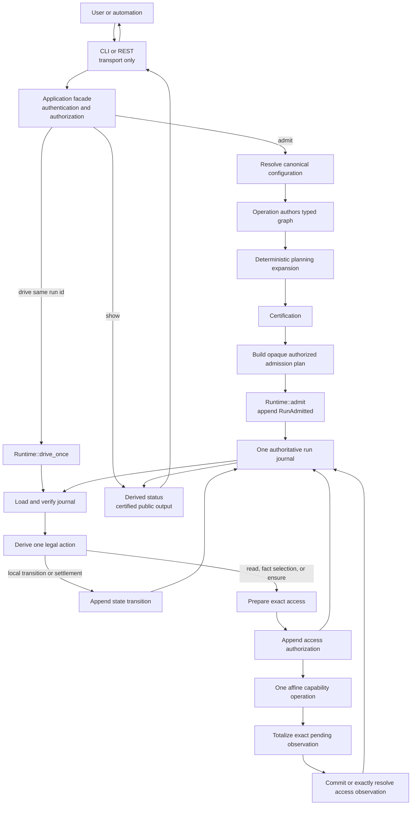
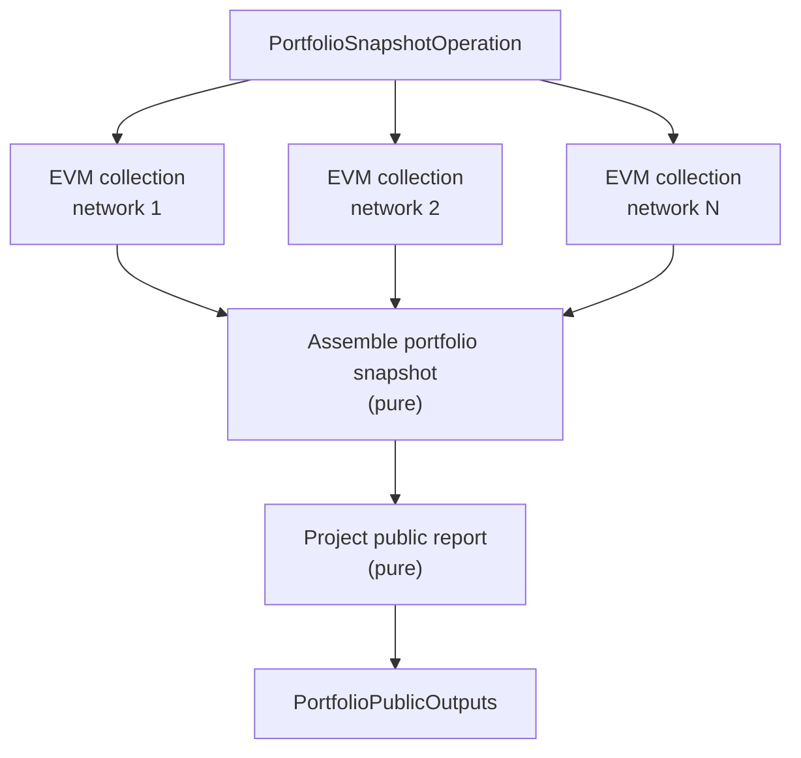
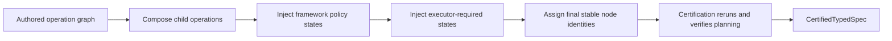
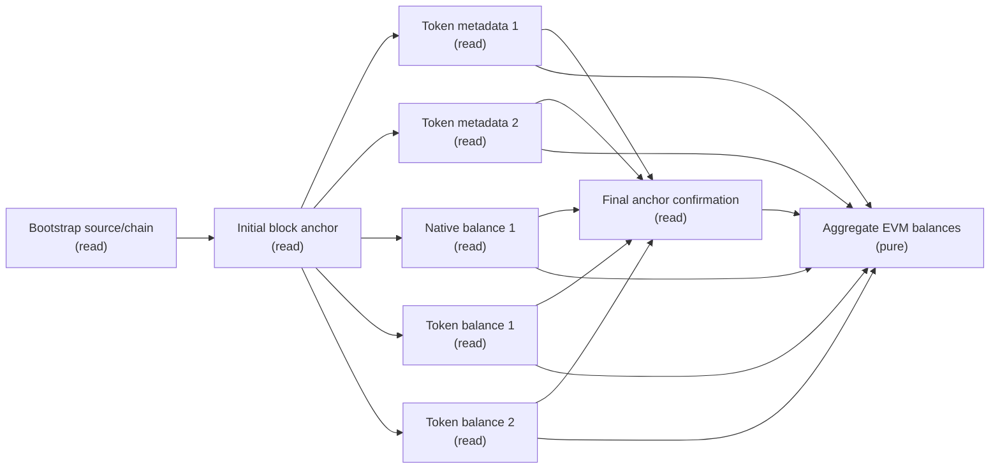
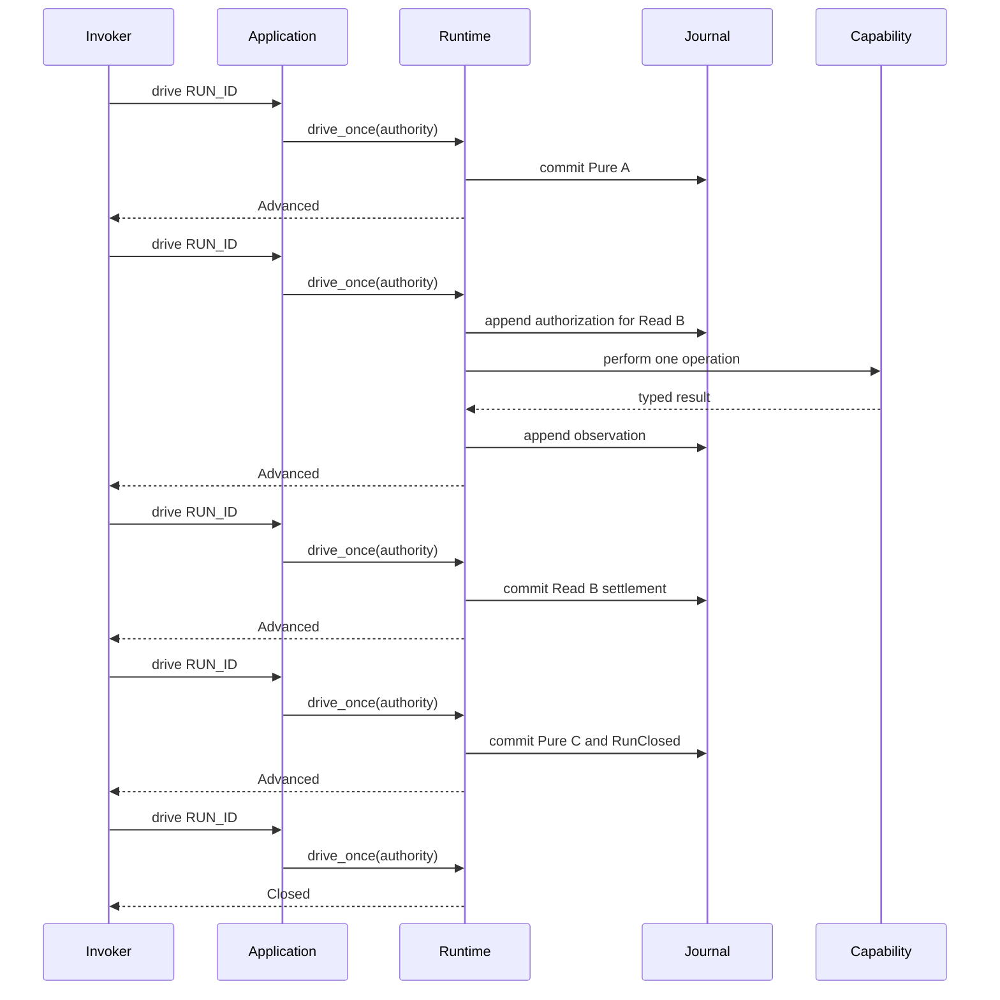
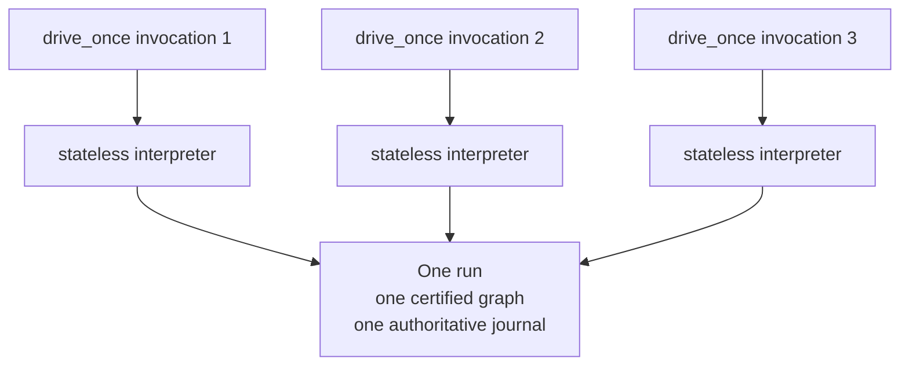
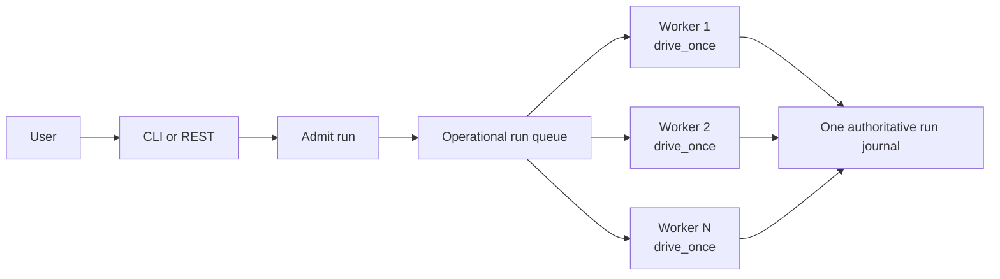

# How MFM Runs Execute

Status: user guide

This guide follows one public MFM operation from CLI or REST admission through planning,
certification, state execution, finalization, and public output. It also explains when fan-out is
possible, how concurrent drivers cooperate, and what the current product does and does not schedule
automatically.

The shortest useful mental model is:

```text
admit once
  -> one run id
  -> one certified state graph
  -> one append-only journal

drive repeatedly
  -> each call performs at most one legal action
  -> any authorized process can issue the next call

show
  -> reads derived status and the certified public output
```

Admission does not execute the graph. If nobody calls `drive`, the run remains safely recoverable
but makes no progress.

## End-To-End Shape



The CLI and REST binaries decode requests, invoke the application facade, and render reviewed
responses. They do not plan graphs, choose states, or interpret domain outcomes.

## Vocabulary

Several different concepts are commonly called an “entry point” or “runtime.” Keeping them
separate makes the execution model easier to understand.

| Term | Meaning |
| --- | --- |
| Product entry point | One of the published operation contracts: `mfm.portfolio/snapshot@1` or `mfm.evm/submit-transaction@1`. |
| Operation | Deterministic code that constructs a typed state graph. It performs no live work. |
| State contract | Reusable pure, read, or effect semantics for one kind of state. |
| State occurrence | One planned use of a state, with its own node id, configuration, and graph edges. |
| Transport entry point | A CLI command or REST route used by a person or client. |
| Runtime entry point | `admit`, which owns the initial append, or `drive_once`, which advances an admitted run by at most one action. |
| Driver invocation | One active call to `drive_once`. |
| Invoker or driver controller | Whatever decides when and how many `drive_once` calls to issue. |
| Logical state machine | The one admitted graph plus its authoritative journal, independent of process memory. |

## From Public Operation To Certified Graph

### Product registration

The current product publishes exactly two entry points:

```text
entry_point_id           = "mfm.portfolio/snapshot@1"
entry_point_operation_id = "mfm.portfolio/snapshot"

entry_point_id           = "mfm.evm/submit-transaction@1"
entry_point_operation_id = "mfm.evm/submit-transaction"
```

The entry-point contract binds:

- the accepted input schema;
- the certified public-output schema;
- one exact planning profile;
- the planner contract and implementation;
- the stable operation identity; and
- the state and capability contracts that may appear in its graph.

An entry point grants admission to one exact product contract. Generic operation-building helpers
do not grant admission authority by themselves.

### States own semantics

Every state chooses exactly one closed execution case:

```text
pure:
  apply(StateFrame) -> Settlement

read:
  request(StateFrame) -> Request
  apply(StateFrame, Observation)
    -> Settlement | InsufficientEvidence | InvalidEvidence

effect:
  request(StateFrame) -> Request
  settle(StateFrame, Request, TerminalEvidence)
    -> Settlement | InsufficientEvidence | InvalidEvidence
```

A state owns outcome-affecting computation: request authorship, evidence interpretation, typed
failure, output construction, and fact emission. It cannot instantiate a transport, access the
journal, append records, choose another node, or retry invisibly.

### Operations own topology

An operation is deterministic planning code. It:

- creates state occurrences;
- supplies their immutable configuration;
- connects typed outputs to typed inputs;
- invokes reusable child-operation builders;
- declares required-success nodes; and
- binds the public output.

The operation does not execute state callbacks or perform network, filesystem, clock, signer, or
provider IO.

For every demanded EVM network, the portfolio operation invokes one reusable EVM balance-collection
child operation. The number of child nodes is derived from the canonical portfolio configuration.



Multiple network child graphs are independent unless an explicit graph edge connects them.

### Planning expansion and certification

The authored graph passes through one deterministic composite planning step:



The current portfolio planning profile has no framework-policy states and contains no effect state.
The EVM transaction planning profile owns one ordinary effect state and uses the same generic
planning and runtime paths rather than an EVM-specific branch. The planning pipeline binds each
profile's exact empty policy, planner, graph, implementations, dependencies, terminal contract,
and public output.

Certification freezes:

- the expanded nodes and edges;
- every node occurrence identity;
- state execution contracts and implementations;
- capability and routing-generation bindings;
- dependency and skip rules;
- terminal-success requirements;
- public-output bindings;
- canonical configuration and initial values; and
- the whole executable identity.

Runtime executes only this certified expanded graph. It has no branch for “portfolio node,”
“framework node,” “fan-out node,” or “child-operation node.”

## Admission

For example, portfolio admission through the CLI looks like:

```sh
mfm run admit mfm.portfolio/snapshot@1 \
  --invocation-identity de305d54-75b4-431b-adb2-eb6b9e546014 \
  --target acme/primary \
  --access-token-file /path/to/token
```

Admission:

1. authenticates the credential and authorizes `Admit`;
2. resolves the target's current canonical portfolio configuration;
3. validates its schema, identity, and cardinality bounds;
4. derives immutable EVM routing-generation references;
5. authors and expands the graph;
6. certifies the graph, profile, manifests, terminal contract, and public output;
7. creates one opaque owned `AuthorizedAdmissionPlan` containing no writer, backend, support graph,
   or prepared append; and
8. calls `Runtime::admit`, which validates the exact registry, injects its admitted support, and
   atomically appends `RunAdmitted` with the required immutable objects.

It does not contact an EVM endpoint, inspect a chain, call a signer, invoke an executor, or execute
the first state.

The result is one stable `run_id`. Repeating the exact admission attaches to the same logical run.
Changed root material conflicts instead of silently creating another interpretation of that run.

## EVM Bootstrap And Anchor

Bootstrap and anchor are EVM-domain states, not generic runtime phases.

The word “anchor” is also used in other contracts. In this section it means an EVM block anchor:
the exact block-number and block-hash pair used to make a portfolio snapshot coherent.

### Immutable routing generation

Admission selects one qualified, immutable, non-secret `routing_generation_ref` for each EVM
network binding. It identifies the exact deployment routing generation the run must use.

It does not contain an endpoint, HTTP credential, connection pool, or secret-source location.
Those remain private below the capability boundary.

Admission may select and validate the reference but cannot:

- contact the provider;
- call the chain;
- inspect live health or block state;
- rotate or rank sources; or
- silently substitute a newer generation during resume.

### Bootstrap state

`BootstrapEvmSourceState` is the first audited live state for one network. It authors one immutable
chain-identity request containing the admitted routing generation and expected semantic
source/chain binding.

The private capability:

1. resolves that exact routing generation;
2. performs one chain-identity protocol operation;
3. checks the bounded response; and
4. returns reviewed, non-secret source evidence.

A mismatch becomes a typed `source_mismatch` result. An unavailable generation becomes a reviewed
access failure. Neither condition triggers fallback to another source.

The successful output is an `EvmCheckedSource`, used as the typed input of the initial-anchor state.

### Initial block anchor

`ReadEvmInitialAnchorState` performs one audited read that obtains an exact canonical:

```text
block number + block hash
```

Its output is an `EvmAnchoredSource`. Every later balance or metadata request receives that value
through an explicit graph edge and uses the exact block hash with EIP-1898
`requireCanonical: true`.

Without the anchor, a nominally single portfolio snapshot could combine values from different
chain moments.

### Per-request fan-out

After the initial anchor settles, the graph may contain many simultaneously ready read occurrences:

- one native-balance state per account request;
- one token-metadata state per distinct token contract and field;
- one token-balance state per account and token request.

Each occurrence has its own immutable request, access authorization, capability call, observation,
and settlement.



This is also a fan-in: confirmation and aggregation cannot run until their required sibling
outputs exist.

### Final anchor confirmation

After the fan-out results exist, `ConfirmEvmAnchorState` asks for the hash currently associated
with the original block number. It requires that hash to equal the initial anchor hash.

`requireCanonical: true` checks each individual request when it occurs. Final confirmation detects
an anchor change during the complete collection window.

### Pure aggregation

`AggregateEvmBalancesState` performs no IO. It verifies:

- complete certified request coverage;
- exactly one accepted result for every required request;
- exact source, chain, routing generation, and anchor agreement;
- canonical addresses and quantities;
- token-decimal bounds; and
- deterministic output and fact ordering.

The portfolio assembly and report states then consume these typed outputs directly through graph
edges.

## Potential Fan-Out Versus Actual Fan-Out

There is no `simple` or `fan_out` runtime mode.

| Question | Owner |
| --- | --- |
| Which nodes exist? | Operation authoring from canonical configuration. |
| Which dependencies exist? | Operation authoring and deterministic planning expansion. |
| Which nodes are ready now? | Runtime, derived from the certified graph and journal. |
| How many ready calls overlap physically? | The invoker's number of concurrent `drive_once` calls and deployment limits. |

Sequentiality is an edge:

```text
Bootstrap -> InitialAnchor
```

Potential fan-out is a set of siblings with satisfied dependencies:

```text
                 +-> Balance A
InitialAnchor ---+-> Balance B
                 +-> Metadata C
```

Actual external-call concurrency is bounded by:

```text
min(
  access-eligible sibling count,
  concurrent drive_once invocations,
  deployment and capability limits
)
```

The operation author explicitly encodes independence. The planner does not inspect arbitrary Rust
code and infer that two requests are safe to parallelize.

## One `drive_once` Call

CLI:

```sh
mfm run drive RUN_ID --access-token-file /path/to/token
```

REST:

```text
POST /v1/runs/{run_id}/drive
```

Each transport invocation:

1. authenticates and authorizes `Drive` for the exact tenant and run;
2. calls `Application::drive_once`;
3. gives runtime one purpose-bound `RunAccessAuthority<Drive>`;
4. loads and verifies a fresh journal view;
5. verifies the admitted executable and registered program support;
6. derives the legal candidates;
7. selects exactly one action;
8. commits or performs that action; and
9. returns one reviewed drive outcome.

Runtime selects actions in this order:

1. scan every committed observation suffix completely and integrity-block on any invalid evidence,
   including invalid evidence after a would-be settlement;
2. report an already closed run, or integrity-block an impossible open/all-terminal fold, before
   semantic work;
3. settle the first callback-accepted structurally consumable observation;
4. commit one ready local pure, effect-request, or dependency-skip transition;
5. authorize and perform one live read or effect `ensure`, ranked by prior authorization count and
   then certified node order; or
6. report an operational block when a current candidate is unavailable, otherwise report waiting.

Invalid evidence and an open/all-terminal fold are integrity blocks. Operational unavailability and
waiting do not reinterpret committed evidence.

The caller supplies only the run id. It cannot choose the node, request, evidence, output, or
transition.

## Authorizations

Two different authorizations are involved.

| Authorization | Purpose |
| --- | --- |
| `RunAccessAuthority<Drive>` | Confirms that this authenticated caller may drive this exact run. |
| `ExternalAccessAuthorized` | Durable journal record permitting zero or one exact capability operation. |

Before runtime enters a live capability, it:

1. purely authors the immutable typed request and preflights its exact binding, codecs, contracts,
   routing, and result encoder into private `Prepared<K>`;
2. appends `ExternalAccessAuthorized`;
3. receives a one-use permit only for a directly acknowledged new append;
4. converts it into private affine `Authorized<K>`;
5. invokes at most one application-protocol operation;
6. totalizes every surviving return into private `PendingObservation<K>`; and
7. commits or byte-identically resolves `ExternalAccessObserved`, producing private
   `CommittedObservation<K>` before returning normal success.

The in-process order is fixed:

```text
Prepared<K>
  -> Authorized<K>
  -> PendingObservation<K>
  -> CommittedObservation<K>
```

No state callback, application response, or successful post-invocation drive result can receive a
pending observation. `CommittedObservation<K>` can be constructed only by a positive store commit
or exact identical-content resolution under that authorization.

The capability wrapper consumes the one-use authority. A stale driver that loses the authorization
append race receives no permit and cannot call the provider.

The pending value remains stable while physical observation appends are retried. Runtime reloads
the verified history and resolves the authorization key before each physical attempt. If the
committed content is identical, it completes without another append; changed content is an
integrity conflict. A definite stale predecessor replaces only the predecessor-bound append
attempt. An acknowledgement-ambiguous append is resolved unchanged before any rebase. None of
these paths invokes the capability again.

While the task still owns a pending observation, operational store failures use capped
10-to-1,000-millisecond exponential backoff; verified head progress resets the delay. Cancellation
does not launch detached completion work. If the task or process disappears, the pending value is
lost and the unmatched authorization remains the complete durable fact.

An authorization proves that an operation was permitted before any possible entry. It does not
prove that entry occurred. If a process disappears before the observation commits, the unmatched
authorization is `CrashAmbiguous`: zero or one physical invocation may have occurred.

Every observation outcome is one of `Returned`, `DidNotEnter`, `Indeterminate`, or
`NonDomainFailure`. The first three retain the reviewed state-facing result/safe-failure contract.
A non-domain failure instead carries only conservative entry status, a fixed
`RetryableOperational | IntegrityBlocked` disposition, and a closed redaction-safe platform code.
It is audit-only and cannot enter state logic or become a domain failure. A retryable operational
record can permit a later fresh authorization after it commits; an integrity-blocked record stops
automatic progress.

## Why A Read Usually Needs Two Drives

A live read is not settled in the same `drive_once` call that performs it:

```text
first drive:
  author request
  -> append authorization
  -> perform one capability operation
  -> retain exact pending observation across any append retry
  -> commit or exactly resolve observation
  -> return Advanced

later drive:
  load committed observation
  -> state callback accepts it
  -> append ReadSettled transition
  -> return Advanced
```

This separation allows a fresh process to settle already recorded evidence after the original
process crashes.

An insufficient observation causes a later drive to authorize another call with the same frozen
request. Invalid evidence blocks instead of becoming a domain result.

## Sequential Execution Example

For:

```text
Pure A -> Read B -> Pure C
```

execution looks like:



The final semantic transition atomically carries `RunClosed`. That drive returns `Advanced`
because it appended a transition. A subsequent drive observes the already closed journal and
returns `Closed`.

## Fan-Out With Concurrent Drivers

Fan-out does not mean several admissions or several logical state machines.

There is one admission:

```text
mfm run admit ...
  -> RUN_ID
```

Several invocations may then drive that same `RUN_ID` concurrently:

```sh
mfm run drive RUN_ID --access-token-file /path/to/token &
mfm run drive RUN_ID --access-token-file /path/to/token &
mfm run drive RUN_ID --access-token-file /path/to/token &
wait
```

The equivalent REST case is three concurrent `POST /v1/runs/RUN_ID/drive` requests.

Physically:

| Deployment | Concurrent execution |
| --- | --- |
| One REST process | One shared runtime value with several asynchronous `drive_once` calls. |
| Several REST replicas | Several stateless runtime values operating on the same journal. |
| Several CLI processes | Several independently constructed application/runtime values operating on the same journal. |

Semantically, all are interpreters of one logical run:



Suppose A, B, and C are ready and have no prior authorizations:

```mermaid
sequenceDiagram
    participant D1 as Driver 1
    participant D2 as Driver 2
    participant D3 as Driver 3
    participant J as Journal
    participant P as Provider

    D1->>J: authorize A
    D1->>P: call A

    D2->>J: reload; A=1, B=0, C=0
    D2->>J: authorize B
    D2->>P: call B

    D3->>J: reload; A=1, B=1, C=0
    D3->>J: authorize C
    D3->>P: call C

    P-->>D2: B result
    D2->>J: observe B

    P-->>D3: C result
    D3->>J: observe C

    P-->>D1: A result
    D1->>J: observe A
```

If drivers initially load the same head and all select A, they race to append A's authorization.
Only one exact-head compare-and-swap wins and mints live authority. The losing calls reload; the
authorization-count rule then spreads them to untouched siblings.

External calls can overlap, but authorizations, observations, and semantic transitions remain
totally ordered in the journal.

## Who Schedules Fan-Out Today?

No current MFM component automatically chooses a driver count or launches a worker pool.

Today:

- one CLI command makes one drive call and exits;
- one REST request makes one drive call and returns;
- a sequential caller produces serial execution; and
- fan-out occurs only when a user, script, client, or deployment issues concurrent drive calls.

The runtime contains a semantic action selector:

```text
Given this certified graph and journal, which one action is legal?
```

It does not contain an operational driver scheduler:

```text
How many drive calls should exist?
Which runs receive capacity?
When should they retry?
```

Therefore the current product guarantees safe, recoverable progress when driven. It does not
guarantee autonomous run-to-completion after admission.

### Future operational controller

A future deployment may add a non-semantic driver controller:



That controller could own:

- per-run parallelism;
- global and per-capability concurrency;
- provider rate limits;
- backoff and jitter;
- wakeups and queues;
- execution budgets; and
- shutdown and restart behavior.

It must not select a node or construct a state request. It only supplies bounded calls to
`drive_once`; runtime remains the sole semantic action selector.

This controller is future operational work, not part of the current public execution contract.

## Drive Outcomes And Invoker Behavior

`drive_once` returns one of:

| Outcome | Meaning | Typical invoker response |
| --- | --- | --- |
| `Advanced` | A transition, authorization, or observation was committed. | Another call may make immediate progress. |
| `Waiting::RetryableEvidenceGap` | Current evidence cannot settle; a later call may retry. | Back off or wait for a wakeup. |
| `Waiting::OperationalBlock` | A required deployment capability or prerequisite is unavailable. | Retry after the condition may have changed. |
| `Waiting::IntegrityBlock` | Committed evidence or a verified contract is invalid. | Stop automatic retry and investigate. |
| `Closed` | The run was already semantically closed. | Stop driving. |

A sequential `drive_until_waiting` helper, if added, is only a mechanical loop over `drive_once`.
It does not create external-call fan-out because it waits for each call before issuing the next.

## Finalization And Public Output

A run closes only when every certified occurrence is terminal. The final semantic transition
atomically includes `RunClosed`; closure is not a separately editable status.

For the portfolio snapshot:

1. every required EVM read settles or produces a certified failure/skip consequence;
2. final anchor confirmation settles;
3. pure EVM aggregation settles;
4. portfolio assembly settles;
5. public report projection settles;
6. the required `PortfolioPublicOutputs` binding exists; and
7. the final transition atomically seals the run.

The user reads status and public output through:

```sh
mfm run show RUN_ID --access-token-file /path/to/token
```

or:

```text
GET /v1/runs/{run_id}
```

The ordinary public view exposes:

- `active`, `succeeded`, or `failed`; and
- the certified public output when available.

It does not expose internal requests, provider routing, observations, facts, transition evidence,
or credentials. Trace, audit, replay, and export require separate grants.

## Complete Portfolio Walkthrough

For one admitted EVM portfolio snapshot:

1. The user imports canonical setup configuration.
2. The user admits `mfm.portfolio/snapshot@1`.
3. The application resolves configuration, authors and certifies the exact graph, then
   `Runtime::admit` validates the exact registry and appends `RunAdmitted`.
4. A drive performs the audited source/chain bootstrap call.
5. A later drive settles the bootstrap observation.
6. A drive performs the audited initial-anchor call.
7. A later drive settles the initial anchor.
8. Every configured metadata and balance state becomes potentially ready.
9. Sequential drive calls execute those reads serially, or concurrent drive calls allow their
   external operations to overlap.
10. Later drives settle the committed observations.
11. The final anchor-confirmation read executes and settles.
12. Pure EVM aggregation commits.
13. Pure portfolio assembly commits.
14. Pure report projection commits together with `RunClosed`.
15. `mfm run show` returns `succeeded` or `failed` and the certified public output when the terminal
    contract permits it.
16. A later `drive` returns `Closed` without changing the journal.

At every step, a fresh authorized process can continue from the graph and journal. No process-local
run state is required for recovery.

## Guarantees And Deliberate Non-Guarantees

The design guarantees:

- one certified graph and one authoritative append-only journal per run;
- exact-head atomic appends;
- one authorization before every MFM-controlled semantic external operation;
- no normal post-invocation success before every surviving capability result is totalized and its
  exact observation commits or resolves identically;
- non-domain platform failures remain audit-only and state-nonconsumable;
- no hidden capability retry, source rotation, or fallback;
- deterministic action selection and input lineage;
- process-independent recovery; and
- certified final status and public output.

The current design deliberately does not guarantee:

- automatic execution after admission;
- a built-in fan-out worker pool;
- a fixed driver count;
- provider-specific backoff or rate-limiting policy;
- at-most-once physical reads; or
- progress when no fair authorized invoker continues driving.

## Related Documentation

- [`docs/portfolio-snapshot.md`](portfolio-snapshot.md): exact published product workflow and output
  contract.
- [`docs/evm-rpc-routing.md`](evm-rpc-routing.md): routing generation, bootstrap, anchor, and EVM
  capability requirements.
- [`docs/evm-transactions.md`](evm-transactions.md): the registered transaction effect profile,
  executor protocol, and recovery contract.
- [`docs/design.md`](design.md): authoritative runtime, journal, store, replay, and authority
  contract.
- [`docs/architecture.md`](architecture.md): ownership and dependency boundaries.
- [`bin/cli/README.md`](../bin/cli/README.md): exact CLI commands and output behavior.
- [`bin/rest-api/README.md`](../bin/rest-api/README.md): exact REST surface.
